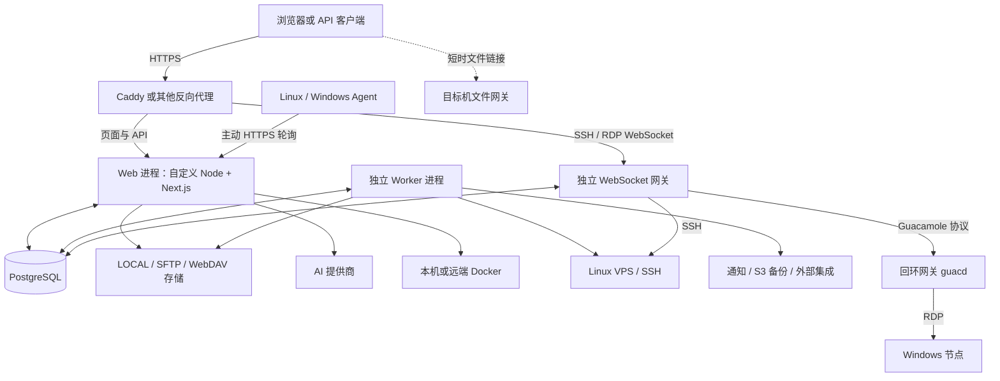
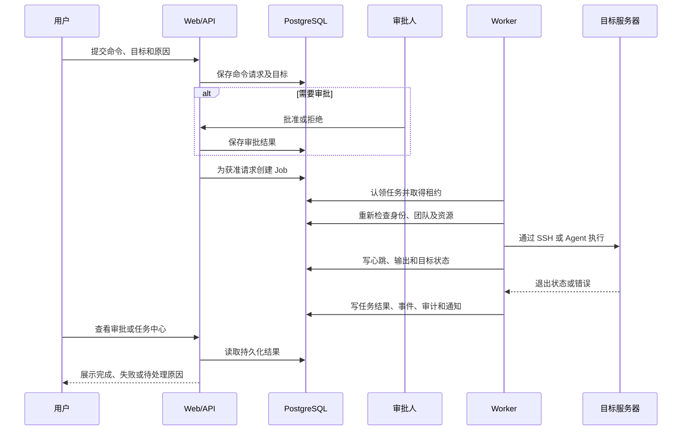

# VControlHub 项目全景、功能详解与使用指南

> 本指南按仓库中的实际功能组织，说明功能入口、配置条件、操作流程、权限、运行架构及能力边界。适用于使用者、管理员和项目维护者。
> 具体实例能否使用某项功能，取决于部署配置、当前工作区、账号授权和目标主机条件；各模块的配置要求见对应章节。
> 适用对象：项目使用者、平台管理员、运维人员、项目介绍与交接文档的读者、后续开发维护者。
> 这是一份当前实现说明。功能是否能在某个安装实例中使用，还取决于账号权限、团队、目标操作系统、外部服务及部署配置。本地代码版本与 GitHub 分支是否同步，应另行核对。

重点阅读：[功能设计目标](#functional-goals) · [功能范围与实现索引](#coverage-review) · [完整功能索引](#reference) · [指南使用方式](#feature-upgrades)。

## 目录

1. [项目定位、整体能力与功能设计目标](#project)
2. [核心概念与首次使用](#getting-started)
3. [全站交互与个人工作台](#workspace)
4. [服务器纳管与节点管理](#servers)
5. [浏览器 SSH、文件面板与 Windows 远程桌面](#remote-access)
6. [存储节点与文件管理](#files)
7. [文件分享、WebDAV 与跨节点同步](#sharing-sync)
8. [远程下载、媒体库与图片外链](#media-downloads)
9. [命令模板、应用部署与 Docker](#deployment)
10. [快捷服务与应用目录](#quick-services)
11. [审批、定时任务、Playbook 与统一任务中心](#automation)
12. [监控、健康检查、流量与告警](#observability)
13. [平台备份、VPS 备份、恢复与迁移](#backup)
14. [AI 助手、知识库与 AI 运维](#ai)
15. [工单、ITSM、通知、公告与代码片段](#collaboration)
16. [成本、账单与预算](#cost)
17. [账号、角色、团队与资源授权](#permissions)
18. [系统设置、配置导入导出与开放 API](#settings-api)
19. [系统设计与运行架构](#architecture)
20. [数据模型与后台任务设计](#data-workers)
21. [部署、升级、运行维护与测试体系](#operations)
22. [典型完整使用流程](#workflows)
23. [功能边界与常见问题](#boundaries)
24. [完整页面、权限、接口与源码索引](#reference)

<a id="project"></a>

## 1. 项目定位、整体能力与功能设计目标

### 1.1 项目是什么

VControlHub 是面向个人和小团队的自托管服务器管理与运维平台。用户部署自己的控制台后，可以在同一个 Web 界面中管理多台 Linux／Windows 服务器、远程终端、文件、容器应用、监控、命令审批、自动化任务、备份和团队协作。

它把“资产—连接—操作—结果—追踪”串在一起：先登记服务器和存储，再通过终端、部署、任务或 AI 发起操作，最后在任务中心、审批记录、通知和审计日志中查看结果。

主要使用场景包括：

- 个人同时维护多台 VPS，集中查看状态、连接终端、上传配置和部署应用。
- 小团队共享运维控制台，通过工作区、角色和目录授权划分资源访问范围。
- 将重复巡检、清理、通知、备份和部署流程做成模板、计划或 Playbook。
- 统一浏览本机、SFTP 和外部 WebDAV 文件，创建有期限或密码的分享链接。
- 使用 AI 查询环境、分析日志、参考知识库、生成方案，并在授权后执行受控动作。
- 保留命令、工单、备份、部署和权限变更的历史，方便追踪问题与交接。

### 1.2 功能全景

| 功能域 | 主要模块 | 用户得到的能力 |
| --- | --- | --- |
| 工作台 | 仪表盘、全局搜索、个人偏好 | 集中查看资源、待办、趋势和最近操作，快速进入常用功能 |
| 服务器 | VPS 管理、SSH 密钥、Agent、Windows RDP | 登记、连接、探测、启停管理状态、批量下发命令 |
| 文件 | 存储节点、云盘、搜索、版本、回收站 | 多节点浏览、传输、整理、编辑、恢复和分享 |
| 文件接入 | 外部 WebDAV、对外 WebDAV、文件网关 | 对接已有存储、客户端挂载、按配置选择文件流量路径 |
| 内容与传输 | 下载任务、媒体库、图片外链 | 下载到 VPS、音视频播放、图片整理与发布 |
| 应用运行 | 命令模板、部署记录、Docker、快捷服务 | 模板化部署、容器和 Compose 管理、应用安装及更新 |
| 自动化 | 审批、定时任务、Playbook、任务中心 | 人工审批、周期执行、多步骤编排和过程追踪 |
| 观测 | 系统健康、VPS 状态、主机监控、流量、告警 | 查看实时及历史资源、容量趋势、异常与通知 |
| 数据保护 | 平台备份、VPS 备份、异地备份、恢复演练、迁移 | 创建备份、校验产物、恢复、保留清理和跨环境转移 |
| AI | 多提供商对话、托管工具、知识库、AI 运维 | 问答、环境查询、受控执行、知识检索和定期诊断 |
| 协作 | 工单、ITSM、公告、通知、片段库 | 需求流转、外部消息集成、知识复用与通知触达 |
| 管理 | 用户、角色、团队、API Token、审计、系统设置 | 授权、隔离、集成、配置和安全追踪 |
| 成本 | 手工账目、服务器月费、CSV 账单、预算 | 按月及分类汇总支出，跟踪预算和历史趋势 |

### 1.3 当前代码规模与口径

项目包含：55 个 `page.tsx` 页面文件、188 个 API 路由文件、79 个 Prisma 数据模型、54 个业务权限项、4 个内置账号角色、24 类后台 Worker，以及 44 个本地快捷服务模板。

配置与调用入口包括 9 个模块中的 25 个 Server Action 运行时导出、42 个系统设置表单字段、8 个持久化个人偏好字段和 21 个 AI 托管工具；逐项对应关系见第 24 章。

这里的“页面”包含详情页、登录页和兼容跳转入口；“API 路由文件”可能同时处理多个 HTTP 方法；“应用模板”表示存在安装定义，不代表所有第三方应用在所有硬件和网络环境中都已逐项验收。

依据：[README](../README.md)、[页面与接口目录](route-catalog.json)、[数据模型](../prisma/schema.prisma)、[Worker 注册表](../src/lib/workers/registry.ts)。

<a id="functional-goals"></a>

### 1.4 总体功能设计目标

从当前功能和业务流程看，项目的总体目标是：**让个人或小团队通过自己的控制台，持续完成多主机、多存储、多应用的日常运维，并能控制操作权限、查看执行结果、保留处理记录和恢复所需数据。** 以下目标依据现有实现归纳，用于说明产品价值及功能验收方向；各目标已经实现到什么程度，以后续模块说明和能力边界为准。

1. **集中管理分散资源。** 将服务器、认证材料、存储、应用、监控和成本放进统一资源视图，减少查找地址、切换工具和重复登记。用户应能从一台服务器继续找到它的终端、文件、状态、任务和相关记录。
2. **让常见操作可以在浏览器完成。** 覆盖连接服务器、查看桌面、传输文件、编辑配置、管理容器、安装应用、查看日志及提交命令；清楚显示这些操作各自的前置条件、目标和结果。
3. **支持不同系统与网络条件。** 为 Linux、Windows、本地目录、SFTP 和 WebDAV 提供适合各自能力的接入方式，通过 SSH、Agent、RDP 和文件网关组合完成管理。界面应说明通道差异，用户可以按实际需要启用。
4. **把重复工作做成可复用流程。** 用命令模板减少重复填写，用定时任务执行单项计划，用 Playbook 编排多步骤，再通过后台任务承担耗时工作。关闭浏览器后，已持久化入队且权限、依赖有效的后台任务仍可执行和查询；尚在浏览器传输中的上传及交互终端会话按各自连接状态处理。
5. **在执行前明确授权，在执行后给出证据。** 命令、部署和 AI 变更应能说明谁提出、操作什么、由谁确认或审批、在哪台机器执行，以及成功或失败的依据。提交、批准、执行中与完成是不同状态。
6. **支持团队协作与按资源授权。** 使用统一账号、工作区成员、岗位权限、逐服务器和逐目录规则，让不同成员承担观察、运维、文件管理和平台管理职责；切换工作区后按相应资源范围工作。
7. **尽早发现异常并推进处理。** 提供资源指标、流量、历史趋势、容量预测、告警、工单和 AI 分析等发现与处理入口，配合通知及当前支持的自动化联动，使异常能被发现、分派、处理，并追踪相应结果。
8. **保留数据保护与转移能力。** 用文件版本、回收站、平台备份、VPS 备份、异地副本及迁移包应对不同问题；让用户能识别备份范围、校验状态和恢复条件，按需要完成实际恢复验证。
9. **让 AI 使用当前环境的真实信息。** 在用户权限范围内提供服务器、日志、文件、知识库及任务工具；对变更保留确认和审批，让建议可以关联真实执行结果。自主运维只承担当前白名单允许的动作。
10. **兼顾日常使用与后续集成维护。** 提供搜索、筛选、分页、快捷操作、移动端、中英文、主题与个人偏好；同时提供受控 API、WebDAV、外部通知与 ITSM 接入，以及配置导入导出和可维护的部署入口。

### 1.5 各模块的功能目标与用户收益

本表按 47 个功能域说明“为什么需要这项功能”；对应章节说明“用户具体怎样使用、有哪些限制”。每个功能域用固定编号 `F-01` 至 `F-47` 标识，并附当前实现入口。多个功能域可以共用一个页面，也可能需要跨页面完成，因此目标与文件之间允许一对多或多对一。

后续需求、提交说明和验收记录可以引用这些编号。调整表格顺序时不重排编号；新增功能域使用下一个未使用的编号，拆分或下线时保留原编号及去向。编号表示稳定的功能归属，不表示该功能在所有部署条件下都已通过实机验收。

| 功能编号／模块 | 要解决的问题 | 功能设计目标／用户完成的事情 | 详细说明 | 当前实现定位 |
| --- | --- | --- | --- | --- |
| <a id="feature-f01"></a>`F-01` 全局导航与搜索 | 功能多、资源分散，难以快速定位 | 从名称或关键词找到页面、服务器、Playbook 和快捷服务，按权限进入目标操作 | [第 3 章](#workspace) | [全局搜索](../src/components/global-search.tsx)、[资源查询](../src/app/api/search/route.ts) |
| <a id="feature-f02"></a>`F-02` 仪表盘与首次设置 | 无法快速判断资源、待办与初始化进度 | 汇总数量、趋势、审批及最近操作，提示尚未配置的基础功能，并允许组织个人布局 | [第 3 章](#workspace) | [工作台](../src/app/dashboard-content.tsx)、[首次设置](../src/app/dashboard-setup-checklist.tsx) |
| <a id="feature-f03"></a>`F-03` 个人偏好与移动端 | 不同用户的入口、刷新频率及设备不同 | 保存常用入口、组件和刷新偏好，在桌面与窄屏上完成相应管理操作 | [第 3 章](#workspace) | [偏好模型](../src/lib/preferences/user-preferences.ts)、[设置入口](../src/app/settings/page.tsx) |
| <a id="feature-f04"></a>`F-04` 服务器资产 | 多台主机的连接、系统、用途和状态难以统一维护 | 登记、检索、筛选、分页、编辑及启停纳管状态，沿节点进入其他业务模块 | [第 4 章](#servers) | [节点页面](../src/app/servers/page.tsx)、[节点业务](../src/lib/server/service.ts) |
| <a id="feature-f05"></a>`F-05` SSH 密钥与主机身份 | 密钥重复维护，连接目标难以确认 | 保存可复用认证材料，绑定到允许管理的节点，并核对及固定主机指纹 | [第 4 章](#servers) | [密钥导入与保存](../src/lib/server/ssh-keys.ts)、[节点模型](../src/lib/server/schema.ts) |
| <a id="feature-f06"></a>`F-06` Agent 管理 | 部分节点需要主动回连或不同采样方式 | 安装并追踪 Agent 心跳，在能力范围内提供监控和命令通道，明确 SSH 回退与纯 Agent 条件 | [第 4 章](#servers) | [Agent 服务](../src/lib/server/agent-service.ts) |
| <a id="feature-f07"></a>`F-07` 浏览器 SSH | 临时操作需要快速取得交互 shell | 多会话连接、终端搜索、命令复用、快捷键及内嵌文件操作，并呈现连接错误与重连状态 | [第 5 章](#remote-access) | [会话管理](../src/components/ssh-terminal-manager.tsx)、[终端面板](../src/components/ssh-terminal-panel.tsx) |
| <a id="feature-f08"></a>`F-08` Windows 远程桌面 | Windows 图形界面管理需要统一入口 | 经平台认证打开 RDP，处理画面缩放、键鼠、全屏、文本剪贴板和证书策略 | [第 5 章](#remote-access) | [远程桌面](../src/components/remote-desktop.tsx)、[RDP 网关](../src/lib/rdp/ws.ts) |
| <a id="feature-f09"></a>`F-09` 文件直连网关 | 大文件经过 Hub 中转会增加其流量和负载 | 在授权后按节点策略取得短时文件入口，并能回到网站中转；清楚区分直连与预览链路 | [第 4、6 章](#files) | [直连接口](../src/app/api/storage/direct-access/route.ts)、[网关开关](../src/app/servers/actions.ts) |
| <a id="feature-f10"></a>`F-10` 存储节点 | 文件位于多个主机和不同协议的目录 | 把 LOCAL、SFTP 和外部 WebDAV 映射为带名称、根目录、健康状态及授权的存储空间 | [第 6 章](#files) | [节点操作](../src/app/storage/actions-nodes.ts) |
| <a id="feature-f11"></a>`F-11` 文件浏览与整理 | 远端文件查找、归类和批量操作繁琐 | 浏览、排序、分页、新建目录、重命名、复制、移动、删除、收藏及标签整理 | [第 6 章](#files) | [文件页面](../src/app/files/page.tsx)、[文件操作](../src/lib/files/) |
| <a id="feature-f12"></a>`F-12` 上传、下载与传输队列 | 传输耗时，容易丢失进度或不知道失败原因 | 多文件和目录上传、分片续传、下载与范围读取，查看逐任务状态并处理取消、重试 | [第 6 章](#files) | [上传队列](../src/components/storage/storage-upload-queue.ts)、[存储传输](../src/lib/storage/) |
| <a id="feature-f13"></a>`F-13` 文件预览与文本编辑 | 查看或小幅修改文件总要完整下载 | 对支持类型在线预览；对符合条件的本地和 SFTP 文本查找、编辑、审查差异并保存 | [第 6 章](#files) | [预览入口](../src/app/files/preview/page.tsx)、[编辑界面](../src/app/files/preview/use-text-preview-controller.ts) |
| <a id="feature-f14"></a>`F-14` 版本与回收站 | 覆盖或误删后缺乏找回入口 | 查看与恢复受限额保护的版本，恢复尚保留正文的回收站条目，并明确永久删除范围 | [第 6 章](#files) | [文件版本](../src/lib/storage/file-versions.ts)、[回收站](../src/app/files/recycle-bin/page.tsx) |
| <a id="feature-f15"></a>`F-15` 搜索、索引与归档 | 外部文件变动后索引滞后，查找与打包不方便 | 搜索名称及支持范围的正文，同步和校验索引，按驱动能力打包、列压缩包目录或解压单个 GZ | [第 6 章](#files) | [文件搜索](../src/app/files/search/page.tsx)、[索引任务](../src/lib/workers/registry.ts)、[解压入口](../src/app/api/files/extract/route.ts) |
| <a id="feature-f16"></a>`F-16` 文件分享与报告 | 对外传文件需要时效和访问控制 | 发布文件或目录链接，设置密码、期限及下载限制，撤销分享并查看访问记录 | [第 7 章](#sharing-sync) | [分享服务](../src/lib/share-link/service.ts) |
| <a id="feature-f17"></a>`F-17` 双向 WebDAV 接入 | 已有 WebDAV 存储和桌面挂载工具需要互通 | 接入外部 WebDAV，或将支持节点导出为带 Token 与路径授权的 WebDAV 入口 | [第 7 章](#sharing-sync) | [对外 WebDAV](../src/lib/webdav/handler.ts)、[存储适配](../src/lib/storage/) |
| <a id="feature-f18"></a>`F-18` 跨节点文件同步 | 两处目录需要周期保持一致 | 保存受支持 Linux VPS 路径间的源、目标、方向及计划，手动或定时同步并查看报告；删除及冲突按现有策略处理 | [第 7 章](#sharing-sync) | [同步配置](../src/lib/sync/service-crud.ts)、[同步执行](../src/lib/sync/service-runtime.ts) |
| <a id="feature-f19"></a>`F-19` 远程下载 | 希望文件直接落到管理节点，无需本机先下载再上传 | 提交 URL／磁力任务，选择目标路径、查看进度和限速，完成后进入目标文件位置 | [第 8 章](#media-downloads) | [下载页面](../src/app/downloads/page.tsx)、[下载任务](../src/lib/downloads/) |
| <a id="feature-f20"></a>`F-20` 媒体库 | 图片、视频、音频分散且缺少内容视图 | 扫描入库、筛选、收藏、打标签、查看缩略图与元信息、播放或下载 | [第 8 章](#media-downloads) | [媒体页面](../src/app/media/page.tsx) |
| <a id="feature-f21"></a>`F-21` 图片外链 | 私有文件与可用于文章的公开图片难以区分 | 将允许的图片发布为链接，复制 URL／Markdown／HTML，维护相册、公开状态和统计 | [第 8 章](#media-downloads) | [外链页面](../src/app/image-bed/page.tsx)、[存储关联](../src/lib/image-bed/linked-storage.ts) |
| <a id="feature-f22"></a>`F-22` 命令模板 | 重复部署或维护依赖手工复制脚本 | 保存参数化命令、说明、标签和可选回滚脚本，再以真实参数提交执行 | [第 9 章](#deployment) | [模板页面](../src/app/templates/page.tsx)、[模板模型](../src/lib/command/schema.ts) |
| <a id="feature-f23"></a>`F-23` 部署、回滚与导出 | 部署后难以还原当时的参数和处理过程 | 关联审批及命令，保存部署快照、追踪结果，使用已有回滚脚本并导出占位符部署包 | [第 9 章](#deployment) | [部署业务](../src/lib/deployment/service.ts) |
| <a id="feature-f24"></a>`F-24` Docker 与 Compose | 容器运行状态和基础生命周期需要统一管理 | 选择本机或授权远端，查看容器、日志、统计、项目、网络与卷，执行支持的管理操作 | [第 9 章](#deployment) | [Docker 接口](../src/app/api/docker/) |
| <a id="feature-f25"></a>`F-25` 快捷服务与应用源 | 常用应用安装需要重复查镜像、端口和挂载 | 选择本地或社区模板，检查端口并取得可用端口建议，预览配置、安装、启停、同步状态、更新及卸载 | [第 10 章](#quick-services) | [服务生命周期](../src/lib/quick-service/service-lifecycle.ts)、[应用源同步](../src/lib/quick-service/app-source-sync.ts) |
| <a id="feature-f26"></a>`F-26` 手工命令与审批 | 多人远程变更缺乏事前检查和责任记录 | 单台或批量提交命令，单项或批量审核，逐目标查看日志，并在允许状态下请求取消 | [第 11 章](#automation) | [审批操作](../src/app/requests/actions.ts)、[命令业务](../src/lib/command/service.ts) |
| <a id="feature-f27"></a>`F-27` 定时任务 | 周期维护或预约操作容易遗忘 | 保存 Cron／一次性计划、目标及审批要求，暂停恢复并查看每次生成的执行记录 | [第 11 章](#automation) | [计划服务](../src/lib/scheduled-task/service.ts) |
| <a id="feature-f28"></a>`F-28` Playbook | 命令、通知和 Webhook 需要有顺序地执行 | 配置多步骤及触发条件，先做 Dry-run，再手工、按计划、指标或告警触发并追踪每步结果 | [第 11 章](#automation) | [步骤模型](../src/lib/playbook/schema.ts)、[步骤执行](../src/lib/playbook/worker.ts) |
| <a id="feature-f29"></a>`F-29` 统一任务中心 | 后台工作分散在多个模块，排障时缺少总览 | 汇总等待、执行和失败任务，展示事件及失败原因，并跳回具体业务处理 | [第 11 章](#automation) | [任务页面](../src/app/operation-tasks/page.tsx)、[聚合业务](../src/lib/operation-task/) |
| <a id="feature-f30"></a>`F-30` 平台健康与 VPS 状态 | 控制台自身故障和被管主机故障容易混淆 | 分别显示服务依赖、主机资源、连接与采样状态，让用户定位实际异常对象 | [第 12 章](#observability) | [平台健康](../src/app/health/page.tsx)、[VPS 状态](../src/app/vps-status/page.tsx) |
| <a id="feature-f31"></a>`F-31` 资源、流量、容量与可用率 | 单个当前数值无法解释长期变化 | 查看实时及历史资源、网卡流量、容量趋势和可用率，明确缺失样本与预测依据 | [第 12 章](#observability) | [监控](../src/lib/monitoring/)、[容量与健康](../src/lib/health/)、[可用率](../src/lib/uptime/) |
| <a id="feature-f32"></a>`F-32` 告警与事件 | 异常无人发现，或重复通知太多 | 设置阈值与持续时间，通过冷却、静默、值班、确认及升级组织通知，并联动受控 Playbook | [第 12 章](#observability) | [告警规则](../src/app/api/alert-rules/route.ts)、[事件处理](../src/lib/alert/incidents.ts) |
| <a id="feature-f33"></a>`F-33` 平台备份与迁移 | 控制台损坏或换机时缺少重建材料 | 按数据库、文件或完整范围备份，校验、保留、恢复和导出迁移包，保护密钥及配置 | [第 13 章](#backup) | [备份恢复](../src/lib/backup/service-runtime.ts)、[迁移入口](../src/app/api/backups/migration/route.ts) |
| <a id="feature-f34"></a>`F-34` VPS 与异地备份 | 远程业务数据及本机备份存在不同失效风险 | 对受支持目标执行备份预设，并在启用后向独立对象存储保留相应副本 | [第 13 章](#backup) | [VPS 备份](../src/lib/backup/vps-backup-service.ts)、[异地上传](../src/lib/backup/offsite-uploader.ts) |
| <a id="feature-f35"></a>`F-35` AI 对话与托管工具 | 环境分析需要查多个页面，建议缺少上下文 | 使用提供商、模型、附件及授权工具获取事实、解释问题、形成方案和受控动作 | [第 14 章](#ai) | [对话入口](../src/app/ai/page.tsx)、[托管执行](../src/lib/ai/hosted-service.ts) |
| <a id="feature-f36"></a>`F-36` 知识库 | 运维约定与 SOP 分散，难以供 AI 复用 | 录入文本知识，切块、检索试跑，并在当前工作区范围内辅助对话 | [第 14 章](#ai) | [知识页面](../src/app/knowledge/page.tsx)、[知识检索](../src/lib/ai/knowledge.ts) |
| <a id="feature-f37"></a>`F-37` AI 运维 | 周期巡检和异常整理耗时 | 汇总扫描发现、建议及提供商健康，在人工批准或严格白名单条件下执行相应动作 | [第 14 章](#ai) | [扫描任务](../src/lib/ai/ops/scan-worker.ts)、[动作边界](../src/lib/ai/ops/types.ts) |
| <a id="feature-f38"></a>`F-38` 工单、SLA 与 ITSM | 问题描述、处理责任和实际命令相互脱节 | 提交、分派、评论和流转工单，关联节点及命令，跟踪期限、升级和外部事件 | [第 15 章](#collaboration) | [工单服务](../src/lib/ticket/service.ts)、[SLA](../src/lib/ticket/sla.ts)、[集成](../src/lib/itsm/) |
| <a id="feature-f39"></a>`F-39` 通知与公告 | 个人待办、处理结果和全站消息没有统一入口 | 查看并处理个人通知；按时效、类型和置顶规则发布平台公告 | [第 15 章](#collaboration) | [通知服务](../src/lib/notification/service.ts)、[公告模型](../src/lib/announcement/schema.ts) |
| <a id="feature-f40"></a>`F-40` 代码片段 | 常用脚本和配置片段散落在聊天或笔记中 | 保存带说明、语言、标签及可见性信息的文本，搜索、复制和维护 | [第 15 章](#collaboration) | [片段页面](../src/app/snippets/page.tsx)、[片段模型](../src/lib/snippet/schema.ts) |
| <a id="feature-f41"></a>`F-41` 成本、账单与预算 | 多节点支出难汇总，预算超额缺少提醒 | 录入或同步月费，导入 CSV 账单，按币种分类汇总，保留快照和检查预算 | [第 16 章](#cost) | [成本页面](../src/app/cost-summary/page.tsx)、[账单来源](../src/lib/cost/cloud-billing/adapters.ts) |
| <a id="feature-f42"></a>`F-42` 账号、安全与角色 | 共享管理员账号难以分工及撤销访问 | 独立账号、改密、MFA、恢复码、全端退出、账号启停、角色和密码重置 | [第 17 章](#permissions) | [账号安全](../src/app/account/security/page.tsx)、[角色权限](../src/lib/auth/rbac.ts) |
| <a id="feature-f43"></a>`F-43` 工作区与资源授权 | 不同团队、服务器或目录需要不同访问范围 | 管理成员和所有权，用权限组及例外授予服务器与目录的读、写、删等能力 | [第 17 章](#permissions) | [团队管理](../src/lib/team/service.ts)、[服务器授权](../src/lib/server/resource-access.ts)、[目录授权](../src/lib/storage/access-control.ts) |
| <a id="feature-f44"></a>`F-44` 审计 | 事后难以确定谁改了什么 | 记录关键管理及执行动作，按条件检索和导出，关联实际业务对象 | [第 17 章](#permissions) | [审计服务](../src/lib/audit/service.ts) |
| <a id="feature-f45"></a>`F-45` 系统设置与配置迁移 | 运行策略分散，换环境后重复配置 | 按组维护品牌、安全、通知、运行及异地参数，预览和导入导出受支持配置 | [第 18 章](#settings-api) | [设置字段](../src/app/settings/field-schema.ts)、[配置迁移](../src/lib/system/) |
| <a id="feature-f46"></a>`F-46` API Token 与接口说明 | 脚本和第三方客户端需要可控访问 | 签发有范围、团队、期限的个人凭据，提供接口说明并支持撤销和使用追踪 | [第 18 章](#settings-api) | [Token 服务](../src/lib/api-token/service.ts)、[接口说明](../src/app/api-docs/page.tsx) |
| <a id="feature-f47"></a>`F-47` 安装、升级与运行维护 | 更新平台可能影响现有入口和数据 | 提供相应平台部署流程、独立进程、分阶段更新及验证；保存升级与恢复所需材料 | [第 21 章](#operations) | [安装](../deploy/install.sh)、[升级](../deploy/upgrade.sh)、[部署验证](../deploy/smoke-test.sh) |


### 1.6 从用户结果判断目标是否达到

功能验收应覆盖下列结果，而不仅检查页面或按钮是否存在。下表帮助使用者判断操作是否达到目的；具体实例的执行结果应在相应任务和业务页面查看。

| 用户目标 | 应能观察到的结果 |
| --- | --- |
| 纳管并使用一台主机 | 节点已保存，身份及目标可信；所需 SSH／Agent／RDP 通道可用，能进入文件、监控或命令流程 |
| 向服务器交付文件或配置 | 传输结束后目标内容可读；编辑保存有结果，冲突明确提示；如需重载，可分别确认保存和服务操作结果 |
| 完成一次多人审核的变更 | 请求、审批意见、目标及执行输出互相关联；失败节点可识别，取消或重试有明确状态 |
| 安装并运行一个应用 | 目标与端口正确，安装任务结束，应用状态及访问入口可查；更新与卸载按相应配置范围执行 |
| 建立自动化维护 | 计划或触发器产生真实任务，Worker 能领取；用户关闭页面后仍能查询结果，失败可定位到具体步骤 |
| 处理一次异常 | 指标或探测产生异常事实，规则生成事件，通知渠道有投递结果，相关工单或联动任务有处理记录 |
| 保护并恢复数据 | 备份范围明确、产物及校验可查；按需要在独立环境恢复数据库和文件，并验证目标业务可用 |
| 给成员最小必要访问 | 成员在指定工作区完成授权操作，未授权资源被拒绝；撤回权限或移除成员后后续访问受到限制 |
| 使用 AI 辅助操作 | 模型获取允许的信息；需要变更时显示真实动作、目标和确认流程，最终以命令／Job 的结果作为完成依据 |
| 对外分享或集成 | 访客或客户端只凭正确链接／Token 在允许范围使用，密码、有效期、撤销和团队限制实际生效 |

### 1.7 设计目标与当前实现的对应口径

第 1.4、1.5 节是从现有项目归纳的功能目标；具体已经提供哪些操作，以对应功能章节及第 23 章的能力边界为准。第 1.6 节说明完成操作后应查看的结果，实际结果由所用实例产生。

| 核对层次 | 本文提供的依据 | 能据此得出的结论 |
| --- | --- | --- |
| 功能归属 | 47 个固定功能编号、详细章节及源码入口 | 每个已列功能域都能定位现有实现；不是每个目标只对应一个按钮或文件 |
| 入口完整性 | 第 24 章的页面、API、Server Action、工具、设置等清单 | 所列源码入口都有文档位置，便于发现新增入口遗漏 |
| 行为与限制 | 用户流程、驱动／操作系统对照、权限和数值限制 | 可作为该基准版本的使用及变更分析依据；发现差异时要回到实际处理逻辑核对 |
| 实际可用性 | 指定环境、账号权限、输入及输出下的执行证据 | 需要相应集成测试或实机验收，源码映射和文档链接检查不能代替 |

查阅时先按第 1.5 节的功能编号定位章节，再结合操作条件与限制使用；需要定位实现时，查阅第 24 章的页面、接口和业务源码索引。

<a id="getting-started"></a>

## 2. 核心概念与首次使用

### 2.1 先理解这些对象

| 名称 | 含义 | 容易混淆的地方 |
| --- | --- | --- |
| Hub／控制台主机 | 部署 VControlHub 本身的机器 | 主机监控默认观测这里；本机 Docker 也指这里 |
| VPS／服务器节点 | 被控制台登记和管理的远程机器 | 节点“已启用”是允许接受操作的管理状态，不等于网络实时在线 |
| 团队／工作区 | 一组成员及其服务器、存储、任务等资源的归属范围 | 账号是全局账号，进入不同工作区看到的业务资源会变化 |
| 平台管理员 | 具有内置 `admin` 角色的账号 | 与某个工作区的所有者或管理员不同 |
| 存储节点 | 一处有明确根路径和访问方式的文件空间 | 一台 VPS 可以绑定存储；服务器记录本身不等于云盘目录 |
| SSH 密钥 | 用于远程 SSH 认证的可复用密钥记录 | SSH 主机指纹用于验证服务器身份，和登录密钥不是同一件事 |
| Agent | 在被管理主机上运行、主动向 Hub 轮询的程序 | Agent、浏览器 SSH、RDP 和文件直连网关承担不同职责 |
| 文件索引 | 数据库中的文件元信息记录 | 文件实际字节保存在本地磁盘或远端存储；外部修改后可能需要同步索引 |
| 命令请求 | 含命令、目标、发起者、审批状态和执行结果的业务对象 | 获准执行后才由 Worker 处理，提交成功不等于远端执行成功 |
| Job | 持久化后台任务 | 用于执行和追踪耗时操作，不是浏览器里的临时计时器 |
| Playbook | 多个有顺序的命令、通知、Webhook 步骤 | 比单条定时命令更适合表达跨步骤流程 |
| 快捷服务 | 已定义镜像、端口、环境变量和挂载的应用模板或实例 | 应用内部账号、初始化和业务配置通常仍需进入应用处理 |
| 公开分享／图片外链 | 持有链接者可按发布策略访问的文件入口 | 和需要登录及路径授权的云盘访问不同 |

### 2.2 初次使用建议顺序

1. 完成平台部署，通过自己的 HTTPS 地址登录。
2. 按账号状态要求修改初始密码，进入账户安全配置双因素认证。
3. 确认当前工作区；团队使用时先创建账号，再加入工作区并分配权限。
4. 添加第一台服务器，独立核对 SSH 主机指纹，完成连接检查。
5. 打开浏览器终端执行一次只读检查，确认账号和 shell 可用。
6. 为服务器配置云盘根目录，或添加本地／外部 WebDAV 存储节点。
7. 在文件页上传一个测试文件，验证浏览、下载、预览与权限。
8. 查看 VPS 状态、系统健康，配置告警规则和实际通知渠道。
9. 建立备份计划，查看一次成功记录并执行产物校验或独立恢复验证。
10. 根据需要启用快捷服务、Playbook、AI、异地备份与外部集成。

仪表盘会提供首次设置清单，提示服务器、告警、外发通知、备份计划和节点月费等尚未配置的项目。清单可以暂时关闭；关闭提示不会替代相应配置。

### 2.3 权限对界面的影响

导航、按钮、列表数据和 API 都会受到权限约束。同一个工作区中，普通观察者、运维人员和存储管理员看到的操作按钮不完全一致。若某个功能不存在于当前页面，应先核对账号角色、工作区身份、资源授权和功能依赖，而不是直接认为功能未实现。

### 2.4 先确定要使用的连接通道

| 使用目的 | 主要通道或依赖 | 独立配置要点 |
| --- | --- | --- |
| 登录和管理资产 | Web、数据库、有效会话 | Web 可用并不能证明远程连接代理可用 |
| Linux 交互终端 | Hub → SSH | SSH 端口、用户名、密码或密钥、主机指纹及连接权限 |
| Windows 交互终端 | Hub → Windows OpenSSH | 节点绑定的 SFTP 存储及其独立凭据；与 RDP 配置分开 |
| Windows 图形桌面 | 浏览器 → RDP 网关 → Windows | 平台 RDP 开关、guacd、WebSocket 代理、RDP 凭据和证书策略 |
| Agent 监控与命令 | 目标 Agent → Hub HTTPS | Agent 注册、心跳、能力、平台任务领取；不提供交互式 SSH shell |
| 云盘与文件访问 | 本地、SFTP 或外部 WebDAV | 存储根路径、驱动配置、路径授权及读写权限 |
| 文件直连 | 浏览器与节点文件网关 | 已配置并可达的网关、授权票据及对应操作支持；与 Agent 心跳独立 |
| 异步任务 | 数据库队列、相应 Worker、目标资源 | 已提交后继续查看审批、排队、执行和结果状态 |

选择通道时先按目的配置，避免用“节点在线”替代每项功能的连接条件。例如，Windows 的 RDP 正常不会自动开启 OpenSSH 或提供 CPU 指标，Linux Agent 在线也不会自动恢复已移除的 SSH 凭据。

### 2.5 操作反馈与结果怎样区分

| 页面反馈 | 表示什么 | 接下来查看什么 |
| --- | --- | --- |
| 保存成功 | 配置记录已保存 | 对应连接检查、启用状态和实际操作条件 |
| 请求已提交／待审批 | 平台收到请求，可能仍需审批 | 请求详情、审批意见和目标范围 |
| 已排队／等待执行 | 已有后台任务等待调度 | Worker 心跳、任务队列和资源依赖 |
| 执行中 | 任务已开始处理 | 进度、日志、步骤结果及失败目标 |
| 已完成 | 此任务定义的处理步骤结束 | 产物、文件位置、应用状态或实际输出 |
| 失败／已取消 | 任务未按正常流程完成，或停止后续处理 | 错误、已执行步骤、已产生的数据和是否允许重试 |
| 连接已断开 | 当前交互通道失效 | 连接诊断与目标侧进程；不能直接判断此前操作已回滚 |

不同业务的状态名称及可取消阶段不同，以对应任务详情为准。取消通常不撤销已经产生的远端变更，重试也不等于从失败位置无副作用地续跑。需要回退时，应使用对应业务的版本、备份或明确的恢复操作。

<a id="workspace"></a>

## 3. 全站交互与个人工作台

### 3.1 导航、搜索与响应式使用

- 桌面侧栏按概览、文件与传输、运维、AI 与协作、配置等组组织入口。
- 移动端提供仪表盘、服务器、任务、文件、设置的主要快捷入口，以及其他页面的导航抽屉。
- 全局搜索可以检索页面与快捷操作，也可以查询有权限看到的服务器、Playbook 和快捷服务。
- 搜索支持键盘上下选择、确认跳转和 Esc 关闭；结果受当前身份及工作区范围限制。
- 中文和英文界面可切换，支持深色、浅色主题。
- 列表、详情面板和确认对话框适配窄屏；分页、筛选和空状态帮助处理较多资源。
- 错误提示、操作反馈、加载状态和重试入口贯穿各模块。

### 3.2 仪表盘

入口：`/`、`/dashboard`。

仪表盘提供：

- VPS 总数、启用与停用情况、在线概况、SSH 密钥绑定及直连网关概况。
- 存储节点、文件条目、下载任务、待审批命令等核心计数。
- 最近审批活动、最近审计记录，以及通知和定时任务相关信息。
- 跳转服务器、文件、远程下载、审批中心、通知中心和定时任务的快捷入口。
- VPS 资源 24 小时趋势、下载任务 7 天趋势、审计活动 30 天趋势及图片上传趋势。
- 仪表盘组件显示／隐藏、拖动调整顺序、恢复默认布局。

布局编辑能否使用还受平台“允许拖拽重排”设置控制。图表没有数据时会显示空状态；新增节点需要等待采样或实际产生业务记录后才有趋势。

### 3.3 个人偏好与账户入口

统一入口：`/settings`；旧 `/preferences` 跳转到设置页的个人偏好区域。

用户可调整登录后的默认页面、仪表盘组件、通知和声音偏好、页面自动刷新频率、VPS 自动探测及 Windows RDP 端口探测相关偏好。刷新频率影响请求及采样负载，关闭页面刷新并不等于暂停已经提交的后台任务。

当前持久化的 8 项个人偏好如下：

| 偏好 | 用户可控制的行为 |
| --- | --- |
| `defaultPage` | 登录后默认进入仪表盘、服务器、文件、Docker、主机监控、下载或 AI；选项按权限筛选 |
| `dashboardWidgets` | 服务器状态、快捷入口、分析图表、审计日志四类组件的显示及排列 |
| `notificationsEnabled` | 个人通知提示偏好；与平台通知渠道配置、后台业务记录分别处理 |
| `notificationSound` | 通知声音提示偏好 |
| `autoRefreshInterval` | 手动刷新，或 5／15／30／60／300 秒；默认 30 秒 |
| `autoProbeEnabled` | 是否自动探测 VPS；手动探测仍是独立操作 |
| `autoProbeIntervalSec` | VPS 自动探测间隔 10／30／60／120／300 秒；默认 60 秒 |
| `rdpAutoProbe` | 是否自动探测 Windows RDP 端口可达性 |

`/account/security` 提供双因素认证及退出所有设备；`/account/password` 提供改密；`/account` 跳转到账户安全。

### 3.4 PWA 与离线提示

项目提供 Web App Manifest、图标及 Service Worker，可在浏览器支持时作为网页应用使用。缓存只覆盖允许缓存的静态资源和公开离线页；受保护的业务 HTML、API 响应和跨域请求不存为离线业务数据。离线时显示 `/offline`，服务器管理、命令执行和实时数据仍需要网络。

依据：[导航定义](../src/components/nav-items.tsx)、[全局搜索](../src/components/global-search.tsx)、[搜索 API](../src/app/api/search/route.ts)、[Service Worker](../public/sw.js)。

<a id="servers"></a>

## 4. 服务器纳管与节点管理

入口：`/servers`。

### 4.1 资产列表与筛选

服务器页可查看节点名称、地址、操作系统、标签、描述、启用状态、连接方式、管理通道、存储绑定和连接诊断摘要。

列表支持搜索名称、主机或标签，按操作系统、节点状态和管理通道筛选，分页浏览并保持相应页面状态。批量目标选择可按搜索结果和分页选择节点，不依赖一次性把全部服务器加载到浏览器。

可执行操作包括添加、编辑、启用、停用、删除、批量启用／停用，以及跳转 SSH、RDP、云盘、审批记录、部署和审计。删除需要确认节点名称；仍有业务依赖的节点会被阻止删除并提示先处理关联内容。

### 4.2 Linux 节点添加流程

填写节点名称、主机名／IP、SSH 端口、登录用户名、密码或 SSH 密钥，可附加描述、标签、存储根路径、管理模式、直连网关及月费信息。

正常流程是“填写信息 → 检测连接 → 查看观测到的 SSH SHA-256 主机指纹 → 通过云厂商控制台等独立渠道核对 → 确认信任并保存”。后续连接固定校验已信任指纹；重装系统或更换主机密钥后，需要重新确认身份并更新配置。

网络失败时会保留表单；确需稍后完善的节点可选择连接失败时保存为草稿。草稿或未完成初始化的节点不会等同于已可执行操作的节点。

编辑节点时可以修改连接信息、更新密码、调整存储路径、标签和月费。密码留空按表单约定保留原值。修改连接目标后要重新完成连接和身份核验。

### 4.3 SSH 密钥管理

在 VPS 管理的密钥区域添加可复用的 SSH 登录密钥，然后在节点配置中选择它。平台保存密钥不会自动把公钥安装到目标服务器；目标账号必须已经允许对应公钥登录。

#### 表单与导入顺序

| 字段 | 填写规则 |
| --- | --- |
| 名称 | 必填，用来在节点选择器中识别用途 |
| 公钥 | 可选；留空时从私钥提取，填写时必须与私钥匹配 |
| 私钥 | 没有上传有效文件时必填，粘贴完整内容及头尾标记 |
| 文件上传 | 选择私钥文件；非空上传文件优先于手动私钥文本，文件扩展名不受限制 |
| 解密密码 | 默认折叠的可选区域；私钥受密码保护时展开填写，密码中的空格也是密码的一部分 |

1. 填写名称，选择文件或粘贴私钥。DER 是二进制容器，应通过文件上传。
2. 如私钥加密，展开“解密密码”并输入该私钥的密码。
3. 公钥一般可留空；已有公钥需要核对配对关系时，可一并填写。
4. 提交后查看结果。格式不支持、密码错误或公私钥不匹配时，按具体提示处理。
5. 在有权管理的节点中选择该密钥，填写对应 SSH 用户名，并核对目标主机指纹。

#### 文件内容与格式

| 格式 | 可导入的内容 | 使用说明 |
| --- | --- | --- |
| OpenSSH | OpenSSH 私钥 | 包括常见的 `id_rsa`、`id_ed25519` 等无扩展名文件 |
| PEM | PKCS#1、PKCS#8、SEC1 私钥 | 包括这些容器支持的加密私钥；保留完整头尾标记 |
| DER | PKCS#8、PKCS#1、SEC1 二进制私钥 | 上传原始文件，不要先用文本编辑器转码 |
| PuTTY PPK | PPK v2、v3 私钥 | 可输入解密密码，导入时转换为 SSH 可用格式 |
| `.key` 等其他文件名 | 文件内部属于上述受支持格式的私钥 | 按内容识别；`.key` 不是独立的加密格式 |

支持的 SSH 密钥类型包括 RSA、ECDSA、Ed25519 和传统 DSA；导入成功还需满足目标 SSH 服务的算法策略。公钥文件 `.pub`、证书、硬件令牌引用和未知专有容器不能替代可用的私钥。

#### 保存、识别与复用

导入过程提取公钥，以公钥内容计算 SHA-256 指纹，并将私钥统一转换为 SSH 可用格式后按平台凭据加密机制保存。新导入记录不保留导入时的解密密码。列表提供名称、指纹等管理信息，不提供已保存私钥的明文回显。

登录密钥指纹标识的是这对登录密钥；节点连接检查显示的 SSH 主机指纹标识的是目标服务器。两者用途不同，不需要相同。密钥与节点的引用受到工作区范围约束；在节点编辑中可以更换绑定密钥。

当前常规界面以新增、查看和复用密钥为主，没有独立的通用密钥编辑／删除管理页。移除某节点的 SSH 回退凭据是另一项节点操作，并不等同于删除密钥记录。

依据：[密钥表单](../src/app/servers/ssh-key-create-form.tsx)、[密钥导入和保存](../src/lib/server/ssh-keys.ts)。

### 4.4 节点详情与连接诊断

详情包含连接地址、登录账号、操作系统、包管理器／服务管理器探测结果、关联存储、直连状态、最近命令和待审批队列。

用户可以手动进行实时探测、重新探测操作系统、查看实时监控结果、进入 SSH 验证交互连接、进入云盘验证文件访问。诊断会区分未配置、未启用、缺少权限、无法连通、Agent 离线、文件网关异常等原因。

Linux 节点编辑还提供存储路径修复选项，按现有配置尝试准备或修复对应目录；该选项不应替代对实际路径、权限及数据位置的核对。Windows 云盘按其已有目录和权限接入条件处理。

“已启用”“SSH 能登录”“SFTP 路径可访问”“Agent 在线”“RDP 能连通”是独立信号，需要按要使用的功能核对对应结果。

### 4.5 SSH 直连与 Agent 管理

| 模式 | 工作方式 | 用户需要理解的行为 |
| --- | --- | --- |
| SSH 直连 | Hub 主动连接目标 SSH，执行采样、命令或文件操作 | 目标需要开放可达 SSH 通道并提供有效凭据 |
| Linux Agent | 节点上的 Agent 主动通过 HTTPS 轮询 Hub，领取命令并上报状态 | 初始安装与应急可以使用 SSH；支持按可用性选择执行通道 |
| Linux 纯 Agent | Agent 在线时可移除 SSH 回退凭据 | 交互式 SSH 终端将不可用；可由 Agent 承担的监控、命令和文件操作按能力继续工作 |
| Windows Agent | 在 Windows 管理员 PowerShell 中执行生成的安装命令 | 提供监控与命令通道；文件访问另配 OpenSSH，桌面另走 RDP |

Linux Agent 安装由控制台通过可用 SSH 通道引导。Agent 上报心跳和能力，平台显示最后连接时间、状态和最近错误。对于已经被 Agent 领取的命令，平台不会在结果超时后再盲目通过 SSH 重放，以免重复执行有副作用的命令。

Windows Agent 通过“获取安装命令”生成一次引导命令；重新生成会使旧令牌失效。管理员在目标 Windows 上执行后，Agent 作为开机计划任务运行。Windows Agent 当前提供指标和命令能力，命令通过 `cmd.exe` 执行；需要 PowerShell 语法时应显式调用 PowerShell。

### 4.6 Windows 节点

Windows 节点使用单独的 RDP 端口、用户名、密码、可选域和证书策略。可以只启用 RDP，也可以再配置 Agent、OpenSSH/SFTP 与文件网关。

- RDP 端口探测只证明 TCP 可达，不证明密码正确或桌面能成功打开。
- CPU、内存、磁盘、网络等 Windows 监控依赖 Agent。
- Windows 云盘依赖 OpenSSH Server、已存在的根目录和相应文件权限。
- RDP 与 SFTP 使用独立凭据；不能拿 RDP 端口当作 SFTP 端口。
- Windows OpenSSH 可用于交互终端；当前连接通过该 Windows 节点绑定的 SFTP 云盘读取端口、用户名和主机指纹，并使用独立 SFTP 密码。需要先完成云盘绑定，实际 shell 由目标机配置决定。
- Docker 快捷服务、Linux 风格 VPS 备份等依赖 Linux 工具链的操作对 Windows 目标有能力限制。

### 4.7 文件直连网关

为绑定了文件存储的目标 VPS 启用直连后，平台可签发短时文件访问链接，让文件流量按所选策略经过目标机网关。节点列表和目录权限仍由 Hub 控制。

Linux 网关可以按配置安装 HTTP 入口，或配合域名和 HTTPS 反代。Windows 托管网关使用 HTTP 31888，公网 HTTPS 需结合目标机反向代理和存储节点地址配置。

“切回网站中转”关闭的是文件直连入口，不等于卸载节点 Agent。直连是否可用还取决于公网地址、浏览器可达性、HTTPS、目标端口及网关健康；不能仅凭开关已开启判断传输链路已经验收。

### 4.8 临时文件代理兼容接口

除托管的文件直连网关外，代码还保留 `/api/servers/[id]/file-proxy` 临时代理接口，可查询、启动和停止受控的远端文件代理，记录端口、状态及到期时间；当前租期为 2 小时。它通过 SSH 启动相应代理程序，并要求服务器连接、文件访问及节点管理等校验，适合维护或兼容已有客户端。

这个接口不等于长期文件网关开关，也不代表普通目录授权用户可以取得整个节点根目录的访问凭据。另外，`/api/storage/direct-access` 的旧 `DELETE` 入口仅保留兼容响应，不会实际停止目标网关；改变直连策略应使用节点或网关管理操作。

依据：[服务器业务层](../src/lib/server/service.ts)、[服务器输入模型](../src/lib/server/schema.ts)、[Agent 实现](../src/lib/server/agent-service.ts)、[临时文件代理](../src/app/api/servers/[id]/file-proxy/route.ts)、[Windows 指南](windows-development.md)。

<a id="remote-access"></a>

## 5. 浏览器 SSH、文件面板与 Windows 远程桌面

### 5.1 浏览器 SSH 终端

入口：服务器卡片或详情中的“SSH 终端”。需要 `server:ssh` 权限、相应节点访问授权、已启用的节点和可用的 SSH 凭据。Linux 纯 Agent 节点没有 SSH 凭据时不能打开交互式 SSH；Windows 终端使用已绑定 SFTP 存储中的独立 SSH 配置，实际 shell 由目标 Windows OpenSSH 决定。

#### 建立连接与管理会话

1. 在 VPS 卡片或详情选择目标节点，打开 SSH 终端。
2. 等待状态由“连接中”变为“已连接”；浏览器与代理建立 WebSocket 并不等于目标 SSH 已认证成功。
3. 点击终端输入区，按目标 shell 的语法输入命令。终端提供键盘输入、复制粘贴、输出滚动和尺寸调整。
4. 可以打开多个节点标签、切换标签、最小化工作台，或拖动调整高度。最小化保留当前会话和连接。
5. 单独关闭标签会结束对应连接；“关闭全部”需确认。离开或刷新承载终端的页面不能作为保留会话的办法。

页面能接收到快捷键时，Ctrl／⌘+Tab 切换标签，配合 Shift 反向切换，Ctrl／⌘+M 最小化。终端展开且焦点不在输入区时，Escape 可关闭当前标签；焦点在终端时 Escape 交给远端程序，在其他编辑输入区则按该输入区行为处理。

#### 输出搜索、命令与快捷按键

| 工具 | 行为 | 数据范围 |
| --- | --- | --- |
| 输出搜索 | 在终端缓冲区定位上一个／下一个匹配，可清除搜索 | 当前终端已接收的输出，不是远端文件内容搜索 |
| 收藏命令 | 添加、删除、点击发送 | 保存在当前浏览器本地，不随平台账号同步到其他浏览器 |
| 命令历史 | 显示最近输入的命令，可点击再次发送 | 当前面板内的输入记录，最多 50 条，不是服务器审计日志 |
| 常用命令 | 一键发送面板提供的命令 | 应按目标操作系统和 shell 选择适用命令 |
| 快捷按键 | Ctrl+C、Ctrl+D、Tab、Esc、方向键及常用行编辑按键 | 发送原始按键序列，不额外添加回车 |
| 自定义组合键 | 组合 Ctrl、Alt、Shift 与可选按键，支持恢复默认 | 保存在当前浏览器本地 |

点击收藏、历史或常用命令会附带回车，直接提交给远端 shell，并非只填入待编辑文本。正在输入的半行命令也会影响远端解释结果。交互式 SSH 的命令直接进入远端会话，不自动创建平台命令请求或进入审批队列；需要审批、执行结果记录和批量追踪时，使用第 11 章的命令请求、定时任务或 Playbook。

在收藏命令和输出搜索输入框中，中文输入法确认候选词只完成文字输入；完成组词后再按回车执行该输入框的操作。搜索框中 Enter 查找下一个匹配，Shift+Enter 查找上一个匹配，Escape 清除搜索。

#### 手机输入与大段粘贴

手机中文输入法的组词由终端输入法流程处理，非组词输入按本次输入的增量发送。文字和标点按原内容传输；中文全角括号 `（）` 不会自动变成 shell 语法中的英文 `()`。输入命令时应使用目标 shell 所需的字符，方向键、Tab 和控制组合键可使用侧面板按钮。

大段粘贴按顺序分片发送；支持输入确认的连接在远端确认写入后继续，确认超时不会重发已发送片段。中文和其他 UTF-8 输出按字节流交给终端解码。待发送队列超过 4 MiB 时，该次输入会被明确拒绝，应分段粘贴或改用文件上传。

#### 断开与重新连接

网络或目标服务断开时显示错误，并提供重新连接。自动重连采用退避，最多尝试 5 次；仍失败时需处理原因后手动重连。新连接不会恢复原来的 shell，也不会自动重放上一条待发送命令。

保活与最小化不能保证目标 SSH 重启、网络故障或主动关闭后远端进程仍然运行。需要长期执行的任务，应使用平台后台任务或目标机的进程管理方式，结果在相应任务页面或目标日志中查看。

### 5.2 SSH 内嵌文件管理器

可浏览目录、返回上级、新建目录、上传文件、拖放上传、下载、重命名和删除。

新建和重命名支持输入中文名称，输入法候选确认不会直接提交。重命名可用回车确认、Escape 取消，或点击相应按钮。双击文件行可进入目录或下载文件；编辑框及行内按钮的双击不触发行本身的打开操作。

文件面板需要 `server:ssh` 权限，并按服务器资源的 `fileRead`、`fileWrite`、`fileDelete` 授权分别限制列目录／下载、上传／新建／重命名、删除。未持有 `server:sftp:unrestricted` 时，Linux 的允许目录为 root 账号的 `/root` 或其他账号的 `/home/<用户名>`，Windows 为绑定 SFTP 存储节点的根路径。目录请求使用绝对路径，并检查远端解析后的路径边界。额外的完整文件系统权限不会替代服务器资源授权，远端账号自身的文件系统权限也仍然生效。

面板首次打开使用上述允许目录作为起点。Linux 当前按账号名选择常规主目录，不自动发现系统自定义 home；Windows 使用独立的 OpenSSH/SFTP 地址、端口、账号、密码和主机指纹，需要已绑定 SFTP 节点，RDP 登录配置不能替代这些条件。

单文件上传上限为 100 MiB。每批文件顺序上传，允许前一批尚未完成时加入另一批；每个文件分别显示进度、成功或失败，失败行保留。上传及目录操作结束后只刷新仍在查看的原目录，切换目录时会清除原目录的选择和编辑状态。

面板与云盘共用部分底层远程访问能力，但授权入口不同：此处使用服务器资源能力及 SFTP 目录范围，云盘使用存储节点和路径授权。

### 5.3 Windows 浏览器远程桌面

入口：Windows 服务器卡片或详情中的远程桌面，页面为 `/servers/[id]/remote-desktop`。需要节点已启用、相应连接权限、RDP 账号密码，以及平台侧启用的 RDP 网关。SSH 与远程桌面是独立连接入口，Linux 节点不提供 Windows 桌面。

#### 连接与操作

1. 打开目标 Windows 的远程桌面页面，确认节点信息后连接。
2. 连接成功后点击远程画面，把键盘输入交给桌面；使用鼠标和键盘操作目标系统。
3. 按显示需要切换“适应窗口”或“原始尺寸”，进入或退出全屏。
4. 需要目标系统的安全操作界面时，使用发送 Ctrl+Alt+Del 功能。
5. 页面显示连接时长，并提供手动断开与重新连接。

首次连接失败会显示具体错误。曾经连接成功的会话意外断开时，自动重连最多尝试 8 次，等待间隔从 3 秒递增至最多 60 秒；手动断开会停止重连。重新建立 RDP 连接后能否恢复 Windows 中的原会话，取决于目标系统的会话策略。

#### 文字剪贴板

| 方向 | 操作 | 条件和结果 |
| --- | --- | --- |
| 本地 → 远端 | 本地复制文字，点击远程桌面，再按 Ctrl+V、Mac ⌘V 或 Shift+Insert | 先传输文字，再在远端触发粘贴；目标程序必须能够接收粘贴 |
| 远端 → 本地 | 在远端程序复制文字，再在本地目标中粘贴 | 浏览器需要允许写入系统剪贴板；失败时页面给出提示 |

通过 HTTPS 使用，并确认网关允许剪贴板。单次上限为 262,144 个 JavaScript 字符单位，部分 Unicode 字符会占两个单位；超过上限时提示分段复制，不会截断后静默粘贴。每次传输独立计数。远端发送空文字剪贴板时，本地旧文字也会清空。

此功能传输纯文本，不承诺图片、富文本或文件剪贴板传输。需要传文件时使用已配置的云盘或 SFTP。网关禁止驱动器／文件传输、打印和任意管道；音频需要单独启用及兼容的网关支持。

### 5.4 RDP 证书和连接依赖

浏览器通过平台认证的 WebSocket 与 RDP 网关通信，Windows 凭据保留在服务端。管理员需要部署并启用 guacd，设置 `RDP_ENABLED=true`，配置 WebSocket 反向代理及允许的网页来源。guacd 使用配置的地址和端口，常见本机端口为 4822。`RDP_ENABLE_CLIPBOARD` 默认为启用，设为 `false` 可关闭；音频仅在 `RDP_AUDIO_ENABLED=true` 时启用。目标地址仍需满足平台的 RDP 主机访问限制，不能把平台当作任意内网地址的透传入口。

证书策略包括默认验证、明确选择忽略验证，以及固定整张证书的 SHA-256。证书固定需要支持该校验的加固网关；固定指纹与忽略验证不能同时启用。指纹应由管理员在 Windows 本机或独立可信渠道核对，证书更换后要更新。

依据：[SSH 终端管理器](../src/components/ssh-terminal-manager.tsx)、[终端输入队列](../src/components/ssh-terminal-input.ts)、[远程桌面组件](../src/components/remote-desktop.tsx)、[RDP 功能开关](../src/lib/rdp/features.ts)、[证书固定说明](rdp-certificate-pinning.md)。

<a id="files"></a>

## 6. 存储节点与文件管理

入口：`/files`。旧 `/storage` 会跳转到文件页。存储节点管理与文件浏览整合在同一功能区域。

### 6.1 三类存储节点

| 驱动 | 实际文件位置 | 主要配置 | 适合的用途 |
| --- | --- | --- | --- |
| `LOCAL` | Hub 可访问的本地目录 | 名称、根路径、默认节点、容量及授权 | 本机资料、配置、上传文件和共享空间 |
| `SFTP` | 远程服务器文件系统 | 绑定 VPS 或远程地址、端口、用户名、凭据、主机指纹、根路径 | Linux VPS 文件、Windows OpenSSH 云盘 |
| `WEBDAV` | 外部 WebDAV 服务 | HTTPS 地址、认证方式与凭据、相对根目录 | 接入已有 WebDAV 存储 |

存储节点可添加、编辑、删除，设置当前工作区默认节点，查看健康状态、来源、连接信息和文件计数。默认节点的驱动与默认身份有保护，迁移默认存储时应先将另一节点设为默认。

本地新工作区的默认存储按工作区划分目录。SFTP 根路径定义云盘范围；外部 WebDAV 无需绑定 VPS，凭据只由服务端使用。

### 6.2 浏览与整理文件

- 按节点筛选，浏览根目录和子目录，使用面包屑、目录树和返回上级导航。
- 使用列表、图标和详情视图；查看名称、类型、大小、修改时间、来源及连接方式。
- 按名称、大小、来源、更新时间排序，切换升降序和分页。
- 搜索当前目录或更大索引范围内的文件名。
- 新建目录，重命名、复制、移动和删除文件或目录。
- 选择多个条目进行批量操作，查看逐项成功、跳过和失败结果。
- 复制冲突可按支持的流程选择跳过、自动改名或覆盖；移动不会把目标同名文件静默当成成功。
- 收藏文件、添加或整理标签，并在支持的视图中筛选。
- 打开详情、下载文件、预览、创建分享、进入版本历史。

文件复制／移动主要在所选节点的目录内进行；跨主机文件复制需求应使用对应同步或传输功能，不应假定一个批量“移动”操作能任意跨所有存储驱动迁移数据。

批量复制、移动和删除可成为持久化文件操作任务，提供进度、逐项结果及取消请求。取消主要阻止后续处理，不会自动撤回已经完成的文件变更；需要查看取消前已处理的条目。

### 6.3 上传与上传队列

上传支持选择多个文件、拖放文件、文件夹模式及保留浏览器提供的相对目录结构。用户选择目标节点和目录后，可查看每个任务的状态、进度、失败原因，按可用操作暂停、继续、重试或取消。

分片上传流程会先建立会话，记录已收到的分片，再合并并写入目标存储，最后更新文件索引。普通存储文件的分片接口默认总大小上限为 2 GiB，可用 `STORAGE_UPLOAD_MAX_BYTES` 调整，建立会话前还会确认暂存目录剩余空间足够；默认分片为 5 MiB；图片处理接口上限更低，为 20 MiB。旧单次上传入口、直连入口和不同后端还各有请求限制，不能把某一个上限套用到所有入口。

恢复上传依赖尚未过期的上传会话和可重新访问的源文件。浏览器刷新后不保证仍持有本地文件句柄；“可继续上传”不等于关闭浏览器后无需重新选择文件。配额、单文件大小限制、临时磁盘和目标容量也会影响上传。

最终提交使用执行者标识和可续租的 120 秒租约，后台检查进程失联后的会话。正常慢上传持续续租，不按最初会话到期时间直接清理。租约失效的上传转为失败并标记“结果待核对”，保留分片和恢复信息；不会自动重放远端写入，也不会删除可能已经写入的文件。管理员确认旧写入已停止、核对目标后，才允许用户明确重传。历史版本产生的无租约 `FINALIZING` 会话不会自动回收，需同样人工核对。管理命令和步骤见[上传恢复说明](upload-recovery.md)。

暂停和取消还受任务阶段约束：单次上传请求提交后、分片上传合并写入阶段不会继续提供普通暂停／取消操作。单次写入后若连接中断而无法判断服务端是否成功，队列可显示“结果未知”；应先检查目标文件，再决定是否重新提交，避免重复覆盖。

### 6.4 下载、直连与中转

普通文件提供受控下载，兼容单区间 HTTP Range；支持的媒体可拖动进度读取部分内容。

- 本地文件由 Hub 读取后提供给浏览器。
- SFTP 中转由 Hub 从目标服务器读取，再传给浏览器。
- SFTP 配置直连后，Hub 在校验权限后提供短时访问入口；`AUTO` 按网关条件选择可用策略。
- 外部 WebDAV 文件通过 Hub 代理，不向浏览器暴露上游认证信息。

文件列表中的预览使用受控的站内中转入口；选择直连下载不会把普通文件预览也自动改为网关直连。网关在签发前健康，不代表后续浏览器请求一定成功；网络、证书和浏览器策略仍可能中断访问。

LOCAL 和满足远端工具条件的 SFTP 目录可下载动态生成的 `tar.gz` 归档。归档不提供普通文件式 Range；归档期间会按文件操作锁及回收站索引约束并发操作。外部 WebDAV 目录没有此打包能力。

### 6.5 文件预览

入口：`/files/preview`，通常由文件条目“预览”进入。

| 文件类型 | 当前交互 |
| --- | --- |
| 常见位图图片 | 在线查看，受浏览器对编码格式的支持影响 |
| 视频、音频 | 浏览器播放器、播放／暂停、拖动进度、下载 |
| PDF | 通过受控文件地址交给浏览器查看，实际显示能力依浏览器 |
| 文本、日志、代码、配置 | 语言识别、语法高亮、行号、查找与跳转行；符合条件的 LOCAL／SFTP 小文件可在线编辑 |
| Markdown | Markdown 预览与相关查看功能，内容经过安全处理 |
| CSV | 第一行作为表头，按逗号解析，支持引号、转义引号、换行及空单元格；最多显示 500 行数据 |
| TSV／TAB | 按制表符分列，单元格内的逗号保留；支持与 CSV 相同的引号规则 |
| SVG、HTML 等主动内容 | 按安全文本或下载策略处理，不作为可信页面直接执行 |
| Office 文档 | 显示下载查看提示；当前未提供稳定的 Word／Excel／PPT 在线渲染 |
| 压缩包 | LOCAL 支持的格式可查看目录；远端或不支持格式使用下载处理 |

文本、日志、代码和 Markdown 的只读预览最多读取文件开头 1 MiB，超出部分不再下载，并提示仅显示开头；可在线编辑的文件仍按 6.6 节的编辑上限读取。表格预览实际最多读取 2 MiB、保留表头和 500 行数据、最多 200 列；达到读取或行数上限会停止流并提示部分预览，不再展示未验证的全文件总行数。字节上限处不完整的记录不展示；引号格式错误或列数超限时提示下载原文件。缺失或通用 MIME 会按扩展名识别 CSV／TSV／Markdown。

支持识别某个 MIME 类型不代表平台包含转码器。不能在浏览器解码的视频和音频仍需下载或使用其他播放器。

### 6.6 在线编辑与配置重载

当前在线编辑支持 `LOCAL` 和 `SFTP` 节点中的文本文件，保存内容上限为 512 KiB。本地编辑读取时同样限制为 512 KiB；SFTP 文本读取接口上限为 1 MiB，能够读取不代表超出 512 KiB 的内容也能保存。二进制文件不能按普通文本编辑。

编辑器提供查找、上一个／下一个匹配、行号、缩进辅助、取消编辑，以及保存前差异预览，展示新增、删除和修改的行。编辑状态下可用 `Ctrl/Cmd+F` 查找，Esc 关闭查找条。

本地保存核对索引更新时间和磁盘修改时间，并按版本策略保存旧内容。SFTP 保存使用远端修改时间进行冲突检查；若目标无法提供有效修改时间，保护能力会下降。两种保存都检查相应存储路径的写权限和容量。需要可靠保留远端旧内容时，应先手动创建版本快照或下载副本。

绑定服务器的 SFTP 配置文件可衔接“保存并重载”，例如 `nginx.conf`、`redis.conf`、`sshd_config` 等已识别的服务配置。重载接口要求 `server:ssh` 权限及目标服务器管理授权，使用目标支持的服务管理器；接口另有 Compose 更新能力。实际成功仍取决于配置语法、服务名称、执行账号和目标依赖。普通文本保存不意味着自动重启业务服务，文件已保存与服务重载成功应分别确认。

外部 WebDAV 当前没有这套在线编辑入口；可以下载修改后重新上传。Markdown、CSV 等专用预览器也不等于通用文本编辑器。

### 6.7 文件版本

版本历史可查看版本号、时间、大小、SHA-256、原因、备注和创建者，下载旧版本、手动创建快照或恢复旧版本。

覆盖上传、支持的在线编辑、恢复等路径在条件满足时先保存旧内容。版本实际字节保存在 Hub 的版本目录，元数据保存在数据库。当前默认每文件保留 20 个版本，单个快照最多 50 MiB，可由环境配置调整；超过上限的文件不会因此自动获得完整版本保护。

底层内容适配覆盖 LOCAL、SFTP 和 WebDAV 的读取／写回，但仍取决于后端访问及权限。恢复版本是写操作，需要当前路径写权限；永久删除时也要处理对应历史字节。

### 6.8 回收站

入口：`/files/recycle-bin`。

普通删除先标记为已删除，用户可在回收站中查看、搜索或分页、恢复、彻底删除。列表要求文件读取权限，并按工作区限制节点；工作区所有者／管理员和具有存储节点管理权限的用户在可管理范围内查看，普通成员仅看到有效读取授权覆盖的路径。被回收的文件不会继续作为正常文件展示或通过普通分享下载；目录归档也需要排除回收站内容。

恢复依赖底层文件仍然存在。平台外直接删除磁盘文件后，仅有数据库中的回收站记录并不能重建文件字节。永久删除不可通过回收站撤销。

### 6.9 文件搜索与索引同步

入口：`/files/search`。

文件名搜索基于可见索引，可限定节点和目录。内容搜索面向 LOCAL 文本和具备相应 Linux 命令条件的 SFTP 节点，返回匹配文件、行号及片段；它有文件大小、递归深度、结果数及运行时间约束。当前不对外部 WebDAV 做全文搜索，也不把 Windows OpenSSH 当作必然提供 `grep` 的 Linux 环境。

目录浏览可同步实际文件状态。远端暂时不可用时可能保留旧索引并显示告警；后台还有 SFTP 扫描及过期索引检查。具有历史版本或子项的异常记录不会简单按“远端缺失”全部清除。

### 6.10 压缩与解压

- 支持对同一个 LOCAL 节点下的选择项创建 `tar.gz`；不支持跨节点批量压缩。
- LOCAL 压缩包目录查看支持 ZIP／JAR、TAR、TAR.GZ／TGZ、单文件 GZ；7z、RAR 依赖对应工具。
- 当前受控在线解压只开放非 `tar.gz` 的单文件 `.gz`，在同目录生成去掉 `.gz` 后缀的文件。
- ZIP、TAR、7z、RAR 的在线解压被明确限制，不能因“能列目录”就认为“能在线解压”。
- GZ 使用流式解压及输出大小限制，当前最大解压产物为 1 GiB；已有同名目标会阻止覆盖。

依据：[文件业务层](../src/lib/files/)、[存储业务层](../src/lib/storage/)、[上传限制](../src/lib/upload/types.ts)、[在线编辑](../src/lib/storage/service-editable.ts)、[版本历史](../src/lib/storage/file-versions.ts)、[压缩包接口](../src/app/api/files/archive-list/route.ts)、[解压接口](../src/app/api/files/extract/route.ts)。

<a id="sharing-sync"></a>

## 7. 文件分享、WebDAV 与跨节点同步

### 7.1 分享链接管理

入口：`/shares`，以及文件条目的分享操作。

支持两种常见创建方式：

1. 文件页快速分享：确认后生成临时公开链接，当前默认 24 小时失效。
2. 分享中心：浏览节点目录并批量选择文件／文件夹，或按节点及路径高级创建，分别设置允许的访问策略。

高级策略包括有效期、访问密码、最大下载次数和权限级别。每个选择项生成独立链接。链接明文在创建时返回，数据库保存哈希；创建后应及时复制保存。

“仅查看”模式只展示允许的目录和文件元信息，不提供下载；当前也不是允许浏览器完整获取文件内容的在线预览授权。密码与下载次数约束应按页面允许的组合配置。

列表显示有效、过期、已撤销、下载次数等状态。撤销后原链接失效；撤销不能收回访问者已经下载的副本。

### 7.2 接收者怎样访问

接收者打开 `/share/[token]`，不需要平台账号。服务端检查链接、有效期及访问策略；需要密码时先验证，再发放短期访问票据。

文件分享可按权限查看或下载；目录分享可浏览范围内已索引条目并下载允许的文件，LOCAL／符合条件的 SFTP 目录还可整目录打包。上游 WebDAV 认证信息始终留在平台侧。

公开文件响应按类型处理，HTML／SVG 等不会直接作为主站可信脚本执行。并发下载次数通过服务端原子计数控制；在真正交付前失败的操作按实现补偿配额。

### 7.3 分享访问报告

分享中心提供访问汇总与单链接明细，记录查看、下载和密码尝试，展示时间、来源 IP、客户端等可用信息。适合查找外发文件是否被访问、下载次数是否耗尽及异常密码尝试。

此报告不是收件人的实名确认系统；链接访问身份与登录用户身份应分别理解。

### 7.4 连接外部 WebDAV 存储

在存储节点配置 HTTPS WebDAV 地址，选择 Basic 或 Bearer 等支持的认证方式，填写根目录及凭据。此节点由 Hub 代为连接，可参与浏览、文件传输和其他已支持的文件操作。

当前外部 WebDAV 出站连接限制为通过校验的公开 HTTPS 地址，拒绝私网端点及不安全重定向。自建内网 WebDAV 服务不能仅填一个私网 URL 就视为已支持，应按当前连接策略评估部署。

远端响应不完整、XML 无效或超限时会报错，不会把异常响应当作空目录清掉全部索引。Range 能力也取决于上游；上游忽略 Range 时，回退可能仍需读取前置字节。

### 7.5 把 VControlHub 挂载为 WebDAV

入口：`/files/webdav`。

用户选择支持的 LOCAL／SFTP 节点，复制 `/api/webdav/{storageNodeId}` 地址，在客户端配置 API Token：

- Bearer：请求头使用 `Authorization: Bearer <平台 API Token>`。
- Basic：用户名可按客户端要求填写，密码填写平台 API Token。
- 读取需要 `storage:read`；写入增加 `storage:write`；删除增加 `storage:delete`，同时受用户和路径授权限制。

已实现的方法包括 OPTIONS、PROPFIND、GET、PUT、DELETE、MKCOL、MOVE、COPY 等入口。当前只声明 DAV class 1 范围，不提供完整锁／解锁及 DAV class 2 兼容承诺；目录 COPY 等高级行为要按实际限制使用。

必须使用项目自定义 Node Web 服务及能转发这些方法的反向代理。普通 `next start`、只验证登录页，或代理层拦截 DAV 方法，都不足以证明 WebDAV 客户端可用。

### 7.6 双向与镜像文件同步

入口：`/files/sync`。

创建同步任务时选择源服务器、源路径、目标服务器、目标路径、模式和调度周期。支持手动运行，以及每 15 分钟、1 小时、6 小时、24 小时等周期配置，可查看最近运行、结果报告和冲突说明，并删除不需要的任务。

| 模式 | 行为 | 使用时注意 |
| --- | --- | --- |
| 双向 | 两侧合并，较新文件优先，不自动删除某一侧独有文件 | 修改时间、同名冲突和主机时间差会影响结果 |
| 镜像 | 源目录向目标目录单向覆盖同步 | 以任务报告和底层同步参数为准，不当成双向备份 |

这套同步依赖目标机器与 SSH／同步工具链的实际能力，主要面向 Linux VPS 路径。同一节点上的源与目标不能是相同目录，也不能互为父子目录；例如 `/data` 与 `/data/archive` 不可互相同步。路径比较会整理重复分隔符、`.` 和 `..`；创建、编辑与执行时都应用这项规则。它按节点记录和路径判断，不替代对符号链接或多个节点记录实际指向同一主机的核对。

依据：[分享服务](../src/lib/share-link/service.ts)、[WebDAV 兼容说明](webdav-compatibility.md)、[同步业务层](../src/lib/sync/)。

<a id="media-downloads"></a>

## 8. 远程下载、媒体库与图片外链

### 8.1 远程下载

入口：`/downloads`。

用户可以输入 HTTP／HTTPS URL 或单独的磁力链接，选择目标 VPS、存储路径、分类和可选速度限制。批量模式每行一个 HTTP／HTTPS 链接；磁力／BT 流程按单任务处理，不能与普通 URL 混入同一批量提交。

任务列表显示等待、运行、完成、失败、取消等状态，提供进度、当前速度、活跃／排队任务数量和全局限速概况。根据任务类型和状态可暂停、继续、刷新、重试、取消或删除记录。

列表支持加载更多，刷新时按当前筛选重新读取已经展开的页数。切换筛选会从第一页开始，已结束的任务不能再改成“已取消”；并发操作使状态改变时，接口提示刷新查看结果。后台派发任务会读取下载执行结果，执行器已记录的失败或取消不会被报告为派发成功；直连下载的派发完成仍不等于远端文件下载完成。

磁力下载使用本机 aria2 RPC 中转，再将结果传到目标 VPS 并清理临时文件。经 Hub 中转的 HTTP／HTTPS 链接在每一次重定向时都重新校验目标地址，不会被跳转到内网、本机或云厂商元数据地址。因此需要 aria2、可用 RPC 配置、Hub 临时空间、目标文件访问权限及目标容量。

完成后可“打开文件夹”或“下载文件”；后者与文件管理采用同一节点访问策略。任务到达完成状态、文件仍实际存在、当前用户仍有下载权限是不同条件。

`/files/recent-downloads` 提供最近完成记录及跳回目录的入口。删除下载记录不应被理解为所有入口下都会删除目标原文件，具体按该动作提示处理。

### 8.2 媒体库

入口：`/media`、`/media/[id]`。

媒体库统一整理图片、视频和音频。用户可以按类型、关键词、收藏和标签筛选，扫描可访问存储中的媒体文件，查看缩略图和元信息，修改整理信息、收藏、播放、下载或跳回源文件位置。

图片工作区可选择存储节点批量上传，并将已入库图片发布成外链。视频和音频通过媒体流接口提供播放，支持单区间读取；缩略图通过独立接口获取。

媒体记录通常与源文件关联。外部移动／删除源文件、节点离线或撤销路径授权都可能影响播放。当前没有宣称通用实时转码或所有视频编码兼容，播放能力以浏览器支持为准。

### 8.3 图片外链中心

入口：`/image-bed`。

主要负责已经发布的图片外链管理：

- 复制原始 URL、Markdown 图片语法和 HTML 图片代码。
- 查看图片来源、上传历史、相册、公开状态和统计趋势。
- 按支持的条件筛选记录，切换批量模式。
- 批量移动相册、切换公开状态、删除外链图片。
- 从媒体库图片发布，或填写 LOCAL／SFTP 文件路径发布。
- 保留兼容旧流程的直接图片上传入口。

图片处理管线可生成相关图片版本及缩略图，上传受类型、大小和图像解码限制。发布图片与在私有云盘保存图片是两种不同操作；公开后具备链接的访问者按图片公开策略读取，切回私有或删除会影响后续外链访问。

推荐流程是“上传到存储 → 媒体扫描／入库 → 整理标签和相册 → 发布外链 → 在外链中心复制和维护”。

依据：[下载业务层](../src/lib/downloads/)、[媒体页面](../src/app/media/)、[图片接口](../src/app/api/images/)、[图片关联存储](../src/lib/image-bed/linked-storage.ts)。

<a id="deployment"></a>

## 9. 命令模板、应用部署与 Docker

### 9.1 命令模板中心

入口：`/templates`。

模板可以保存名称、说明、命令正文、`{{变量名}}` 参数、标签，以及可选回滚命令。列表区分内置与用户创建模板，提供查看、筛选、编辑／删除允许修改的模板和发起部署等操作。

使用者选择模板后，填写版本号、端口、路径等实际变量，再选择目标服务器。模板减少重复输入，但变量值、目标操作系统和脚本作用范围仍需用户核对。回滚命令是模板作者明确提供的脚本，不会由平台自动推导任意命令的逆操作。

### 9.2 应用部署

入口：`/deployments`。

完整链路为“选择模板 → 填写变量 → 选择目标 VPS → 提交 → 按策略审批 → Worker 执行 → 查看日志与结果”。

部署记录关联命令请求、目标节点、渲染后的配置快照和回滚信息。用户可以查看最近部署、状态和执行记录，在允许时重新提交部署或发起真实回滚。

“重新部署”再次执行部署模板；“真实回滚”执行原部署快照中保存的回滚命令并进入审批执行链路。模板没有有效回滚命令时，不能宣称平台可自动恢复任意旧环境。数据库业务变更和应用数据是否可回退由具体脚本负责。

### 9.3 部署模板导出

部署页可以生成便携的部署说明／模板包，包含环境变量示例、systemd 单元、Caddy 示例、部署及回滚脚本等。此类导出使用占位符，不把生产密钥和连接串写入普通部署模板。

它与“完整平台备份”和“含密钥配置导出”是不同产物。拿到模板包后仍需填入目标环境配置、准备依赖、迁移所需数据并执行验收。

### 9.4 Docker 容器管理

入口：`/docker`。也可从相关应用或配置入口进入。

当前可以选择 Hub 本机或有权限的远程 Linux VPS。Hub 本机通过配置的 Docker 连接访问守护进程；远程节点通过 SSH 执行 Docker 访问链路。

用户可以：

- 查看 Docker 是否可用、版本、容器列表及容器状态。
- 查看容器使用的镜像、端口、运行信息和支持的资源统计。
- 启动、停止、重启、删除容器。
- 查看容器日志及可用详情。
- 区分独立容器与 Compose 项目中的容器。
- 按个人刷新偏好更新状态与统计。

本机 Docker 属于共享控制台基础设施，要求平台级管理身份及相应权限；普通团队不能仅凭 `docker:manage` 就操作 Hub 上所有容器。远程目标则要通过工作区及服务器读／管理授权。

### 9.5 Compose 项目、网络与数据卷

Compose 支持发现已有项目、查看项目容器，并按项目执行 `ps`、`up`、`down`、`start`、`stop`、`restart` 等受支持动作。相关主机需要安装并能访问 Compose；界面管理已有项目不等于提供任意 Compose 文件的完整可视化编辑器。

Docker 资源区域支持查看、创建、检查详情和删除网络／数据卷，操作针对当前所选目标。删除容器、项目和卷是不同范围：停止容器不等于删除数据卷，`down` 不应被用户理解为业务数据已完成备份。

依据：[命令模板模型](../src/lib/command/schema.ts)、[部署服务](../src/lib/deployment/service.ts)、[Docker 接口](../src/app/api/docker/)、[本机 Docker 授权](../src/lib/docker/hub-host-access.ts)。

<a id="quick-services"></a>

## 10. 快捷服务与应用目录

入口：`/quick-services`。

### 10.1 从选择应用到安装完成

1. 选择安装目标：Hub 本机或可管理的远程 Linux VPS。
2. 在本地模板或已同步社区目录中搜索应用，可按类别浏览。
3. 选择监听端口等允许填写的参数，平台进行端口冲突检查，也可请求自动推荐可用端口；检查反映当时状态，最终安装仍可能遇到后续端口争用。
4. 查看安装前配置摘要：镜像、端口、挂载路径、环境变量键及必要说明。
5. 确认后提交后台生命周期任务。
6. 在应用卡片和任务中心查看安装进度及错误，完成后打开应用访问地址。

Docker 环境不可用时，安装入口会提示依赖未就绪。应用的数据库、域名、硬件加速、初始账号或其他依赖应按各模板提示准备；存在模板不代表一个镜像即可替代应用官方所有部署组件。

### 10.2 已安装服务管理

快捷服务卡片提供实例状态、访问入口、启动、停止、同步实际运行状态、更新和卸载。不同服务器上的同一应用按实例区分。“同步状态”用于重新核对容器状态；需要直接重启容器或读取容器日志时，进入 Docker 管理的对应目标。

更新前展示配置预览，避免用户只看到“更新”按钮却不知道将使用哪个镜像和端口。卸载可选择是否清理该服务允许清理的数据目录；操作不会把任意挂载、Docker socket 或系统根目录当成可删除的应用数据。

### 10.3 第三方应用源

应用源管理支持添加、启用／停用、删除、单个同步和同步全部，查看同步次数、最近时间和错误。

当前支持的源类型包括 LinuxServer 官方目录、GitHub JSON 和通用 JSON，可选择预设后修改源地址。同步结果进入社区应用区域，并保留来源信息。来源可达及元数据有效后才会有可用目录，不会在刚添加空源时自动产生应用。

### 10.4 全部 44 个本地模板

| 分类 | 当前模板 |
| --- | --- |
| 存储，共 5 个 | AList Cloud Drive、Nextcloud Drive、File Browser、MinIO Object Storage、Davos Download Manager |
| 媒体，共 7 个 | Emby Media、Jellyfin Media、Navidrome Music、PhotoPrism Photos、Immich Photos、MeTube Downloader、Komga Comics |
| 博客，共 4 个 | Halo Blog、Ghost Blog、WordPress、Typecho Blog |
| 开发与工具，共 8 个 | Gitea Git、Code Server、Vaultwarden Password Manager、Portainer、Stirling PDF、IT-Tools、n8n Automation、Gladys Assistant |
| 网络与监测，共 6 个 | Uptime Kuma、AdGuard Home、Pi-hole、SpeedTest Tracker、Beszel Monitoring、ChangeDetection |
| 笔记与知识，共 6 个 | Memos Notes、Outline Knowledge Base、HedgeDoc Collaboration、AFFiNE Workspace、Linkwarden Bookmarks、Wallabag Read Later |
| 其他，共 8 个 | ITDog TCPing、QR Code Generator、Dufs File Sharing、PairDrop File Transfer、Tianji、LobeChat AI、FRP Tunnel、MaxKB Knowledge Base |

以上按代码中的显示名称列举；社区源应用数量动态变化。MinIO 的快捷服务模板代表可安装一个对象存储应用，不代表云盘驱动自动新增为 S3；当前云盘驱动仍为 LOCAL／SFTP／WEBDAV，S3 另用于异地备份。

依据：[本地模板入口](../src/lib/quick-service/catalog.ts)、[应用源同步](../src/lib/quick-service/app-source-sync.ts)、[服务生命周期](../src/lib/quick-service/service-lifecycle.ts)、[安装前预览](../src/app/quick-services/config-preview-dialog.tsx)。

<a id="automation"></a>

## 11. 审批、定时任务、Playbook 与统一任务中心

### 11.1 手工与批量命令

服务器页的命令下发区可填写任务名称、命令、原因，选择一台或多台已启用节点，按权限选择需要审批或立即执行。直接执行前有目标与命令确认；需要审批的请求在批准前不会开始远端执行。

一条请求包含多个目标时，各目标分别记录状态、输出、错误和退出码。部分节点成功不代表全部成功；失败目标应结合日志定位。后台执行有超时、输出上限和心跳维护，结果在审批记录和任务中心可追踪。

对于允许取消的命令，请求取消会写入持久化状态并通知执行通道停止。Agent 等通道需要返回处理结果；远端未确认时，应核对目标进程再决定是否重试，不能把“已请求取消”理解为任意远端副作用均已撤销。

### 11.2 审批中心的两条流程

入口：`/requests`。

| 流程 | 输入来源 | 用户处理 | 后续结果 |
| --- | --- | --- | --- |
| 命令审批 | 手工命令、模板部署、定时任务、AI 产生的命令请求 | 审核命令、原因及目标，批准或拒绝并留意见 | 获准请求进入后台执行，查看逐节点日志 |
| AI 助手授权 | 当前账号 AI 对话中提出的待确认动作 | 查看工具类型、参数和风险，确认或拒绝 | 按动作创建命令／自动化任务或执行允许动作，再回写结果 |

AI 页面中的用户确认与命令审批可能是同一操作链的不同阶段；看到“已确认”应继续查看命令或任务是否完成。审批能力不能越过工作区和资源范围，权限也会在后续执行阶段重新校验。

审批卡片展示发起者、时间、状态、最新审批、目标节点以及 Worker／执行日志，并可与工单关联，便于将“提出问题”和“实际处理命令”连成时间线。

审批中心还支持选择多条待处理命令，统一批准或拒绝并填写共同意见。批量审核逐请求检查和反馈，一条已被其他人处理或无权审批的记录失败，不会把其余记录的结果一并隐藏。

### 11.3 定时任务

入口：`/scheduled-tasks`。

支持周期 Cron 与一次性执行两种计划模型，可保存名称、命令、目标节点、原因，以及方案、验证命令、回滚命令等信息。页面提供创建、修改允许字段、暂停／恢复、删除、重试、搜索与运行记录查看。

- Cron 为五字段表达式，周期计划按项目应用时区 `Asia/Shanghai` 计算。
- 一次性计划使用明确的执行时间，完成后不应继续当作循环计划调度。
- 默认每次调度产生需要审批的命令请求；关闭逐次审批需要 `command:approve`。
- 可区分手工创建与 AI 方案来源。
- 列表展示上次运行、下次运行、上次结果及累计执行情况。
- 暂停影响后续调度，不能据此推断已经下发的远端进程被立即终止。

### 11.4 Playbook 编排

入口：`/playbooks`。

一个 Playbook 可包含 1–32 个顺序步骤，每一步有名称、类型、参数、超时及重试次数，链路还可配置重试策略。

| 步骤类型 | 可配置内容 | 用途 |
| --- | --- | --- |
| 执行命令 | 命令、变量、目标服务器 | 检查服务、执行部署或修复步骤 |
| 发送通知 | 接收用户、标题、正文 | 在流程中间或结束时通知处理人 |
| 调用 Webhook | HTTPS 地址、GET／POST／PUT、请求头与正文 | 对接允许访问的外部系统 |

触发配置支持 Cron 或 CPU／内存／磁盘指标阈值，同时提供“立即运行”和无副作用的 Dry-run 演练。告警规则也能关联 Playbook，在命中规则后触发。

指标触发按进入阈值范围的变化处理，持续高于阈值不会每次采样都重复执行同一链。命令步骤等待实际请求结果；步骤或链路失败记录原因。对已经发出的非幂等通知／Webhook，恢复任务会避免简单重复发送；因此“支持重试”不等于任何动作都可以无条件再次执行。

用户可查看运行历史、触发来源、步骤结果、起止时间和失败原因，编辑或停用有权限管理的 Playbook。Dry-run 用于检查配置及执行计划，不证明目标服务运行时一定成功。

### 11.5 统一任务中心

入口：`/operation-tasks`。

聚合命令、定时运行、下载、同步扫描、备份、部署与通用后台 Job。用户可按状态、任务类型和关键词筛选，调整排序，优先查看失败、运行或等待任务。

页面提供任务来源汇总、失败原因分类、重复失败模式、最近任务及源模块跳转。具体任务可打开事件流，查看入队、认领、心跳、进度、重试、恢复、成功和失败等记录。

后台任务不依赖用户持续打开页面。浏览器关闭后，已入队且权限、依赖正常的任务仍由 Worker 执行；若长期等待，需检查 Worker 心跳、队列并发及执行资源。

依据：[命令业务层](../src/lib/command/)、[定时任务服务](../src/lib/scheduled-task/service.ts)、[Playbook 输入及步骤](../src/lib/playbook/schema.ts)、[后台任务服务](../src/lib/job/service.ts)、[统一任务业务层](../src/lib/operation-task/)。

<a id="observability"></a>

## 12. 监控、健康检查、流量与告警

### 12.1 五个观测入口各看什么

| 入口 | 主要对象 | 解决的问题 |
| --- | --- | --- |
| `/health` 系统健康 | VControlHub 平台及相关资源 | 控制台依赖、运行目录、服务和配置是否正常 |
| `/vps-status` VPS 状态 | 当前可见的被管理节点 | 哪台服务器在线，CPU／内存／磁盘是否异常 |
| `/monitoring` 主机监控 | Hub 所在主机 | 控制台机器本身的进程和资源占用 |
| `/traffic` 流量中心 | 本机网卡及可采集的远端节点 | 实时速度、累计流量、历史趋势 |
| `/status` 服务状态 | 匿名安全摘要及登录后的授权详情 | 对外展示总体状态，内部查看历史可用率 |

### 12.2 平台系统健康

检查数据库连接、VPS／存储资产读取、运行目录、Web／Worker／SSH WebSocket／反向代理服务、关键环境配置、通知配置和本地 Git 同步状态等项目。

检查按正常、警告、严重等状态汇总，展示具体原因及建议动作，并可刷新、重试或跳转审计。服务检查依赖部署形态；原生 Windows、Docker 与 Linux systemd 的可读检查项不同。

“整体警告”可能只是某个存储节点认证失败或配置未完善，并不自动意味着整个 Web 服务不可访问；应查看分项结果。

### 12.3 VPS 资源与容量预测

VPS 状态支持卡片／表格，按全部、在线、异常筛选。可查看 CPU、内存、磁盘、负载、网络入出、运行时长、采样时间及可用的月度流量统计。

指标由 SSH 或 Agent 等可用通道采集，后台保存历史快照。资源汇总包括跨节点平均使用率、网络汇总和占用较高的节点。详情可查看历史趋势。

容量预测使用历史样本对 CPU、内存、磁盘百分比做线性趋势估计，展示当前值、每日变化、预测值及预计到达 85%／95% 的天数。当前最少需要 6 个样本且覆盖至少 6 小时；离线样本不会被当成 0% 资源负载参与拟合。

预测是趋势参考，突发负载、清理文件、扩容和工作模式变化都会改变结果；“样本不足”不等于健康或异常。

### 12.4 Hub 主机监控

主机监控显示主机名、平台、运行时间、CPU 型号和核心数、使用率、1／5／15 分钟负载、内存总量／已用／可用、磁盘、网卡收发、TCP 连接和按内存排序的进程列表。

支持手动刷新和实时 SSE 数据通道，展示最后更新时间和错误重试。平台相关 Web Vitals 与请求观测有独立采集接口，用于分析 Web 自身质量，不能替代远端服务器采样。

受控的运行观测接口还提供 Web Vitals 聚合、通知投递延迟／失败率，以及通知与 SSH WebSocket 连接计数。这是平台维护的观测能力，没有单独列为新的侧栏页面。

### 12.5 流量中心与可用率

流量中心可自动选择主网卡或手动选择，查看当前收发速度、累计字节、各网卡明细和远端节点来源。图表区分当前页面会话内实时数据、本机持久化 24 小时历史和 7 天汇总。

服务状态页匿名只给总体状态，不暴露主机名、端口、内部连接串等信息。登录并有权访问时可查看分项及团队节点的 90 天可用率热力图。未采样时间单独表达，不能当成已验证正常运行。

### 12.6 告警规则

入口：`/alert-rules`。

可一键生成离线、CPU、内存、磁盘基础规则，也可自定义：

- 指标：CPU、内存、磁盘、离线、网络流入／流出、负载、Swap，以及容量预测到 85% 的剩余天数。
- 比较关系：大于、大于等于、小于、小于等于、等于。
- 阈值、持续命中时长、指定服务器、冷却时间。
- 通知渠道：站内、邮件、Telegram、Webhook。
- 静默时间窗口、值班接收人、未确认升级时长。
- 告警触发后关联执行的 Playbook。

规则可启用／暂停、修改和删除，可立即检测、测试发送并查看各渠道成功／失败／跳过原因。邮件和 Telegram 需要先在设置中启用并完成连接配置。

### 12.7 告警事件处理

规则命中产生告警事件，可查看触发、确认、恢复等状态及相关时间。未确认事件达到升级条件后会升级并再次通知指定人员。冷却和持续时间用于减少抖动通知，静默窗口主要抑制相应通知，不应被理解为删除了异常事实。

告警联动 Playbook 失败会被记录，不阻断告警状态更新。应分别查看“规则触发成功”“通知发送成功”“联动修复成功”。

依据：[健康与预测](../src/lib/health/)、[监控业务层](../src/lib/monitoring/)、[告警规则接口](../src/app/api/alert-rules/route.ts)、[告警事件](../src/lib/alert/incidents.ts)、[可用率汇总](../src/lib/uptime/)。

<a id="backup"></a>

## 13. 平台备份、VPS 备份、恢复与迁移

### 13.1 平台备份的三种类型

入口：`/backups`，主要由平台管理员使用。

| 类型 | 主要内容 | 常见用途 |
| --- | --- | --- |
| `DATABASE` 数据库 | 平台 PostgreSQL 数据 | 恢复账号、资源、任务、配置和元数据 |
| `FILES` 文件 | 备份脚本约定的本机运行文件与数据目录 | 保存平台侧上传文件、版本文件等被纳入的目录 |
| `FULL` 完整 | 数据库及脚本纳入的配置、文件、运行数据 | 平台迁移及完整恢复 |

实际包含目录由备份配置和脚本决定，外部存储路径需明确纳入；平台完整备份不会自动备份所有远端 VPS、外部 WebDAV 或所有 Docker 卷。

手动创建后进入后台队列，记录创建者、类型、路径、大小、校验值、开始／完成时间和错误。页面提供按类型汇总、空间统计、最近成功时间、失败原因聚合，以及失败重试和历史等待／失败记录作废。

### 13.2 平台备份计划与保留

备份计划保存名称、类型、Cron、备注和保留天数。调度器每分钟检查到期计划，在 Hub 本地创建并执行备份任务，无需选择远程 VPS。

计划可暂停／恢复、删除，查看上次／下次运行、次数及结果。删除计划不删除已生成备份。

保留清理按“保留天数”和“每类型保留最新数量”等策略执行，产生 `backup.retention` 任务，清理目标记录及对应文件。它会影响可恢复历史，应结合页面实际规则核对。系统级备份定时器也可能独立存在，应避免将 Web 内计划和系统定时器重复安排成相同任务。

### 13.3 无损恢复演练的准确含义

备份页的“无损恢复演练”检查产物是否存在且非空、SHA-256 是否一致、gzip 数据流是否完整；数据库备份检查 SQL 格式特征，文件备份检查归档目录，完整备份还验证内部数据库压缩流。

它不会覆盖生产数据，也不是把数据库真正导入临时 PostgreSQL 后运行整套业务验证。因此：

- 适合日常发现文件损坏、缺失、摘要不符和归档结构问题。
- 跨版本数据库兼容、实际数据可用及应用启动仍需要独立环境的真实恢复验证。
- 看到“演练通过”后应按恢复目标判断是否还要做更完整的验证。

### 13.4 实际恢复

只有完成且具备必要校验信息的备份可以恢复。用户选择全部／仅数据库／仅文件等允许范围，输入 `RESTORE` 确认，提交后由 Worker 执行。

恢复前验证原备份摘要，按范围创建当前环境的安全快照并登记，然后调用平台对应恢复脚本。任务中心可追踪进度和结果，安全快照可用于后续处理。

恢复会改变实际数据库或文件。文件、配置、数据库和加密密钥需要配套；只有数据库而没有原密钥，可能无法解密原先保存的 SSH、RDP 或外部服务凭据。

### 13.5 跨环境迁移

迁移向导支持：选择完成备份 → 导出带 `manifest.json` 和 payload 的迁移包 → 将目录或归档复制到目标机器的备份目录 → 校验 SHA-256 → 导入登记为目标环境备份 → 演练／恢复。

可列出本地迁移包、填写备注、查看校验结果。导入登记不会立即覆盖生产数据，实际恢复仍需独立确认。

数据库迁移包、系统配置导出和部署模板导出各有用途：前者搬数据，配置导出搬配置，部署模板帮助搭建运行环境。它们不能互相替代。

### 13.6 S3 兼容异地备份

设置中支持 S3、Cloudflare R2、Backblaze B2、MinIO 类型及相应 endpoint、region、bucket、访问凭据、路径前缀、UTC 每日窗口、保留天数和失败通知收件人。

界面可保存配置、启用／停用、执行连接探测。名为 Dry-run 的连接探测会创建一个小测试对象、检查它并尝试删除，所以它是受控的连通性与权限试写，不是完全无写入请求。

完成备份可上传异地，后台窗口可补传，保留策略处理受管理对象。异地上传失败会保留本地完成的备份，并记录上传错误／按配置发送通知；本地备份完成和异地副本可用是两个结果。

此外，系统级完整恢复归档提供独立上传入口 `upload-recovery-backup`，需同时满足 S3 配置启用和 `OFFSITE_RECOVERY_UPLOAD_ENABLED` 开关。该入口对完成归档做流式 SHA-256、按内容寻址上传、远端回读核对字节数与摘要并写收据，默认关闭。页面中的普通备份上传与这一路系统恢复归档上传不要混为同一个开关。

### 13.7 远程 VPS 备份

入口：服务器详情中的“VPS 远程备份”。

支持手动触发、创建／编辑／暂停／恢复／删除 Cron 计划、保留天数、查看记录、下载、失败重试及删除记录。预设包括：

| 预设 | 当前备份方式 | 前提 |
| --- | --- | --- |
| Nginx 配置 | 归档 `/etc/nginx` | 目录存在且账号可读 |
| MySQL | `mysqldump` 导出数据库并压缩 | 命令已安装，具备数据库访问凭据／权限 |
| PostgreSQL | `pg_dumpall` 并压缩 | 客户端可用，具备数据库访问权限 |
| Docker Volumes | 通过临时容器归档约定 Docker 卷目录 | Linux Docker、相应路径、权限及镜像可用 |
| 网站文件 | 归档 `/var/www` | 网站使用该路径或改用自定义方案 |
| 自定义 | 归档逐行填写的文件／目录路径 | 路径通过校验、存在且可读 |

任务在目标机生成产物，再回传到平台侧并清理临时文件。这不是所有服务的一致性快照系统；运行中的数据库、Docker 数据和业务文件应采用适合应用的一致性方案。自定义 Docker 数据根目录、rootless Docker 与默认卷路径不同，不能直接套用预设假设。

依据：[备份服务](../src/lib/backup/service.ts)、[恢复及演练实现](../src/lib/backup/service-runtime.ts)、[VPS 备份预设](../src/lib/backup/vps-backup-presets.ts)、[系统恢复归档异地上传](../src/lib/backup/recovery-offsite.ts)。

<a id="ai"></a>

## 14. AI 助手、知识库与 AI 运维

### 14.1 AI 提供商管理

入口：`/ai` 中的提供商管理，需相应权限。

当前提供商类型包括 OpenAI、OpenAI 兼容、Anthropic、Google、自定义。可配置名称、API Key、Base URL、默认模型、可选模型列表、默认提供商和启用状态，读取模型清单、手动填写模型 ID、编辑或删除提供商。

添加或编辑时可用当前填写的提供商配置探测模型列表，无需先把错误配置保存为正式提供商。探测主要验证该地址和凭据能否取得模型信息，不等于每个模型的对话、多模态和工具能力都已验证。

这些是平台支持的适配类型，不保证任意兼容地址实现了完全相同的模型发现、流式、多模态或工具调用协议。配置后应使用实际账号和模型验证所需能力。

### 14.2 对话功能

- 创建、切换、重命名、删除对话，清空消息，导出 Markdown。
- 对话内快速切换模型，查看当前提供商和模型。
- 设置系统提示词、temperature、max tokens、top-p、频率／存在惩罚等支持的参数。
- 流式显示回复、停止生成、显示 Markdown 与代码内容。
- 复制消息或代码；对界面允许的最近回复重新生成，失败时按重试入口重新请求。
- 上传／拖放／粘贴支持的附件，界面按模型能力提示限制。
- 使用服务器状态、日志、流量、磁盘、命令、Playbook 等快捷指令。
- 从服务器页携带节点上下文进入 AI，进行单节点或全局状态分析。

附件是否真正可被模型理解取决于格式、内容抽取、提供商适配及选定模型；界面可以选择文件不等于所有文件均可原生输入所有模型。执行日志和知识库片段若进入对话，会按配置发送给对应 AI 服务。

### 14.3 普通问答、辅助执行与方案模式

关闭托管能力时以对话为主。开启后，模型可以调用允许的工具，但每个工具仍按当前用户、工作区和资源重新授权。

| 自动化方式 | 可以做什么 | 变更怎样发生 |
| --- | --- | --- |
| `ASSISTED` 辅助模式 | 读取状态、分析环境、提出命令和其他动作 | 变更动作显示参数与风险，经过相应确认／审批 |
| `PLAN_ONLY` 方案模式 | 查询、检索知识和模板、生成自动化方案 | 不直接开放一般变更工具；生成的任务方案仍需用户确认及权限校验 |

对话中可查看待确认动作、风险等级、目标、参数及最终结果。批准一个动作不会永久授予 AI 超出用户本来拥有的权限。

### 14.4 全部托管工具能力

当前工具定义涵盖以下 21 项。工具名用于方便维护者定位，用户通常通过自然语言或动作卡片使用。

| 类别 | 工具 | 用户能让 AI 完成的事项 |
| --- | --- | --- |
| 服务器 | `list_servers` | 查询当前可见服务器 |
| 服务器 | `get_server_status` | 查看目标资源与健康状态 |
| 日志 | `read_server_logs` | 读取允许范围内的服务器日志 |
| 服务 | `check_service_status` | 查询服务运行状态 |
| Docker | `list_docker_containers` | 查询目标容器 |
| Docker | `get_docker_logs` | 读取容器日志 |
| 文件 | `list_files` | 列出允许目录内容 |
| 文件 | `search_file_contents` | 检索支持范围内的文件内容 |
| 文件 | `read_file` | 读取允许的文件 |
| 知识 | `search_knowledge` | 检索工作区知识库 |
| 流量 | `query_traffic` | 查询流量情况 |
| 备份 | `list_backups` | 查看有权限的备份记录 |
| 计划 | `list_scheduled_tasks` | 查询计划任务 |
| 模板 | `list_command_templates` | 查询可复用命令模板 |
| 命令 | `execute_command` | 提出并经授权执行命令 |
| 服务变更 | `restart_service` | 提出重启服务动作 |
| 配置变更 | `modify_config` | 提出配置修改动作 |
| 应用变更 | `deploy_docker` | 提出 Docker 部署动作 |
| 编排 | `run_playbook` | 发起允许的 Playbook |
| 计划管理 | `manage_cron` | 暂停／恢复相应计划 |
| 自动化方案 | `create_automation_task` | 生成含目标、计划、验证、回滚和审批方式的任务 |

只读工具也不是任意访问：日志、文件、服务器、备份均检查相应资源范围。工具执行失败后显示错误结果，模型生成的文字本身不能作为命令已经成功执行的证据。

### 14.5 知识库

入口：`/knowledge`。

可创建工作区知识库，录入标题及 Markdown／纯文本的运维手册、SOP、架构说明，查看文档和切块情况，删除文档或知识库，并通过“检索试跑”验证效果。

系统按约 800 字符、120 字符重叠的窗口分块，以关键词、短语和中文相关分词逻辑排序。AI 对话可自动检索并加入相关内容，也可通过知识检索工具查询。

当前是数据库中的文本分块与词法检索，不依赖外部向量数据库，也不能描述为已实现任意 PDF OCR、网站爬取或通用向量语义搜索。只有当前工作区可见的知识内容进入检索范围。

### 14.6 AI 智能运维

入口：`/ai-ops`。

后台按应用时区默认每日 02:00 扫描，也可手动触发。输入来自平台已有事实，例如告警、命令失败、工作流失败等；输出包括发现、严重程度、资源关联、建议、动作和扫描日志。

页面提供扫描汇总、按模式／状态／触发来源筛选、详情查看、批准建议、执行建议，以及提供商和模式配置。

建议模式需要人工批准；自主模式还需要 `ai:ops:autonomous`，仅执行代码白名单。当前可实际自主执行的动作只有：

1. `alert.evaluate`：运行告警评估，可能产生通知。
2. `cache.purge:stale`：清理受管理的旧任务／AI 运维日志记录。

当前不能把自主模式描述为 AI 可以无人值守重启任意服务、删除任意文件或执行任意 Playbook。

### 14.7 AI 提供商不可用时的行为

扫描保留基于规则的事实发现，并记录提供商是否真实尝试、错误分类和下一次尝试时间。限流、网络、上游错误采用受控退避；访问权限、额度或请求配置问题采用较长冷却。手动扫描及更新提供商配置后的重试有对应处理。

汇总展示基于真实请求的成功率、最近成功和重试状态。模型不可用时不把未尝试伪装为成功，也不会将缺失分析当作任意自主变更的依据。

依据：[AI 输入模型](../src/lib/ai/schema.ts)、[工具清单](../src/lib/ai/hosted-tools.ts)、[托管执行服务](../src/lib/ai/hosted-service.ts)、[知识检索](../src/lib/ai/knowledge.ts)、[AI 运维白名单](../src/lib/ai/ops/types.ts)、[提供商健康](../src/lib/ai/ops/provider-health.ts)。

<a id="collaboration"></a>

## 15. 工单、ITSM、通知、公告与代码片段

### 15.1 工单与请求

入口：`/tickets`、`/tickets/[id]`。

用户可填写标题、详细描述、分类和优先级，提交资源申请、故障反馈或运维请求；列表支持搜索、状态／优先级／SLA 筛选及看板视图。

工单有待处理、处理中、已解决、已关闭等状态。详情支持评论、调整有权限管理的处理人及状态，查看发起者、处理过程、关联命令和对象。普通用户主要看到本人提交或负责的工单，工单管理员按当前工作区管理。

双向时间线将工单状态、评论，以及关联命令审批和执行事件按时间合并，便于回答“谁提出、谁批准、执行了什么、结果如何”。

可在有权限的时间线操作中关联或解除关联服务器、命令。解除关联只调整工单的关联关系，不代表删除服务器、撤销已经执行的命令或清空历史执行记录。

### 15.2 SLA 与升级

当前默认处理期限根据优先级计算：

| 优先级 | 默认期限 |
| --- | --- |
| 紧急 `URGENT` | 2 小时 |
| 高 `HIGH` | 8 小时 |
| 普通 `NORMAL` | 24 小时 |
| 低 `LOW` | 72 小时 |

页面显示截止时间、正常、即将超时、已超时或无有效 SLA。后台检查尚未解决的超时工单，按低→普通→高→紧急链路升级并通知同工作区内相应人员，记录升级前后优先级和原因。已经解决／关闭的工单不继续作为未解决超时项处理。

此处 SLA 是项目内跟踪规则，不包含复杂工作日、节假日和多阶段服务合同引擎。

### 15.3 ITSM／IM 双向集成

入口：`/itsm`。

可配置通用 Webhook、Slack、Telegram、钉钉、飞书等提供商适配，选择出站、入站或双向。连接配置包括名称、Webhook、目标标识、凭据、入站默认分类／优先级、是否允许创建工单及启用状态。

出站将工单创建、状态或评论相关事件按适配发送，后台处理发送及错误；用户可测试出站并查看最近事件、方向、状态和失败原因。

入站入口验证共享密钥的 HMAC 签名，按平台定义的数据格式创建工单、添加评论或更新状态。事件可按外部 ID 去重，且只能操作连接所属工作区的工单；回写不会简单再次向同一链路无限转发。

这些提供商选项表示已实现相应消息格式／连接适配，不代表原生支持每家平台全部事件协议、OAuth 安装、按钮交互或免转换回调。对接方需要按本项目入站签名和数据格式配置，必要时加适配层。

### 15.4 通知中心

入口：`/notifications`，全站通知铃铛提供快捷查看。

通知可来自审批、执行结果、告警、工单、备份及其他业务动作。支持只看未读、单条标已读、全部标已读、删除个人通知以及跳转相关详情。

站内通知和外部邮件／Telegram／Webhook是不同投递渠道。站内通知出现，不自动证明邮件已送达；渠道测试和发送结果应分开查看。

### 15.5 公告

入口：`/announcements`。

有权限的管理者可创建和编辑公告，设置标题、正文、类型、置顶、生效及到期时间，删除不需要的公告。用户看到当前有效公告，置顶内容优先。

故障或维护类型可在相关健康页面提示影响范围及预计时间。公告适合计划维护、故障通告和使用说明，属于平台级发布能力。

### 15.6 代码片段库

入口：`/snippets`。

可保存脚本、命令或配置片段，填写标题、语言、说明、正文、标签和私有状态，按标题／内容／标签搜索，按语言筛选，复制、编辑和删除允许管理的条目。

代码片段用于整理和复用文本，不会因为保存了一段 shell 脚本就自动运行。需要执行时应通过终端、命令模板或审批链路发起。

依据：[工单服务](../src/lib/ticket/service.ts)、[SLA 实现](../src/lib/ticket/sla.ts)、[ITSM 业务层](../src/lib/itsm/)、[通知服务](../src/lib/notification/service.ts)、[公告模型](../src/lib/announcement/schema.ts)、[片段模型](../src/lib/snippet/schema.ts)。

<a id="cost"></a>

## 16. 成本、账单与预算

入口：`/cost-summary`。

### 16.1 手工费用与汇总

支持录入、修改、删除费用条目，包括 VPS、带宽、存储、其他分类，提供方、金额、币种、生效日期及备注。可按月份／分类查看明细、总额、分类分布及历史快照。

支持币种为人民币 CNY、美元 USD、欧元 EUR、日元 JPY、港币 HKD。当前没有汇率源，同一汇总币种之外的金额单独提示，不会直接相加或自动换汇。

### 16.2 VPS 月费自动同步

服务器创建或编辑时可启用成本同步，填写月费、币种和提供方。后台按月份生成或幂等更新该节点自动费用，避免每次刷新重复记账。没有填写月费的节点不会凭空产生真实费用。

自动条目是用户填写的成本计划，不等于云厂商确认的实际账单。

### 16.3 云账单账户与 CSV 导入

可创建 AWS、阿里云、腾讯云或通用 CSV 账单账户，保存配置、启停账户、按指定月份同步，查看最近同步时间、状态、导入／跳过数量和错误。

**当前生产适配读取配置中的 CSV 内容或 CSV 导出 URL。选择 AWS／阿里云／腾讯云用于账目来源分类，不代表已经直接调用对应云厂商原生账单 API。** 即使表单存在云凭据字段，也不能省略实际 CSV 来源。

导入按稳定的来源标识防止重复，校验日期、金额、币种与分类，并可做产品分类映射。CSV URL 受公开地址和响应大小等限制。

### 16.4 预算与通知

预算面板可按分类、币种创建月度、季度或年度预算，设置额度和提醒阈值，查看当前使用额／百分比，删除预算，并立即检查。预算更新接口还支持修改字段及启停状态；当前面板主要提供创建、查看、删除和检查按钮。

后台快照和预算检查帮助保留趋势与发出提醒。预算只累计相应币种，其他币种支出单独列示；成本变更或补录会影响预算使用情况。

依据：[成本模型](../src/lib/cost/types.ts)、[账单适配实现](../src/lib/cost/cloud-billing/adapters.ts)、[成本快照 Worker](../src/lib/cost/snapshot-worker.ts)。

<a id="permissions"></a>

## 17. 账号、角色、团队与资源授权

### 17.1 登录、密码与会话

入口：`/login`、`/login/verify-2fa`、`/account/password`、`/account/security`。

用户使用账号和密码登录，可按界面选择记住登录。需要改初始密码的账号会先进入改密流程；启用了 MFA 的账号还需要 TOTP 验证码或有效恢复码。

用户可以修改密码、退出当前登录或退出所有设备。服务端结合会话签名、账号状态、密码相关校验及会话撤销状态验证登录；禁用账号、撤回权限和移除团队成员会影响后续请求，不是只在登录时检查一次。

密码最小长度、是否要求大写／数字／特殊字符由平台设置约束，作用于新建、重置和改密。登录限流与账号锁定状态用于限制持续错误尝试，配置 Redis 后可在多实例间共享相关状态。

### 17.2 双因素认证

用户在账户安全中发起设置，使用自己的认证器扫描二维码或手工录入密钥，输入当前验证码完成启用。

启用后提供恢复码，用于无法使用认证器时登录；恢复码应由本人保存，重新生成需要再次验证当前 TOTP 或有效恢复码，并使旧恢复码失效。启用、关闭 MFA 或重新生成恢复码会原子撤销旧会话，正常情况下刷新当前浏览器会话，其他设备需重新登录。密码变更、全端退出等凭据撤销也会使旧的待二次验证登录失效；发生并发凭据变更时，当前浏览器可能需要重新登录。关闭 MFA 需要按界面要求完成身份验证。

“部署支持 MFA”与“每个账号已绑定 MFA”是两个状态；管理员不能仅通过安装平台替每位用户完成认证器绑定。

### 17.3 用户管理

入口：`/users`。

平台管理员可创建用户、分配角色、启用／禁用账号、重置密码、维护操作权限和资源授权；有只读权限的账号可按允许范围查看用户信息。系统保护最后一个有效平台管理员，防止常规管理操作导致无人可管理平台。

岗位权限模板可保存角色、额外操作权限、服务器例外和存储路径授权，用于复用一组账号配置。账号模板按应用时的配置使用；工作区权限组则是后续修改会实时影响已分配成员的另一种机制。

### 17.4 四个内置账号角色

| 角色 | 默认定位 | 默认关键能力与限制 |
| --- | --- | --- |
| `admin` 管理员 | 平台维护者 | 全部业务权限及需要平台身份的全局管理 |
| `operator` 运维 | 日常运维 | 服务器、SSH、命令执行、部署、Docker、AI 提供商、成本等；默认没有命令审批、全局备份恢复、用户管理和存储删除 |
| `viewer` 观察者 | 观察与反馈 | 读取允许资源、健康、成本、审计，创建自己的工单并使用获准 AI；默认不能连接 SSH 或修改服务器 |
| `storage_manager` 存储管理员 | 文件与资料维护 | 存储节点、读写删除、分享、媒体、片段及工单；默认没有 SSH、Docker和部署执行 |

角色可以组合，账号也可获得明确的额外操作权限。删除额外权限不会收回角色本身授予的权限；需要调整角色才能收回后者。具体 54 项权限见文末矩阵。

### 17.5 工作区与成员

入口：设置页团队空间区域及全站团队切换器。

支持创建、查看、修改、切换工作区，添加和移除已有账号成员，调整成员身份、访问角色及权限组，转移所有权，并由获准身份删除工作区。

- 工作区身份包含 owner、admin、member。
- owner／admin 在该工作区内拥有完整业务操作能力，但不会因此成为全平台管理员。
- 普通成员的访问角色可选择继承、运维、观察者、存储管理员，再由可编辑权限组进一步收紧。
- 当前所有者或平台管理员可将所有权交给有效成员，原所有者保留工作区管理员身份。
- 使用中的权限组不能直接删除，需要先处理引用成员。
- 删除工作区保留历史归属标记，相关资源从正常视图中隔离，不等同于立即物理擦除所有数据。

浏览器切换工作区只更新当前浏览器会话。账号保存的最近工作区可作为下次登录偏好，不会强制把另一个已登录浏览器同时切到相同团队。

### 17.6 有效权限怎样计算

对普通成员，授权需要同时满足：账号角色／额外授权、当前工作区有效成员身份、访问角色或权限组限制，以及具体服务器／存储路径范围。API Token 还要再满足自己的 scopes。

工作区 owner／admin 可绕过该工作区普通成员的资源限制，执行工作区内完整业务操作；平台级资源、账号、全局凭据、全平台备份恢复和公告仍需平台管理员。

授权检查不仅用于“按钮显示”，API 和后台执行也必须通过对应校验。更换工作区不会让旧 Token 自动换成新工作区。

### 17.7 单台服务器授权

服务器例外授权可分别约束：查看、连接、管理，以及文件读、写、删除等能力。没有例外记录时，普通成员按当前有效操作权限继承；显式例外用于收紧原有能力，不能凭空增加账号原本没有的操作权限。

新增服务器会出现在权限编辑器中，管理员可补充规则。即使有 `server:ssh`，仍要满足目标服务器可访问、启用及连接凭据等条件。

### 17.8 存储路径授权与配额

普通成员访问存储需要节点及路径白名单，可以按目录授予读、写、删除，并设置容量配额和单文件大小上限。新的存储节点默认不会自动向所有普通成员开放。

路径校验覆盖浏览、上传、下载、分享、版本和相应 WebDAV 操作。能读某个目录不代表能读它的兄弟目录；有写权限不自动包含删除权限。当前工作区存储管理身份及工作区管理员按各自管理规则处理。

### 17.9 审计日志

入口：`/audit`。

审计记录用户、AI 助手和系统动作，按 INFO、WARNING、CRITICAL 分类，关联时间、操作者、动作、资源及细节。支持搜索、动作／严重程度／来源筛选、排序和分页，查看最近 24 小时、高风险占比、常见动作等统计。

覆盖登录、改密、MFA、Token、节点、文件、命令审批执行、部署、容器、备份、团队、权限和相关业务操作。导出接口支持 CSV 和 JSON，仍执行身份及范围校验。

审计用于操作追踪，不代表完整录制每个 SSH 屏幕或具有外部不可篡改存证能力。数据保留策略可能清理旧记录，需要长期留档时应按管理流程导出。

依据：[角色定义](../src/lib/auth/rbac.ts)、[工作区边界](multi-tenant.md)、[会话实现](../src/lib/auth/session.ts)、[资源授权](../src/lib/server/resource-access.ts)、[存储授权](../src/lib/storage/access-control.ts)、[审计服务](../src/lib/audit/service.ts)。

<a id="settings-api"></a>

## 18. 系统设置、配置导入导出与开放 API

### 18.1 设置的组织方式

入口：`/settings`。

设置页按个人偏好、安全与账户、通知与集成、高级配置组织，支持分类导航、展开／折叠、分组保存、未保存修改提示和高影响配置确认。

| 分组 | 可配置内容 | 生效说明 |
| --- | --- | --- |
| 平台信息 | 平台名称、Logo URL | 新打开或刷新页面读取品牌配置 |
| 账户安全 | 当前账号 TOTP、相关账户入口 | 按本人验证流程启用 |
| 会话与密码 | 会话超时、最小长度、大写／数字／特殊字符 | 会话策略影响后续签发；密码策略用于后续密码操作 |
| 个人偏好 | 默认页、组件、通知、声音、刷新、自动探测 | 按用户保存及具体页面使用 |
| 仪表盘 | 是否开放组件拖动重排 | 不改变组件数据本身 |
| SMTP | 开关、服务器、端口、账号、密码、发件人、告警收件人 | 启用且连通后才能实际发邮件 |
| Telegram | 开关、Bot Token、一个或多个 Chat ID | 启用后供告警渠道使用 |
| 运行参数 | 命令超时／输出／心跳、卡死判定、扫描周期、SSH 保活、列表上限等 | 页面标出来源、范围和是否需重启 |
| 异地备份 | S3 兼容连接、凭据、UTC 窗口、保留、失败通知 | 需显式启用并完成连接验证 |
| AI 运维 | 模式与提供商 | 自主模式需额外权限及白名单限制 |
| 团队 | 工作区、成员、权限组、所有权 | 成员及权限变更会影响后续授权 |
| 配置迁移 | 配置导出、预览、导入 | 与数据库／文件备份分别使用 |

敏感字段读取时使用掩码等安全返回方式，不能把 `***` 当作原始密码复制到其他系统。保留原值、清空和更换值应按对应表单约定操作。

### 18.2 配置导出与导入

支持导出带格式版本的 JSON 配置快照，界面文件名形如 `vch-config-<scope>-<时间>.json`。范围包括当前团队与需要平台管理员的全平台，模式包括标准脱敏与含敏感配置的完整模式。

- 标准导出剥离密码、私钥、API Key 等敏感字段，导入后需补配。
- 完整模式含敏感凭据材料，仅平台管理员可用，需要按敏感备份保管。
- 配置集合涵盖受支持的账号／角色权限、服务器、SSH 密钥、存储及自动化等资源，具体以导出清单为准。
- 导入前可预览各表数量与警告，选择是否覆盖既有记录、是否导入用户、是否导入系统设置。
- 正式导入执行范围校验、对象关系映射和审计。

配置导出不包含任意服务器磁盘文件，文件索引也不等于文件正文。迁移云盘数据仍需匹配实际存储和备份。

### 18.3 平台 API Token

入口：`/api-tokens`。

用户可创建具名个人 Token，选择 scopes、可选过期时间，复制仅展示一次的明文，查看前后缀、创建时间、最近使用、绑定团队和撤销状态，并撤销不需要的 Token。

当前允许的 scopes 为：

| Scope | 用途 |
| --- | --- |
| `read` | 受支持的基础读取入口 |
| `server:read` | 服务器读取 |
| `storage:read` | 文件与存储读取 |
| `storage:write` | 支持的文件写入 |
| `storage:delete` | 支持的文件删除 |
| `health:read` | 健康数据读取 |
| `status:read` | 状态读取 |
| `image:read` | 图片记录读取 |
| `image:write` | 图片写入 |

Token 创建时绑定一个有效成员工作区，后续不跟随浏览器切换团队。使用时同时检查 Token 状态、用户状态、团队成员关系、scopes 和业务资源授权。API Token 不是把管理员浏览器全部权限复制给脚本的通用凭据，也不能假定所有内部 API 都接受它执行写操作。

### 18.4 API 文档与接口

入口：`/api-docs`；OpenAPI 输出有 `/api/docs/openapi` 和 `/api/docs/openapi.json`。

可查看接口路径、方法和认证说明。当前 OpenAPI 区分 `catalog` 路由目录与 `documented` 已补充合约的接口，页面描述也标出差异；目录覆盖不表示每个请求参数和响应结构均已完整描述。Agent 安装／轮询和图片分页列表提供明确参数及响应结构，其余接口需核对实现。Agent 使用节点专用 Bearer Token，与用户 API Token 分开；会话 Cookie 名跟随当前部署配置。Web 界面还使用 Server Actions，因此仅数 HTTP 路由不能完整解释所有页面操作。

内部浏览器请求使用统一 API 客户端处理错误、认证与 CSRF；WebDAV、Agent、分享和集成回调使用各自明确的认证协议。集成时应选对应接口，避免模拟页面内部动作来代替稳定的 API 合约。

依据：[设置结构](../src/app/settings/field-schema.ts)、[配置迁移业务](../src/lib/system/)、[Token 服务](../src/lib/api-token/service.ts)、[Token 授权](../src/lib/api-token/authorization.ts)、[API 页面](../src/app/api-docs/page.tsx)。

### 18.5 系统设置表单的全部 42 个配置项

下列清单按当前声明式设置表单核对，便于查找每个开关或输入项的用途。个人偏好的 8 个字段见第 3.3 节；MFA、团队、权限组及配置迁移使用独立交互，不能因为没有列入这 42 个字段就认为没有这些功能。

| 配置项 | 含义与用户用途 |
| --- | --- |
| `platform.name` | 控制台显示名称 |
| `platform.logo` | 控制台 Logo 地址 |
| `session.timeout` | 新签发会话使用的有效时间策略，单位为秒 |
| `password.minLength` | 密码最小长度要求 |
| `password.requireUppercase` | 是否要求大写字母 |
| `password.requireNumber` | 是否要求数字 |
| `password.requireSpecial` | 是否要求特殊字符 |
| `runtime.commandExecutionTimeoutMs` | 单次命令执行超时，单位为毫秒 |
| `runtime.commandOutputLimitBytes` | 命令输出保留上限，单位为字节 |
| `runtime.commandStaleRunningAfterMs` | 执行记录长期未更新时的过期／异常判定阈值 |
| `runtime.commandExecutionHeartbeatMs` | 命令执行心跳间隔 |
| `runtime.commandReconcileIntervalMs` | 命令状态核对及恢复检查间隔 |
| `runtime.sftpSyncDirectoryTimeoutMs` | SFTP 目录索引同步的超时限制 |
| `runtime.sshWsHeartbeatIntervalMs` | SSH WebSocket 心跳间隔 |
| `runtime.sshIdleTimeoutSec` | SSH 空闲关闭策略；0 表示关闭这项空闲计时，不取消其他连接有效性检查 |
| `runtime.operationTaskListLimit` | 统一任务列表相关返回上限 |
| `runtime.aiProviderListLimit` | AI 提供商列表相关返回上限 |
| `runtime.aiConversationListLimit` | AI 对话列表相关返回上限 |
| `smtp.enabled` | 启用或停用 SMTP 邮件投递 |
| `smtp.host` | SMTP 服务器地址 |
| `smtp.port` | SMTP 服务端口 |
| `smtp.user` | SMTP 认证账号 |
| `smtp.pass` | SMTP 认证密码或对应凭据 |
| `smtp.from` | 发件人地址 |
| `smtp.alertRecipients` | 告警收件人列表，支持按界面规则输入多个地址 |
| `telegram.enabled` | 启用或停用 Telegram 渠道 |
| `telegram.botToken` | 用于投递的 Bot 凭据 |
| `telegram.chatId` | 一个或多个接收聊天／频道标识 |
| `dashboard.layout.dragReorderEnabled` | 是否允许用户拖动调整仪表盘组件顺序 |
| `offsite.enabled` | 是否启用普通备份记录的异地上传 |
| `offsite.provider` | 对象存储类型分类：S3、R2、B2、MinIO |
| `offsite.endpoint` | S3 兼容服务端点 |
| `offsite.region` | 对象存储区域 |
| `offsite.bucket` | 存放异地备份的桶 |
| `offsite.accessKeyId` | 对象存储访问密钥 ID |
| `offsite.secretAccessKey` | 对象存储秘密访问密钥 |
| `offsite.pathPrefix` | 桶内对象路径前缀 |
| `offsite.dailyWindowHour` | 每日上传窗口小时，按 UTC 解释 |
| `offsite.retentionDays` | 异地保留天数 |
| `offsite.failureAlertRecipient` | 异地任务失败的通知收件人 |
| `ai.ops.mode` | AI 运维采用建议模式或受白名单约束的自主模式 |
| `ai.ops.provider` | AI 运维使用的提供商选择配置 |

运行参数会展示当前值、配置来源及需要重启的提示；默认值与有效值还受部署环境和配置读取规则影响。更改超时、输出上限或刷新策略时，应结合任务耗时及机器容量理解其效果，不能仅靠调大数值推断吞吐量提高。

<a id="architecture"></a>

## 19. 系统设计与运行架构

### 19.1 技术栈

| 层次 | 当前主要技术 | 职责 |
| --- | --- | --- |
| Web 框架 | Next.js 16、React 19、TypeScript | 页面、App Router、Server Components、Server Actions、API |
| 样式与交互 | Tailwind CSS 4、共享组件、CSS 主题变量、dnd-kit | 响应式布局、主题、对话框、拖动、表单 |
| 输入验证 | Zod | API／业务输入结构、字段约束和错误边界 |
| 数据库 | PostgreSQL、Prisma 7、pg adapter | 业务对象、任务状态、事务和数据迁移 |
| Web 运行时 | Node.js、自定义 HTTP 服务 | Next 页面与 API、非标准 WebDAV 方法派发 |
| 后台执行 | 独立 Node Worker、PostgreSQL Job／租约／锁 | 持久化队列、调度、恢复、定期采样 |
| SSH | ssh2、ws、xterm.js | SSH 连接、WebSocket 桥接、浏览器终端 |
| RDP | Guacamole 浏览器协议、guacd、WebSocket 桥接 | 浏览器远程桌面及服务端 RDP 连接 |
| 文件与图片 | Node 流、SFTP、WebDAV、Sharp | 文件流、分片上传、图像解码与派生版本 |
| 外部下载 | aria2 RPC 及远端传输工具 | 磁力等下载执行与回传 |
| AI | 提供商 HTTP／流式适配、工具调用、文本检索 | 对话、受控动作、知识增强、巡检分析 |
| 通知 | Nodemailer、Telegram、HTTPS Webhook | 邮件、消息与集成投递 |
| 可选组件 | Redis、Sentry | 共享限流／锁定状态、应用错误与性能观测 |
| 测试 | Vitest、Playwright、axe-core、CI 脚本 | 单元、集成、浏览器、可访问性与部署检查 |

版本指文档基准代码所采用的系列，安装应以仓库锁文件为准。

### 19.2 总体拓扑



单机生产部署通常由 Web、Worker、WebSocket 三个应用进程组成，PostgreSQL提供共享状态。guacd、aria2、Redis及外部服务根据启用功能增加。代码按业务模块组织，不能把每个 Worker 类型理解为需要独立部署的一套微服务。

### 19.3 Web 与业务分层

典型调用链为：

`页面／组件 → API 或 Server Action → 会话与权限守卫 → 输入验证 → 业务服务 → 数据库／文件后端／远端适配 → 结果、任务、通知和审计`。

目录职责：

| 目录／入口 | 内容 |
| --- | --- |
| `src/app/` | 路由页面、页面组件、Server Actions、API 路由 |
| `src/components/` | 导航、通用表单／对话框、SSH／RDP、上传等共享组件 |
| `src/lib/auth/` | 登录会话、RBAC、CSRF、MFA、团队与权限 |
| `src/lib/<业务域>/` | 服务器、文件、任务、备份、AI、成本、工单等服务 |
| `src/lib/http/` | API 守卫、请求限制、响应、统一前端客户端 |
| `src/lib/config/`、`src/lib/settings/` | 环境配置、数据库设置和运行参数 |
| `src/lib/i18n/` | 中英文词典、服务端／客户端翻译及文案工具 |
| `src/server.ts` | 自定义 Web 入口 |
| `src/worker.ts` | 后台任务生命周期入口 |
| `src/ssh-ws-proxy.ts` | SSH／RDP WebSocket 入口 |
| `prisma/` | Schema、迁移、初始角色和管理员等种子数据 |
| `scripts/` | 类型／路由／权限／翻译／构建／安全／维护检查 |
| `deploy/` | 安装、更新、服务单元、备份、打包和跨平台入口 |
| `e2e/` | 浏览器工作流及跨浏览器验证 |

### 19.4 为什么将长任务放入 Worker

HTTP 请求适合提交、查询和返回结果，不适合让浏览器连接承载长时间 SSH、下载、备份和部署。平台先持久化业务对象与 Job，再由 Worker 认领执行。



持久化任务支持重试、租约恢复和去重，但平台没有对任意远端命令承诺“恰好执行一次”。网络中断后无法确认副作用的操作可能要求人工核对，而不是直接再执行一遍。

### 19.5 SSH／RDP 与站内通知实时链路

SSH：浏览器获取短期连接凭据 → 连接 `/ssh` → 网关校验来源、登录、服务器访问与状态 → 解密必要的服务器凭据 → 建立 SSH PTY → 双向转发字节、尺寸及心跳。

RDP：浏览器领取单次票据 → 连接 `/rdp` → 校验票据、用户、工作区和服务器 → 网关连接本机 guacd → guacd 使用服务端凭据连接 Windows → 返回画面与交互指令。

站内通知：浏览器经认证连接 Web 进程的 `/ws` 通知通道，收到允许的实时通知及更新；完整通知记录和已读操作仍通过通知业务接口处理。这个通道与独立网关上的 `/ssh`、`/rdp` 各有用途。

实时连接会持续检查授权有效性，并控制消息大小、缓冲、空闲／生命周期和慢客户端。前端关闭会话或授权被撤销后，不能仅凭原来已经建立连接而永久访问。

### 19.6 文件数据与索引分离

`StorageNode` 定义驱动和目录边界；`FileEntry` 保存路径、类型、大小、时间和删除状态；实际文件内容通过统一后端适配读写。文件版本字节、分片临时文件和图片派生文件有自己的存储目录。

目录同步将磁盘或远端状态更新到索引，页面按索引及授权展示。文件变更结合路径规范化、节点操作锁、容量校验及失败补偿，尽量保持文件系统与数据库一致；远端响应丢失等不确定情况会提示核对。

因此，数据库备份只保存文件元数据还不够，必须同时保护实际数据目录。外部修改文件也不会必然实时反映在所有索引视图中。

### 19.7 安全设计落点

| 机制 | 落点 | 对用户的意义 |
| --- | --- | --- |
| 认证与权限分层 | 页面、API、业务服务、执行阶段 | 页面可见和真实操作权限保持一致，后台任务也重新授权 |
| 团队范围 | 业务查询和资源归属 | 以当前工作区隔离数据，历史无归属数据需明确处理 |
| 密码与凭据保护 | 密码哈希、AES-256-GCM 凭据加密 | 密码不按可逆明文保存，业务凭据依赖独立加密密钥 |
| Token 哈希 | API Token、分享、Agent 等相应实现 | 明文访问凭证尽量只在签发时交付 |
| CSRF 与来源检查 | 浏览器写请求、WebSocket Origin | 限制跨站代发操作和外站连接 |
| 主机身份验证 | SSH 主机指纹、RDP 证书策略 | 登录凭据使用前先验证目标身份 |
| 路径与上传限制 | 存储后端、编辑、解压、分片 | 防止跨目录访问并控制资源占用 |
| 出站 URL 校验 | WebDAV、Webhook、账单、相关外部请求 | 避免把集成功能变成任意内网访问入口 |
| 审批与审计 | 命令、AI 动作、部署及管理变更 | 留存发起、批准和执行结果 |
| 服务隔离 | systemd、运行目录、网关边界 | 按职责减少进程可访问的文件与系统能力 |

这些机制是实现中的控制点，不构成“绝对安全”或特定合规认证。具体安全属性还依赖运行账号、环境密钥、数据库权限、反向代理和管理员配置。

依据：[Web 入口](../src/server.ts)、[WebSocket 入口](../src/ssh-ws-proxy.ts)、[Worker 入口](../src/worker.ts)、[API 守卫](../src/lib/http/api-guard.ts)、[加密服务](../src/lib/crypto/service.ts)。

<a id="data-workers"></a>

## 20. 数据模型与后台任务设计

### 20.1 79 个数据模型按职责分组

| 业务域 | 模型 | 记录的主要内容 |
| --- | --- | --- |
| 身份与权限，11 个 | `User`、`Team`、`TeamMember`、`Role`、`Permission`、`UserRole`、`RolePermission`、`UserServerAccess`、`UserStorageAccess`、`RoleTemplate`、`ApiToken` | 账号、成员、角色、策略、单资源授权和集成凭据 |
| 服务器与连接，6 个 | `SshKey`、`Server`、`RdpTicket`、`ServerAgentJob`、`ServerFileProxy`、`ServerUptimeSnapshot` | 节点、认证材料、桌面票据、Agent 任务、文件网关和可用率 |
| 命令，5 个 | `CommandRequest`、`CommandApproval`、`CommandTarget`、`ExecutionLog`、`CommandTemplate` | 请求、审批、逐节点目标、执行输出和可复用模板 |
| 存储与同步，7 个 | `StorageNode`、`FileEntry`、`FilePreference`、`FileVersion`、`SyncJob`、`SyncLog`、`MediaUploadSession` | 节点、索引、个人整理、版本、同步和上传会话 |
| 任务与编排，7 个 | `Job`、`JobEvent`、`WorkerRuntime`、`ScheduledTask`、`ScheduledTaskRun`、`Playbook`、`PlaybookRun` | 队列、事件、心跳、调度和分步执行 |
| 指标与告警，4 个 | `MetricSnapshot`、`TrafficSnapshot`、`AlertRule`、`AlertIncident` | 资源与流量历史、规则和告警生命周期 |
| 平台基础，4 个 | `Setting`、`AuditLog`、`Notification`、`Announcement` | 系统设置、审计、通知和公告 |
| 传输与发布，5 个 | `DownloadTask`、`ShareLink`、`ShareAccessLog`、`MediaItem`、`ImageUpload` | 下载、分享访问、媒体索引和图片发布 |
| 备份，4 个 | `BackupRecord`、`BackupSchedule`、`VpsBackupSchedule`、`VpsBackupRecord` | 平台与远程主机的备份计划、产物和状态 |
| 部署与应用，7 个 | `DeploymentRun`、`DeploymentSnapshot`、`DeploymentRollbackRun`、`DeploymentExport`、`QuickService`、`AppSource`、`AppSourceApp` | 部署快照、回滚、导出、应用实例及来源目录 |
| AI 与知识，8 个 | `AiProvider`、`AiConversation`、`AiMessage`、`AiHostedAction`、`AiOpsLog`、`KnowledgeBase`、`KnowledgeDocument`、`KnowledgeChunk` | 模型连接、对话、工具结果、巡检及文档分块 |
| 工单与集成，5 个 | `Ticket`、`TicketEscalation`、`TicketComment`、`ItsmConnection`、`ItsmEvent` | 工单、升级、讨论和外部事件 |
| 成本，5 个 | `CostEntry`、`CostSnapshot`、`CostBudget`、`CloudBillingAccount`、`CloudBillingSyncRun` | 费用、快照、预算、账户和同步批次 |
| 文本复用，1 个 | `Snippet` | 脚本、命令和配置片段 |

### 20.2 主要关系

- 用户通过成员关系进入工作区，业务资源以 `teamId` 形成归属。
- 服务器关联 SSH 密钥、存储节点、命令目标、采样历史、Agent 任务和备份。
- 存储节点包含文件条目，条目关联版本、个人收藏／标签、分享和媒体。
- 命令请求关联审批及多个目标，每个目标记录执行结果。
- 部署关联模板及命令请求，并保存执行时的快照和回滚记录。
- 定时任务、备份计划和 Playbook 触发持久化执行，任务中心聚合其业务状态。
- AI 对话包含消息，工具调用保存为独立动作，后续可关联真实命令或任务。
- 工单、评论、命令和外部 ITSM 事件形成处理时间线。

### 20.3 Job 生命周期

任务数据包含类型、负载、状态、优先级、可运行时间、尝试次数、锁／租约、心跳、执行器和结果。基本过程是等待认领、执行中、成功／失败／取消，以及符合策略时的重试或过期租约恢复。

数据库事务和锁控制多个执行者竞争，避免同一时间重复认领。运行时可配置全局、按用户、按节点并发限制；不同业务再增加自己的互斥和去重规则。

Web 进程读取持久化 Worker 心跳判断后台是否工作，不用“当前 Web 进程里有没有一个定时器”替代真实 Worker 健康。

### 20.4 全部 24 类 Worker

| Worker ID | 职责 |
| --- | --- |
| `ai-ops-scan` | AI 运维扫描及相关定期处理 |
| `alert-evaluation` | 评估告警规则并推动通知／事件 |
| `backup` | 平台备份、恢复及保留等后台任务 |
| `backup-schedule` | 备份计划派发、相关异地与保留调度 |
| `command-execution` | 实际执行获准命令 |
| `command-maintenance` | 维护命令状态、心跳和异常执行记录 |
| `cost-snapshot` | 成本快照、同步和预算相关周期处理 |
| `download-execution` | 远程下载任务执行 |
| `health-sampling` | 采集被管理节点资源历史 |
| `job-maintenance` | 任务租约、异常及维护处理 |
| `itsm-outbound` | 外部工单／消息投递 |
| `quick-service` | 快捷服务安装、更新及生命周期任务 |
| `scheduled-task` | Cron／一次性命令计划派发 |
| `sftp-sync` | SFTP 文件索引扫描 |
| `file-operations` | 批量复制、移动、删除文件任务 |
| `sync-schedule` | 跨节点文件同步计划 |
| `sftp-stale-inventory` | 远端缺失与过期索引检查 |
| `operation-task-retention` | 统一任务相关历史保留维护 |
| `playbook-trigger` | Playbook Cron／指标触发 |
| `playbook-run` | 按步骤执行 Playbook |
| `ticket-sla` | 工单 SLA 检查与升级 |
| `vps-backup` | 执行远程 VPS 备份 |
| `vps-backup-schedule` | 派发远程 VPS 备份计划 |
| `traffic-sampling` | 持久化流量采样 |

Worker 生命周期由统一注册表启动和停止。部分任务属于周期扫描，部分消费持久化 Job，不能把上述 24 项都当成独立操作系统进程。

依据：[完整 Prisma Schema](../prisma/schema.prisma)、[Job 业务实现](../src/lib/job/)、[Worker 注册与生命周期](../src/lib/workers/)。

<a id="operations"></a>

## 21. 部署、升级、运行维护与测试体系

### 21.1 支持的部署形态

| 形态 | 适用范围 | 关键条件 |
| --- | --- | --- |
| Debian／Ubuntu + systemd | 主要 Linux 生产安装路径 | 安装脚本准备依赖、数据库、服务和反代 |
| 其他 systemd Linux | 预装依赖后使用安装流程 | 不能假定 apt 或发行版特定配置自动可用 |
| Docker／Compose | 容器化运行和新安装 | 持久化数据库／数据、正确运行 Web／Worker／网关及代理 |
| Windows 原生 | 开发、构建及 PowerShell 生产入口 | 预装 Node／PostgreSQL，按平台适配配置依赖 |
| 离线包／源码目录迁移 | 无法直接拉取 GitHub 或已有源码 | 搬运版本包、准备依赖与运行配置 |

项目运行基线以 Node.js 22 工具链为主，脚本中涉及 `--env-file-if-exists` 的用法需要 Node 22.9 及以上相应能力。PostgreSQL、版本依赖及具体安装要求以部署文档和锁文件为准。

Windows 原生部署与“从 Linux Hub 管理远程 Windows”是两件事。前者需额外处理进程启动、路径、Docker 和 guacd，不能照抄全部 Linux systemd 命令。

### 21.2 主要服务与网络入口

默认 Linux 服务结构：

| 服务／组件 | 作用 | 常见默认入口 |
| --- | --- | --- |
| `vcontrolhub-next` | 页面、API、自定义 WebDAV 派发 | 本机回环 3000 |
| `vcontrolhub-worker` | 后台任务与调度 | 通常不对浏览器监听业务端口 |
| `vcontrolhub-ssh-ws` | SSH／RDP WebSocket | 本机回环 3001 |
| Caddy／其他反代 | HTTPS、HTTP 路由、WebSocket 升级 | 公网 80／443 |
| PostgreSQL | 持久化数据库 | 按数据库部署配置 |
| guacd | Windows RDP 协议网关 | 回环端口，常见 4822，可配置 |
| aria2 | 支持的下载 RPC | 按下载配置，使用受控访问 |
| 目标机文件网关 | 文件直连 | 默认 HTTP 31888，或配置 HTTPS |

上述是默认约定，安装器可改服务前缀、路径、端口和域名。guacd 没有平台用户认证入口，应由应用桥接，不直接作为浏览器公网入口。

### 21.3 关键配置与需要保存的数据

部署需要数据库连接、会话签名密钥、加密密钥、公开应用地址及初始账号相关配置。SSH／RDP、Docker、下载、S3、AI 和通知按功能配置。

需要纳入备份与迁移考虑的内容包括：

- 数据库及迁移版本。
- 实际使用的环境文件、加密密钥和会话相关密钥。
- 本地存储、上传、下载结果、图片、文件历史版本等业务目录。
- 备份目录、异地上传收据及需要保留的运行日志。
- systemd／反代配置及必要的自定义 drop-in。
- 明确选定的外部本地路径与远端数据；它们不会因在数据库里有记录就自动被打包。

历史记录按表定期清理，由后台维护任务执行：审计日志默认保留 365 天（`AUDIT_RETENTION_DAYS`）；Agent 任务和已结束的上传会话保留 30 天，Playbook 运行、同步日志和 ITSM 事件保留 90 天，分享访问日志和云账单同步批次保留 180 天。`LOG_RETENTION_DAYS` 可为这些表统一指定天数，设为 0 表示不清理。需要长期留存时，应先在外部归档再调短保留期。

`.next`、编译后的 `dist` 和 `node_modules` 属于运行产物；是否保留用于版本回滚可按部署方案决定，不能用它们代替业务数据备份。

### 21.4 升级与回滚设计

推荐通过生命周期入口或 `deploy.sh` 部署。当前部署流程会在独立暂存目录准备依赖、生成 Prisma 客户端、构建 Next 和运行时、检查资产，再执行数据库迁移和短时运行产物切换。

它保留旧运行产物及相关配置，用于新版本健康检查失败时恢复。构建阶段尽量不破坏正在服务的 `.next`；直接在生产运行目录执行普通构建会受到保护。

运行产物回滚不等于数据库迁移自动反向执行。涉及数据库结构或业务数据的变更，需要确认旧程序兼容，或使用事先验证的数据库恢复方案。

### 21.5 部署后应该验证哪些链路

| 验证层 | 要确认的结果 |
| --- | --- |
| 进程 | Web、Worker、WebSocket 及相关依赖真正运行 |
| HTTP | 登录页、受保护页面、认证与权限响应符合预期 |
| WebSocket | 允许来源能完成升级，非法来源／未认证连接被正确拒绝 |
| SSH | 实际节点交互、输入输出、空闲保活和大段输入 |
| RDP | 真实桌面、证书策略、键鼠及启用的剪贴板功能 |
| 文件 | 实际上传、列表、下载、预览、路径授权及删除恢复 |
| Docker | 所选目标正确、原有容器可见及允许的生命周期操作 |
| 后台 | Worker 心跳更新，提交任务能够被领取并结束 |
| 备份 | 产物完整、密钥与数据范围正确、可在独立环境恢复 |

只验证端口监听或 `systemctl active` 无法证明所有业务功能可用。项目附带 WebDAV 方法和 WebSocket 协议检查，可作为分层验证的一部分。

### 21.6 测试与质量检查

项目有单元、组件、PostgreSQL 集成、浏览器工作流及部署验证。维护者常用命令包括：

```bash
npm run typecheck
npm run lint
npm test
npm run route:verify
npm run rbac:audit
npm run i18n:key-check
npm run api-copy:audit
npm run docs:check
```

完整本地检查通过 `npm run ci:local:full`；部署相关检查涵盖 Next／运行时构建、部署资产与 smoke。浏览器测试覆盖 Chromium、Firefox、WebKit，产品工作流包含登录导航、文件、媒体、团队边界、权限撤销及服务器清单等。

CI 还包含 Windows 工具链检查及 Docker 全新安装验证。测试使用专用隔离账号和临时数据库；不能将为隔离测试编写的初始化／清理流程直接指向生产库。

测试通过说明相应场景得到验证，不等于第三方云账单、每家 WebDAV 厂商、所有快捷服务和每种 Windows 安装环境都完成了实机认证。

依据：[部署说明](../deploy/README.md)、[部署脚本](../deploy.sh)、[Windows 开发运行](windows-development.md)、[CI 门禁](ci-gates.md)、[package scripts](../package.json)。

<a id="workflows"></a>

## 22. 典型完整使用流程

### 22.1 接入一台 Linux VPS 并开始使用

1. 进入目标工作区，准备可达的 SSH 地址和登录凭据。
2. 添加服务器，检测连接并独立核对主机指纹。
3. 保存后打开 SSH，检查当前用户、主机与工作目录。
4. 配置存储根路径并检查文件权限，进入云盘上传、下载一个测试文件。
5. 打开 VPS 状态，确认采样时间和资源数据更新。
6. 按需要启用 Agent，观察心跳；需要直连文件时再配置文件网关。
7. 填写月费、告警规则、通知渠道及备份计划。
8. 在任务中心和审计中核对操作结果。

### 22.2 接入一台 Windows 节点

1. 在 Windows 启用远程桌面并设置允许的账号及网络访问。
2. 在控制台添加 Windows 节点，填写 RDP 端口、域和凭据。
3. 配置合适证书策略，使用固定指纹时先在 Windows 本机核对。
4. 确认 Hub 已启用 RDP 和 guacd，再打开浏览器远程桌面。
5. 需要监控和命令时生成 Agent 安装命令，在管理员 PowerShell 中执行。
6. 需要云盘时另行启用 Windows OpenSSH，填写独立 SFTP 凭据和真实根目录，核对 SSH 指纹。
7. 分别验证桌面、Agent 指标、命令和文件；其中一项通过不能替代其他项。

### 22.3 给团队成员开放指定目录

1. 平台管理员创建账号并配置合适角色。
2. 将账号加入目标工作区，选择普通成员及合适访问角色／权限组。
3. 授予所需存储操作权限，再授权具体节点与目录前缀。
4. 按需要限制写入、删除、单文件大小和容量。
5. 如需 SSH 或服务器管理，另外设置相应服务器授权。
6. 使用该成员身份验证可以访问允许目录，无法访问其他目录。
7. 后续移除成员或收紧权限后，重新检查浏览器和 Token 访问结果。

### 22.4 对外发送一个临时文件

1. 在文件页确认文件路径、内容及所属节点。
2. 仅需短期下载时使用快速分享；需要密码和次数限制时进入分享中心高级创建。
3. 选择有效期、允许下载等策略，生成并复制链接。
4. 使用访客视角验证访问流程，交付给预期接收者。
5. 在访问报告中查看下载与密码尝试。
6. 交付结束后撤销链接；需要再次交付时重新创建。

### 22.5 发布配置并保留回退办法

1. 在命令模板中记录部署命令、变量和明确的回滚命令。
2. 在部署页选择模板、填变量、选目标，核对系统类型与路径。
3. 提交审批，由获准人员审核目标和脚本。
4. Worker 执行后查看逐节点输出及退出状态。
5. 检查实际应用可访问、进程和日志符合预期。
6. 需要回滚时执行该部署快照的回滚流程，再验证恢复结果。
7. 将命令请求与处理工单关联，保留原因、审批和结果。

### 22.6 安装一个快捷应用

1. 确认目标 Linux 主机的 Docker 正常，选择正确目标。
2. 搜索模板，核对端口、数据目录和应用依赖。
3. 检查安装前预览，确认镜像、挂载及环境变量键。
4. 提交安装，在任务中心观察执行和错误。
5. 打开应用地址，完成应用自身的初始配置。
6. 备份应用数据后再安排更新；卸载前区分保留数据与删除数据。

### 22.7 建立一次可追踪的自动化运维

1. 先在单台测试节点验证所需命令和结果。
2. 单命令周期执行使用定时任务，多步骤使用 Playbook。
3. 定义目标、超时、重试、通知及验证／回滚信息。
4. 先运行 Dry-run 或手动触发，核对实际输出。
5. 确认审批方式，启用计划或绑定告警触发。
6. 在任务中心观察失败和队列，在通知／审计／工单中复核处理记录。

### 22.8 使用 AI 分析并执行修复

1. 配置可用提供商和模型，按需要录入运维知识库。
2. 从服务器页发起带上下文的问题，或在对话中选择要分析的目标。
3. 让 AI 查询状态、日志与知识，查看实际工具返回。
4. 先审阅方案、参数、目标、验证和回滚办法。
5. 对需要变更的动作进行确认，按权限完成后续审批。
6. 查看实际命令／任务结果，要求基于结果继续分析。
7. 如果只是希望每天巡检，使用 AI 运维页的扫描与建议模式单独配置。

### 22.9 将平台迁移到另一台主机

1. 记录当前代码版本、数据库版本、环境配置、密钥和外部目录。
2. 创建完整备份，执行摘要及结构校验。
3. 导出迁移包，准备新主机的数据库、依赖、域名和服务配置。
4. 将备份、所需实际文件和正确密钥搬到目标安全位置。
5. 校验并登记备份，先在隔离环境验证可恢复性。
6. 按计划恢复数据、执行兼容的迁移并启动各服务。
7. 验证登录、SSH、文件、Docker、后台任务和 RDP 等实际使用功能。
8. 核对旧主机与新主机的调度，避免重复执行计划；确认后切换访问入口。

<a id="boundaries"></a>

## 23. 功能边界与常见问题

### 23.1 不同存储驱动的能力对照

“支持”仍以前述权限、容量和依赖为前提。SFTP 涉及远端 shell 的功能主要按 Linux 工具链实现，Windows OpenSSH 不自动具备同等命令能力。

| 能力 | LOCAL | SFTP | 外部 WEBDAV |
| --- | --- | --- | --- |
| 文件／目录浏览与索引 | 支持 | 支持 | 支持，受上游列表能力与限制影响 |
| 文件上传／下载 | 支持 | 支持 | 支持，受上游权限影响 |
| 文件夹上传与批量操作 | 支持相应界面流程 | 支持相应界面流程 | 通过适配执行，受上游目录与写能力影响 |
| 元数据、收藏、标签 | 支持 | 支持 | 支持可见索引条目 |
| 文件名搜索 | 支持 | 支持 | 支持已索引名称 |
| 文本内容搜索 | 支持，有限制 | Linux 可用条件下支持 | 未实现 |
| 在线文本编辑器 | 受支持文本可编辑，保存上限 512 KiB | 受支持文本可编辑，保存上限 512 KiB | 当前编辑器不支持 |
| 版本快照／下载／恢复 | 支持限额内文件 | 支持限额内且可读写文件 | 通过内容适配支持，取决于上游 |
| 回收站元数据及恢复 | 支持，依赖正文保留 | 支持，依赖远端正文保留 | 支持相应索引逻辑，依赖上游正文保留 |
| 公开文件／目录分享 | 支持 | 支持 | 支持代理分享 |
| 整目录 tar.gz 下载 | 支持且需本机 tar | 需远端 tar 与相应能力 | 未实现 |
| 批量创建 tar.gz | 支持单节点选择 | 不支持该本地压缩入口 | 不支持 |
| 压缩包在线列目录 | 支持的本地格式 | 当前接口不支持 | 当前接口不支持 |
| 单文件 GZ 解压 | 支持限额内文件 | 不支持该本地解压入口 | 不支持 |
| ZIP／TAR 通用在线解压 | 未开放 | 未开放 | 未开放 |
| SFTP 文件网关直连 | 不使用这一远端模式 | 配置并验证网关后可用 | 当前走代理 |
| 作为对外 WebDAV 挂载源 | 支持 | 支持相应方法 | 接入界面当前不作为导出源 |

### 23.2 Linux 与 Windows 目标节点对照

| 能力 | Linux 目标 | Windows 目标 |
| --- | --- | --- |
| 浏览器 SSH | 配置 SSH 后可用 | 配置 OpenSSH、独立 SFTP 凭据并绑定云盘后可用，实际 shell 按目标设置 |
| 浏览器 RDP | 当前产品入口以 Windows 为目标 | 需 RDP、guacd、证书及有效凭据 |
| Agent 安装 | 可通过 SSH 引导 | 管理员 PowerShell 手动执行引导命令 |
| 资源采样 | SSH 或 Agent | Agent；单纯 RDP 不提供指标 |
| 受控批量命令 | 按 SSH／Agent 能力执行 | 按 Windows Agent 通道执行，使用相应命令语法 |
| 云盘文件 | SFTP 或支持的 Agent 文件适配 | 需独立 OpenSSH/SFTP，Windows Agent 本身无文件流通道 |
| 文件直连 | 支持相应 HTTP／HTTPS 网关部署 | 托管 HTTP 网关，HTTPS 需额外配置 |
| Docker／快捷服务目标 | 有 Docker 的受支持 Linux 节点 | Linux 操作链路有系统类型限制 |
| VPS 备份预设 | 具备 Linux 工具及权限时可用 | 不能直接使用 Linux 预设 |
| 远端内容搜索 | 具备 grep 等依赖时可用 | 当前 Linux grep 搜索路径跳过 Windows |

### 23.3 最常见的理解偏差

| 现象／问题 | 正确解释与下一步 |
| --- | --- |
| 页面能打开，SSH 却不能连 | Web 与 WebSocket 是不同进程／路由，需核对代理升级、允许来源、授权及目标 SSH |
| 节点已启用但离线 | 启用是管理状态，继续检查对应连接、指纹、网络和 Agent 心跳 |
| 手机中文括号不能作为 shell 语法使用 | 文本按原字符发送；需要英文括号时切换英文符号，中文全角括号不会自动转换 |
| SSH 最小化后是否继续连接 | 最小化保留会话；关闭标签、刷新页面与最小化不同 |
| SSH 收藏命令为什么立即执行 | 点击命令会附带回车，需要先确认当前 shell 输入状态和目标节点 |
| `.key` 文件提示无法导入 | 核对文件实际容器、是否包含私钥及是否需要解密密码；改扩展名不会改变格式 |
| 上传文件后手动私钥没有被使用 | 非空上传文件优先；要使用文本时先清除所选文件 |
| 提示公私钥不匹配 | 公钥必须来自同一私钥；可留空让平台提取，不要填目标 SSH 主机指纹 |
| Windows 无法粘贴文字 | 点击远程画面，确认 HTTPS、网关剪贴板开关和文本上限；远端到本地还需浏览器剪贴板写入权限 |
| RDP 能登录但 Windows SSH 不可用 | SSH 需独立的 OpenSSH 服务和绑定 SFTP 配置，RDP 凭据不能代替 |
| Windows RDP 在线但没有 CPU 信息 | RDP 端口探测不采集资源，需要接入 Agent |
| 能看文件，不能上传或删除 | 读、写、删除、路径授权和配额分别检查 |
| 远端文件删了，列表仍有记录 | 可能尚未同步，或因版本／子项保护保留异常索引；查看同步告警 |
| 大文件没有旧版本 | 快照有大小和数量上限，历史保护不是无限制的磁盘快照 |
| Office 点开只显示下载提示 | 当前没有稳定的 Office 在线渲染服务 |
| 压缩包可查看但不能解压 | 目录查看与安全解压是不同能力，通用 ZIP／TAR 解压未开放 |
| 分享链接撤销后收件人仍有文件 | 已下载副本无法通过撤销链接收回 |
| WebDAV 挂载失败但网页正常 | 核对 Token、路径权限、自定义 Web 服务与代理是否允许 DAV 方法 |
| 任务提交成功但一直等待 | 检查是否待审批、Worker 心跳、队列限制及目标依赖 |
| AI 说“已经处理”，任务仍失败 | 以真实工具、命令和 Job 结果为准，文字回答不能替代执行证据 |
| AI 运维自主模式没重启服务器 | 当前自主白名单只有告警评估和受管理旧记录清理 |
| 备份完成却无异地副本 | 检查异地开关、对象存储配置、上传结果；系统恢复归档另有开关 |
| 无损恢复演练通过 | 已验证产物完整性／结构，数据库真实导入与业务验证还需隔离环境 |
| AWS 账单账户不直接拉云账单 | 当前生产读取 CSV 或 CSV URL，未实现原生账单 API 拉取 |
| MinIO 安装后没出现 S3 云盘驱动 | 快捷应用与云盘驱动是不同能力；S3 当前主要用于异地备份 |
| 团队管理员不能改平台用户或恢复全库 | 工作区管理员没有自动获得平台 `admin` 身份 |
| 切换工作区后旧 Token 没有变化 | Token 在签发时固定绑定工作区，需要为另一工作区单独创建 |
| PWA 离线后看不到资产数据 | 只缓存静态资源与离线页，业务数据要求实时认证访问 |

### 23.4 时间、状态和能力说明的阅读规则

- Cron 计划、Playbook 和 AI 日常扫描使用项目应用时区 `Asia/Shanghai`；S3 每日上传窗口按 UTC；系统级 timer 以其部署配置为准。
- 表单“启用”表示允许使用，健康探测“可达”表示某条链路通过，任务“完成”表示该任务定义的步骤结束，应分别阅读。
- 可配置字段、代码中存在的适配、实际部署启用及第三方实机验收是不同层次。
- 本文与所在仓库版本的源代码配套使用。较早专项文档可能保留历史方案或待办；遇到冲突应核对本文引用的当前服务与接口。
- 当前仓库没有独立 LICENSE 文件；公开代码的使用和分发授权应向维护者确认，本文不另行授予授权。

<a id="reference"></a>

## 24. 完整页面、权限、接口与源码索引

本章用于检查模块覆盖及快速定位实现；日常使用可按前面的功能章节阅读。

<!-- GENERATED_REFERENCE_START -->
### 24.1 全部 55 个页面入口

动态段 `[id]`、`[token]` 需要真实对象标识；本表包含兼容跳转和公开页面。

| 页面路径 | 名称 | 主要功能与正文 |
| --- | --- | --- |
| [`/`](../src/app/page.tsx) | 首页 | [仪表盘内容](#workspace) |
| [`/account`](../src/app/account/page.tsx) | 账户入口 | [跳转到账户安全](#permissions) |
| [`/account/password`](../src/app/account/password/page.tsx) | 修改密码 | [当前账号改密及策略校验](#permissions) |
| [`/account/security`](../src/app/account/security/page.tsx) | 账户安全 | [MFA、恢复码与退出所有设备](#permissions) |
| [`/ai`](../src/app/ai/page.tsx) | AI 助手 | [提供商、对话、附件、工具与动作确认](#ai) |
| [`/ai-ops`](../src/app/ai-ops/page.tsx) | AI 智能运维 | [扫描、诊断、建议、白名单动作及提供商健康](#ai) |
| [`/alert-rules`](../src/app/alert-rules/page.tsx) | 告警规则 | [阈值、渠道、静默、升级、事件和联动](#observability) |
| [`/announcements`](../src/app/announcements/page.tsx) | 公告 | [发布、编辑、生效时间、置顶及查看](#collaboration) |
| [`/api-docs`](../src/app/api-docs/page.tsx) | API 文档 | [OpenAPI 接口说明](#settings-api) |
| [`/api-tokens`](../src/app/api-tokens/page.tsx) | 个人 API Token | [签发、范围、过期、团队与撤销](#settings-api) |
| [`/audit`](../src/app/audit/page.tsx) | 审计日志 | [操作记录、筛选、风险统计及导出接口](#permissions) |
| [`/backups`](../src/app/backups/page.tsx) | 备份与迁移 | [平台备份、计划、恢复、演练和异地状态](#backup) |
| [`/cost-summary`](../src/app/cost-summary/page.tsx) | 成本追踪 | [费用、月费同步、CSV 账单、预算与快照](#cost) |
| [`/dashboard`](../src/app/dashboard/page.tsx) | 仪表盘 | [资源统计、趋势、待办、布局与首次设置](#workspace) |
| [`/deployments`](../src/app/deployments/page.tsx) | 应用部署 | [模板执行、记录、快照、回滚、导出](#deployment) |
| [`/docker`](../src/app/docker/page.tsx) | Docker 管理 | [本机／远程容器、Compose、网络和卷](#deployment) |
| [`/downloads`](../src/app/downloads/page.tsx) | 远程下载 | [URL／磁力任务、进度、限速和结果](#media-downloads) |
| [`/files`](../src/app/files/page.tsx) | 文件与存储 | [存储节点、目录、上传下载和文件操作](#files) |
| [`/files/preview`](../src/app/files/preview/page.tsx) | 文件预览 | [媒体、PDF、文本、Markdown、CSV、压缩包及本地／SFTP 编辑](#files) |
| [`/files/recent-downloads`](../src/app/files/recent-downloads/page.tsx) | 最近下载 | [下载记录及目录回跳](#media-downloads) |
| [`/files/recycle-bin`](../src/app/files/recycle-bin/page.tsx) | 回收站 | [已删除条目、恢复、永久删除](#files) |
| [`/files/search`](../src/app/files/search/page.tsx) | 文件搜索 | [文件名和支持范围内的内容搜索](#files) |
| [`/files/sync`](../src/app/files/sync/page.tsx) | 文件同步 | [双向／镜像任务、调度和报告](#sharing-sync) |
| [`/files/webdav`](../src/app/files/webdav/page.tsx) | WebDAV 接入 | [节点挂载地址和 Token 认证说明](#sharing-sync) |
| [`/health`](../src/app/health/page.tsx) | 系统健康 | [平台自检、修复建议与相关健康视图](#observability) |
| [`/image-bed`](../src/app/image-bed/page.tsx) | 图片外链中心 | [外链复制、公开状态、相册和批量管理](#media-downloads) |
| [`/itsm`](../src/app/itsm/page.tsx) | ITSM／IM 集成 | [连接、双向事件、签名及出站测试](#collaboration) |
| [`/knowledge`](../src/app/knowledge/page.tsx) | 知识库 | [知识库、文档入库、切块与检索试跑](#ai) |
| [`/login`](../src/app/login/page.tsx) | 登录 | [密码登录与会话建立](#permissions) |
| [`/login/verify-2fa`](../src/app/login/verify-2fa/page.tsx) | 登录二次验证 | [TOTP 或恢复码验证](#permissions) |
| [`/media`](../src/app/media/page.tsx) | 媒体库 | [图片、视频、音频筛选、整理、扫描和发布](#media-downloads) |
| [`/media/[id]`](../src/app/media/[id]/page.tsx) | 媒体详情 | [单个媒体查看／播放与下载](#media-downloads) |
| [`/monitoring`](../src/app/monitoring/page.tsx) | 主机监控 | [Hub 资源、进程、网络与 SSE](#observability) |
| [`/notifications`](../src/app/notifications/page.tsx) | 通知中心 | [未读、已读、删除与详情跳转](#collaboration) |
| [`/offline`](../src/app/offline/page.tsx) | 离线页 | [网络不可用时的公开提示](#workspace) |
| [`/operation-tasks`](../src/app/operation-tasks/page.tsx) | 统一任务中心 | [各类业务任务、失败聚合与事件流](#automation) |
| [`/playbooks`](../src/app/playbooks/page.tsx) | Playbook | [步骤编排、触发、Dry-run 和运行历史](#automation) |
| [`/preferences`](../src/app/preferences/page.tsx) | 旧偏好入口 | [跳转设置中的个人偏好区域](#workspace) |
| [`/quick-services`](../src/app/quick-services/page.tsx) | 快捷服务 | [应用模板、安装实例、更新、应用源](#quick-services) |
| [`/requests`](../src/app/requests/page.tsx) | 审批中心 | [命令审批、AI 授权及执行记录](#automation) |
| [`/scheduled-tasks`](../src/app/scheduled-tasks/page.tsx) | 定时任务 | [Cron／一次性计划、审批与运行记录](#automation) |
| [`/servers`](../src/app/servers/page.tsx) | VPS 管理 | [节点、密钥、连接诊断、Agent、命令、VPS 备份](#servers) |
| [`/servers/[id]/remote-desktop`](../src/app/servers/[id]/remote-desktop/page.tsx) | Windows 远程桌面 | [单节点浏览器 RDP](#remote-access) |
| [`/settings`](../src/app/settings/page.tsx) | 统一设置 | [个人、平台、通知、运行参数、团队和配置迁移](#settings-api) |
| [`/share/[token]`](../src/app/share/[token]/page.tsx) | 公开分享页 | [访客按链接策略访问文件或目录](#sharing-sync) |
| [`/shares`](../src/app/shares/page.tsx) | 分享管理 | [创建、撤销、限制、访问报告](#sharing-sync) |
| [`/snippets`](../src/app/snippets/page.tsx) | 代码片段库 | [脚本／配置、语言、标签和私有片段](#collaboration) |
| [`/status`](../src/app/status/page.tsx) | 服务状态 | [匿名总体状态及登录后的授权详情](#observability) |
| [`/storage`](../src/app/storage/page.tsx) | 旧存储入口 | [跳转 /files](#files) |
| [`/templates`](../src/app/templates/page.tsx) | 命令模板 | [脚本、变量、标签、回滚及部署入口](#deployment) |
| [`/tickets`](../src/app/tickets/page.tsx) | 工单列表 | [创建、筛选、看板与 SLA](#collaboration) |
| [`/tickets/[id]`](../src/app/tickets/[id]/page.tsx) | 工单详情 | [状态、处理人、评论、关联命令和时间线](#collaboration) |
| [`/traffic`](../src/app/traffic/page.tsx) | 流量中心 | [网卡速度、累计流量、历史和远端来源](#observability) |
| [`/users`](../src/app/users/page.tsx) | 用户管理 | [账号、角色、权限、资源授权与岗位模板](#permissions) |
| [`/vps-status`](../src/app/vps-status/page.tsx) | VPS 状态 | [节点资源、在线状态、采样与趋势](#observability) |

### 24.2 全部 54 项权限与默认账号角色

✓ 表示该内置账号角色默认授予，— 表示默认未授予。此表描述账号角色的静态定义；实际操作还需满足工作区身份、成员限制、平台级身份要求、Token scopes 和资源路径授权。工作区所有者／管理员的特殊业务授权见第 17 章。

| 权限 | 含义 | admin | operator | viewer | storage_manager |
| --- | --- | :---: | :---: | :---: | :---: |
| `announcement:manage` | 发布和管理公告 | ✓ | — | — | — |
| `api-token:manage` | 管理个人 API Token | ✓ | ✓ | — | — |
| `audit:read` | 读取审计 | ✓ | ✓ | ✓ | ✓ |
| `ai:chat` | AI 对话 | ✓ | ✓ | ✓ | ✓ |
| `ai:manage` | 管理 AI 提供商等配置 | ✓ | ✓ | — | — |
| `ai:action:approve` | 审批 AI 动作 | ✓ | — | — | — |
| `ai:ops:read` | 读取 AI 运维记录 | ✓ | — | — | — |
| `ai:ops:manage` | 管理及触发 AI 运维 | ✓ | — | — | — |
| `ai:ops:autonomous` | 允许 AI 运维自主模式 | ✓ | — | — | — |
| `backup:create` | 创建和管理允许的备份任务 | ✓ | — | — | — |
| `backup:read` | 查看备份 | ✓ | — | — | — |
| `backup:restore` | 恢复备份 | ✓ | — | — | — |
| `command:approve` | 审批命令及相应免逐次审批配置 | ✓ | — | — | — |
| `command:create` | 创建命令请求 | ✓ | ✓ | — | — |
| `command:execute` | 执行获准命令 | ✓ | ✓ | — | — |
| `command:read` | 读取命令记录 | ✓ | ✓ | ✓ | ✓ |
| `cost:read` | 查看成本 | ✓ | ✓ | ✓ | — |
| `cost:manage` | 管理费用和预算 | ✓ | ✓ | — | — |
| `deploy:manage` | 部署管理权限项；当前不是独立页面能力 | ✓ | — | — | — |
| `deploy:read` | 查看部署 | ✓ | ✓ | ✓ | — |
| `deploy:run` | 发起部署 | ✓ | ✓ | — | — |
| `deploy:export` | 导出部署模板 | ✓ | ✓ | — | — |
| `docker:manage` | 管理授权目标的 Docker | ✓ | ✓ | — | — |
| `health:read` | 查看健康和监控 | ✓ | ✓ | ✓ | ✓ |
| `image:read` | 读取图片发布记录 | ✓ | — | — | — |
| `image:write` | 写入及管理图片发布 | ✓ | — | — | — |
| `media:manage` | 管理媒体库 | ✓ | ✓ | — | ✓ |
| `notification:manage` | 相关通知／告警管理 | ✓ | ✓ | — | — |
| `playbook:manage` | 管理 Playbook | ✓ | — | — | — |
| `playbook:read` | 读取 Playbook | ✓ | ✓ | — | — |
| `playbook:run` | 运行 Playbook | ✓ | ✓ | — | — |
| `role:manage` | 角色和岗位模板相关管理 | ✓ | — | — | — |
| `server:read` | 查看服务器 | ✓ | ✓ | ✓ | ✓ |
| `server:ssh` | 服务器远程连接 | ✓ | ✓ | — | — |
| `server:sftp:unrestricted` | 允许受控入口的完整服务器文件访问 | ✓ | — | — | — |
| `server:write` | 管理服务器配置 | ✓ | ✓ | — | — |
| `share:create` | 分享创建权限项 | ✓ | ✓ | — | ✓ |
| `share:manage` | 管理分享链接 | ✓ | ✓ | — | ✓ |
| `share:read` | 查看分享管理记录 | ✓ | ✓ | ✓ | ✓ |
| `snippet:manage` | 管理代码片段 | ✓ | ✓ | — | ✓ |
| `storage:delete` | 删除文件 | ✓ | — | — | ✓ |
| `storage:manage-node` | 管理存储节点 | ✓ | — | — | ✓ |
| `storage:read` | 读取存储与文件 | ✓ | ✓ | ✓ | ✓ |
| `storage:write` | 写入文件 | ✓ | ✓ | — | ✓ |
| `task:read` | 查看统一任务 | ✓ | ✓ | ✓ | ✓ |
| `team:create` | 创建工作区 | ✓ | ✓ | — | — |
| `team:read` | 查看工作区 | ✓ | ✓ | ✓ | ✓ |
| `team:manage` | 平台团队管理相关权限 | ✓ | — | — | — |
| `team:member:manage` | 团队成员管理相关权限 | ✓ | — | — | — |
| `ticket:create` | 创建工单 | ✓ | ✓ | ✓ | ✓ |
| `ticket:manage` | 管理工单 | ✓ | ✓ | — | ✓ |
| `ticket:read` | 读取工单 | ✓ | ✓ | ✓ | ✓ |
| `user:manage` | 管理平台用户 | ✓ | — | — | — |
| `user:read` | 读取允许的用户信息 | ✓ | ✓ | ✓ | ✓ |

权限项是代码定义的授权词汇，不等于每项都有一个独立按钮。部分操作组合使用多个权限，部分平台级操作还明确检查内置 `admin` 身份。

### 24.3 全部 API 路由分组

按 `/api/` 下第一层路径分为 54 组，共 188 个 `route.ts` 文件。一个文件可提供多个方法，动态路径和协议入口也计入。完整路径、方法和声明权限可继续查看 [route-catalog.json](route-catalog.json) 与运行实例中的 API 文档。

| 路径前缀 | 路由文件数 | 主要接口能力 |
| --- | ---: | --- |
| [`/api/admin`](../src/app/api/admin/) | 1 | 后台 Worker 状态 |
| [`/api/agent`](../src/app/api/agent/) | 2 | Agent 引导安装与轮询 |
| [`/api/ai`](../src/app/api/ai/) | 16 | 提供商、模型、对话、托管动作、运维扫描与日志 |
| [`/api/alert-incidents`](../src/app/api/alert-incidents/) | 1 | 告警事件生命周期 |
| [`/api/alert-rules`](../src/app/api/alert-rules/) | 1 | 规则、测试、检测及默认规则 |
| [`/api/announcements`](../src/app/api/announcements/) | 1 | 公告管理 |
| [`/api/api-tokens`](../src/app/api/api-tokens/) | 1 | 个人 Token |
| [`/api/app-sources`](../src/app/api/app-sources/) | 1 | 应用源管理与同步 |
| [`/api/audit`](../src/app/api/audit/) | 2 | 审计查询及 CSV／JSON 导出 |
| [`/api/auth`](../src/app/api/auth/) | 9 | 退出、全端退出、MFA、SSH 凭据及 RDP 票据 |
| [`/api/backup-schedules`](../src/app/api/backup-schedules/) | 2 | 平台备份计划 |
| [`/api/backups`](../src/app/api/backups/) | 9 | 备份、恢复、演练、迁移、保留及异地 |
| [`/api/command-templates`](../src/app/api/command-templates/) | 1 | 命令模板 |
| [`/api/commands`](../src/app/api/commands/) | 2 | 命令请求、审批及关联工单 |
| [`/api/cost`](../src/app/api/cost/) | 10 | 费用、预算、快照、账单账户及同步 |
| [`/api/dashboard`](../src/app/api/dashboard/) | 1 | 仪表盘趋势分析 |
| [`/api/deploy-export`](../src/app/api/deploy-export/) | 2 | 部署模板导出和包下载 |
| [`/api/deployments`](../src/app/api/deployments/) | 2 | 部署记录及回滚 |
| [`/api/docker`](../src/app/api/docker/) | 3 | 容器、Compose、网络和数据卷 |
| [`/api/docs`](../src/app/api/docs/) | 2 | OpenAPI 两种输出地址 |
| [`/api/downloads`](../src/app/api/downloads/) | 2 | 下载任务及最近完成记录 |
| [`/api/files`](../src/app/api/files/) | 11 | 列表、批量操作、搜索、压缩、编辑、版本及偏好 |
| [`/api/health`](../src/app/api/health/) | 2 | 节点健康及容量预测 |
| [`/api/images`](../src/app/api/images/) | 11 | 图片上传、分片、发布、统计和批量操作 |
| [`/api/itsm`](../src/app/api/itsm/) | 5 | 集成连接、出站测试、入站回调及事件 |
| [`/api/jobs`](../src/app/api/jobs/) | 2 | 队列积压及单任务事件流 |
| [`/api/knowledge`](../src/app/api/knowledge/) | 2 | 知识库、文档及检索 |
| [`/api/login`](../src/app/api/login/) | 1 | 账号登录 |
| [`/api/media`](../src/app/api/media/) | 4 | 媒体索引、详情、流和缩略图 |
| [`/api/monitoring`](../src/app/api/monitoring/) | 4 | 主机统计、SSE、Web Vitals 和应用观测 |
| [`/api/notifications`](../src/app/api/notifications/) | 1 | 个人通知 |
| [`/api/operation-tasks`](../src/app/api/operation-tasks/) | 1 | 聚合业务任务 |
| [`/api/playbooks`](../src/app/api/playbooks/) | 5 | 编排配置、运行、演练和历史 |
| [`/api/preferences`](../src/app/api/preferences/) | 1 | 个人偏好 |
| [`/api/quick-services`](../src/app/api/quick-services/) | 3 | 应用目录、实例动作与端口检查 |
| [`/api/role-templates`](../src/app/api/role-templates/) | 2 | 岗位模板及工作区策略组相关操作 |
| [`/api/scheduled-tasks`](../src/app/api/scheduled-tasks/) | 1 | 周期及一次性命令计划 |
| [`/api/search`](../src/app/api/search/) | 1 | 全局动态资源搜索 |
| [`/api/servers`](../src/app/api/servers/) | 18 | 采样、SFTP、OS 探测、重载、RDP、网关及 VPS 备份 |
| [`/api/settings`](../src/app/api/settings/) | 1 | 平台设置 |
| [`/api/share`](../src/app/api/share/) | 1 | 持链接访问的公开文件／目录 |
| [`/api/share-links`](../src/app/api/share-links/) | 1 | 创建、列出和撤销分享 |
| [`/api/shares`](../src/app/api/shares/) | 2 | 分享访问明细与报告 |
| [`/api/snippets`](../src/app/api/snippets/) | 1 | 代码片段 |
| [`/api/status`](../src/app/api/status/) | 1 | 公开总体状态及授权详情 |
| [`/api/storage`](../src/app/api/storage/) | 12 | 节点、后端传输、直连、归档、索引和上传 |
| [`/api/sync-jobs`](../src/app/api/sync-jobs/) | 4 | 跨节点同步任务、运行和报告 |
| [`/api/system`](../src/app/api/system/) | 3 | 配置导入、导出和可用率汇总 |
| [`/api/system-health`](../src/app/api/system-health/) | 1 | 平台系统自检 |
| [`/api/teams`](../src/app/api/teams/) | 6 | 团队、切换、成员及所有权 |
| [`/api/tickets`](../src/app/api/tickets/) | 4 | 工单、时间线及 SLA 升级 |
| [`/api/traffic`](../src/app/api/traffic/) | 2 | 流量汇总与历史 |
| [`/api/users`](../src/app/api/users/) | 2 | 用户及细粒度权限 |
| [`/api/webdav`](../src/app/api/webdav/) | 1 | 对外 DAV 协议入口 |
| **合计** | **188** | **所有 API 路由文件** |

公开分享使用持链接及密码策略；Agent 使用节点令牌；ITSM 入站使用签名；WebDAV 使用平台 API Token；浏览器会话和 Bearer Token 的支持范围由各接口守卫决定。路径出现在本表中不表示可以匿名调用或允许全部 Token 使用。

### 24.4 源码与维护文档定位

| 关注内容 | 来源 | 说明 |
| --- | --- | --- |
| 产品导航与页面 | [src/components/nav-items.tsx](../src/components/nav-items.tsx) | 导航分组和主入口 |
| 页面／接口总目录 | [docs/route-catalog.json](../docs/route-catalog.json) | 可核对的完整路由及声明权限 |
| 用户与团队边界 | [docs/multi-tenant.md](../docs/multi-tenant.md) | 成员、工作区和授权规则 |
| 角色与权限 | [src/lib/auth/rbac.ts](../src/lib/auth/rbac.ts) | 默认角色与 54 项权限 |
| 服务器业务 | [src/lib/server](../src/lib/server) | 节点、Agent、凭据、直连和诊断 |
| 远程连接 | [src/ssh-ws-proxy.ts](../src/ssh-ws-proxy.ts) | SSH／RDP WebSocket 入口 |
| 存储适配 | [src/lib/storage](../src/lib/storage) | LOCAL／SFTP／WebDAV、文件流及版本 |
| 文件操作 | [src/lib/files](../src/lib/files) | 索引查询、复制、移动、删除和批量任务 |
| 上传会话 | [src/lib/upload](../src/lib/upload) | 分片、会话、限制及完成处理 |
| 分享与访问策略 | [src/lib/share-link](../src/lib/share-link) | 公开链接、密码票据和访问报告 |
| 同步与下载 | [src/lib/sync](../src/lib/sync) | 跨主机文件同步 |
| 远程下载执行 | [src/lib/downloads](../src/lib/downloads) | 任务执行与传输 |
| Docker 适配 | [src/lib/docker](../src/lib/docker) | 本机／远程引擎、Compose 和权限 |
| 快捷服务 | [src/lib/quick-service](../src/lib/quick-service) | 44 模板、社区源及生命周期 |
| 命令与审批 | [src/lib/command](../src/lib/command) | 请求、审批、逐目标执行和模板 |
| 计划与编排 | [src/lib/playbook](../src/lib/playbook) | 触发、步骤、Dry-run 和恢复处理 |
| 定时命令 | [src/lib/scheduled-task](../src/lib/scheduled-task) | 周期／一次性计划 |
| 任务底座 | [src/lib/job](../src/lib/job) | 持久化队列、租约、事件和维护 |
| 后台注册 | [src/lib/workers/registry.ts](../src/lib/workers/registry.ts) | 24 类 Worker |
| 健康与容量 | [src/lib/health](../src/lib/health) | 采样、预测和告警评估 |
| 监控和流量 | [src/lib/monitoring](../src/lib/monitoring) | Hub 指标、流量与应用观测 |
| 备份和恢复 | [src/lib/backup](../src/lib/backup) | 平台、VPS、异地、迁移和演练 |
| AI 与知识 | [src/lib/ai](../src/lib/ai) | 对话、模型、工具、知识及 AI 运维 |
| 工单与外部集成 | [src/lib/itsm](../src/lib/itsm) | 签名、适配、双向处理和投递 |
| 成本 | [src/lib/cost](../src/lib/cost) | 费用、预算、快照和 CSV 账单 |
| 配置迁移 | [src/lib/system](../src/lib/system) | 范围、脱敏、预览和导入执行 |
| 数据库定义 | [prisma/schema.prisma](../prisma/schema.prisma) | 79 个模型及关系 |
| 部署生命周期 | [deploy/README.md](../deploy/README.md) | 安装、更新、备份和迁移入口 |
| Windows 能力 | [docs/windows-development.md](../docs/windows-development.md) | 作为运行主机和被管节点的差异 |
| 发布门禁 | [docs/ci-gates.md](../docs/ci-gates.md) | 本地检查、CI 和分支保护要求 |

### 24.5 文档维护约定

新增或修改页面、API、Server Action、设置项、个人偏好、权限、Worker、数据模型、AI 工具或应用模板时，除更新代码及专项说明，也应更新对应功能目标、用户操作章节和本章清单，并同步离线 HTML 阅读版。明确区分已实现、需配置、后端限制与尚未提供的能力；部署采用的提交和日期另记在发布记录中。Markdown 是正文唯一来源；修改后运行 `npm run guide:build` 生成 HTML，`npm run docs:check` 检查统计、页面／API／模型清单、链接、HTML 锚点和生成物一致性。离线架构图及阅读布局由 `scripts/project-guide/` 管理，图源变化时需同步更新相应 SVG。功能名称与行为冲突时，先核对实际界面及 API／业务实现，再修订用户说明。

需求变化使用固定功能编号及[功能变更模板](feature-change-template.zh-CN.md)记录；需求状态、当前实现状态和实际部署状态分别注明。具体流程见[第 24.9 节](#feature-upgrades)。
<!-- GENERATED_REFERENCE_END -->

<!-- FUNCTION_COVERAGE_START -->
<a id="coverage-review"></a>

### 24.6 功能范围与实现索引

以下清单按实现入口组织，便于从用户功能定位到页面、配置、接口、数据与后台处理。一个功能通常跨越多种入口，同一个接口也可能服务多个页面。

| 实现对象 | 数量 | 文档位置 |
| --- | ---: | --- |
| 页面文件 | 55 | 第 24.1 节及对应功能章节 |
| API 路由文件 | 188 | 第 24.3 节分组及第 24.7 节逐项索引 |
| Server Action 运行时导出 | 25，分布在 9 个模块 | 第 24.8 节，包含表单选项／目标查询入口 |
| 系统设置表单字段 | 42 | 第 18.5 节 |
| 持久化个人偏好字段 | 8 | 第 3.3 节 |
| 内置账号角色／业务权限 | 4／54 | 第 17 章及第 24.2 节 |
| 本地快捷服务模板 | 44 | 第 10.4 节 |
| AI 托管工具 | 21 | 第 14.4 节 |
| Worker 类型 | 24 | 第 20.4 节 |
| Prisma 数据模型 | 79 | 第 20.1 节 |

通知 `/ws`、SSH `/ssh`、RDP `/rdp`、自定义 WebDAV 方法、Agent 轮询、系统恢复归档及部署入口，分别在实时链路、文件接入、服务器管理、备份和运行维护章节说明。

查阅某个功能时，先确认业务页面，再沿接口或 Server Action 定位服务实现；涉及耗时操作时继续查看 Worker 与任务模型。这里的入口数量不是业务成功率或第三方兼容性承诺，具体驱动和操作系统的能力对照见第 23 章。

### 24.7 全部 188 个 API 路由的功能索引

HTTP 方法列来自实际源码导出，包括转导出的下载及 OpenAPI 路由。方法声明用于定位接口；具体操作仍由输入、权限和处理器决定。WebDAV 的 PROPFIND、MKCOL、COPY、MOVE 等扩展方法经自定义 Web 入口派发，见第 7 章。

| 接口路径／源码 | 声明方法 | 功能与操作 | 对应章节 |
| --- | --- | --- | --- |
| [`/api/admin/workers`](../src/app/api/admin/workers/route.ts) | GET | 后台 Worker 注册、运行状态及心跳 | [数据模型与后台任务设计](#data-workers) |
| [`/api/agent/v1/bootstrap`](../src/app/api/agent/v1/bootstrap/route.ts) | GET | 校验引导凭据并提供 Agent 安装内容 | [服务器纳管与节点管理](#servers) |
| [`/api/agent/v1/poll`](../src/app/api/agent/v1/poll/route.ts) | POST | Agent 上报心跳／指标、领取命令并回传结果 | [服务器纳管与节点管理](#servers) |
| [`/api/ai/chat`](../src/app/api/ai/chat/route.ts) | POST | 对话请求、流式回复及受控工具调用 | [AI 助手、知识库与 AI 运维](#ai) |
| [`/api/ai/conversations`](../src/app/api/ai/conversations/route.ts) | GET / POST | 列出与新建对话 | [AI 助手、知识库与 AI 运维](#ai) |
| [`/api/ai/conversations/[id]`](../src/app/api/ai/conversations/[id]/route.ts) | GET / PATCH / DELETE | 读取、重命名、修改设置、清空或删除对话 | [AI 助手、知识库与 AI 运维](#ai) |
| [`/api/ai/hosted-actions`](../src/app/api/ai/hosted-actions/route.ts) | GET | 查询托管动作及待处理授权 | [AI 助手、知识库与 AI 运维](#ai) |
| [`/api/ai/hosted-actions/[id]`](../src/app/api/ai/hosted-actions/[id]/route.ts) | PATCH | 确认、批准或拒绝托管动作 | [AI 助手、知识库与 AI 运维](#ai) |
| [`/api/ai/models`](../src/app/api/ai/models/route.ts) | GET | 读取已配置提供商的模型清单 | [AI 助手、知识库与 AI 运维](#ai) |
| [`/api/ai/models/probe`](../src/app/api/ai/models/probe/route.ts) | POST | 使用当前填写的连接参数探测模型清单 | [AI 助手、知识库与 AI 运维](#ai) |
| [`/api/ai/ops/logs`](../src/app/api/ai/ops/logs/route.ts) | GET | 筛选与查询 AI 运维扫描记录 | [AI 助手、知识库与 AI 运维](#ai) |
| [`/api/ai/ops/logs/[id]`](../src/app/api/ai/ops/logs/[id]/route.ts) | GET | 查看一条扫描的发现及建议详情 | [AI 助手、知识库与 AI 运维](#ai) |
| [`/api/ai/ops/logs/[id]/approve`](../src/app/api/ai/ops/logs/[id]/approve/route.ts) | POST | 审批扫描建议 | [AI 助手、知识库与 AI 运维](#ai) |
| [`/api/ai/ops/logs/[id]/execute`](../src/app/api/ai/ops/logs/[id]/execute/route.ts) | POST | 执行获准且受当前能力约束的建议 | [AI 助手、知识库与 AI 运维](#ai) |
| [`/api/ai/ops/scan`](../src/app/api/ai/ops/scan/route.ts) | POST | 发起即时运维扫描 | [AI 助手、知识库与 AI 运维](#ai) |
| [`/api/ai/ops/settings`](../src/app/api/ai/ops/settings/route.ts) | GET / PATCH | 读取及更新 AI 运维模式和提供商配置 | [AI 助手、知识库与 AI 运维](#ai) |
| [`/api/ai/ops/summary`](../src/app/api/ai/ops/summary/route.ts) | GET | 扫描统计、提供商健康与最近结果 | [AI 助手、知识库与 AI 运维](#ai) |
| [`/api/ai/providers`](../src/app/api/ai/providers/route.ts) | GET / POST | 列出及创建 AI 提供商 | [AI 助手、知识库与 AI 运维](#ai) |
| [`/api/ai/providers/[id]`](../src/app/api/ai/providers/[id]/route.ts) | GET / PATCH / DELETE | 读取、编辑、启停或删除提供商配置 | [AI 助手、知识库与 AI 运维](#ai) |
| [`/api/alert-incidents`](../src/app/api/alert-incidents/route.ts) | GET / POST | 按条件查询告警事件及确认／处理事件 | [监控、健康检查、流量与告警](#observability) |
| [`/api/alert-rules`](../src/app/api/alert-rules/route.ts) | GET / POST / PUT / PATCH / DELETE | 规则增删改查、默认规则、渠道测试与立即评估 | [监控、健康检查、流量与告警](#observability) |
| [`/api/announcements`](../src/app/api/announcements/route.ts) | GET / POST / PATCH / DELETE | 公告查询、发布、修改及删除 | [工单、ITSM、通知、公告与代码片段](#collaboration) |
| [`/api/api-tokens`](../src/app/api/api-tokens/route.ts) | GET / POST / DELETE | 列出、签发及撤销个人 API Token | [系统设置、配置导入导出与开放 API](#settings-api) |
| [`/api/app-sources`](../src/app/api/app-sources/route.ts) | GET / POST / PATCH / DELETE | 应用源增删、启停及单个／全部同步 | [快捷服务与应用目录](#quick-services) |
| [`/api/audit`](../src/app/api/audit/route.ts) | GET | 审计事件查询、过滤与汇总 | [账号、角色、团队与资源授权](#permissions) |
| [`/api/audit/export`](../src/app/api/audit/export/route.ts) | GET | 导出可访问审计的 CSV 或 JSON | [账号、角色、团队与资源授权](#permissions) |
| [`/api/auth/2fa/disable`](../src/app/api/auth/2fa/disable/route.ts) | POST | 按验证流程关闭本人 MFA | [账号、角色、团队与资源授权](#permissions) |
| [`/api/auth/2fa/enable`](../src/app/api/auth/2fa/enable/route.ts) | POST | 验证 TOTP 并启用本人 MFA | [账号、角色、团队与资源授权](#permissions) |
| [`/api/auth/2fa/recovery-codes`](../src/app/api/auth/2fa/recovery-codes/route.ts) | POST | 生成新恢复码并使旧码失效 | [账号、角色、团队与资源授权](#permissions) |
| [`/api/auth/2fa/setup`](../src/app/api/auth/2fa/setup/route.ts) | POST | 创建待绑定的 TOTP 配置 | [账号、角色、团队与资源授权](#permissions) |
| [`/api/auth/2fa/verify-login`](../src/app/api/auth/2fa/verify-login/route.ts) | POST | 登录时验证 TOTP 或恢复码 | [账号、角色、团队与资源授权](#permissions) |
| [`/api/auth/rdp-ticket`](../src/app/api/auth/rdp-ticket/route.ts) | POST | 签发一次性 RDP 连接票据 | [浏览器 SSH、文件面板与 Windows 远程桌面](#remote-access) |
| [`/api/auth/signout`](../src/app/api/auth/signout/route.ts) | POST | 退出当前登录 | [账号、角色、团队与资源授权](#permissions) |
| [`/api/auth/signout-all`](../src/app/api/auth/signout-all/route.ts) | POST | 退出当前账号的全部会话 | [账号、角色、团队与资源授权](#permissions) |
| [`/api/auth/ws-token`](../src/app/api/auth/ws-token/route.ts) | POST | 签发短期 SSH WebSocket 连接凭据 | [浏览器 SSH、文件面板与 Windows 远程桌面](#remote-access) |
| [`/api/backup-schedules`](../src/app/api/backup-schedules/route.ts) | GET / POST / PATCH | 平台备份计划查询、创建及修改／启停 | [平台备份、VPS 备份、恢复与迁移](#backup) |
| [`/api/backup-schedules/[id]`](../src/app/api/backup-schedules/[id]/route.ts) | DELETE | 删除指定备份计划 | [平台备份、VPS 备份、恢复与迁移](#backup) |
| [`/api/backups`](../src/app/api/backups/route.ts) | GET / POST | 备份列表、汇总及创建任务 | [平台备份、VPS 备份、恢复与迁移](#backup) |
| [`/api/backups/[id]/drill`](../src/app/api/backups/[id]/drill/route.ts) | POST | 校验备份完整性和格式的无损演练 | [平台备份、VPS 备份、恢复与迁移](#backup) |
| [`/api/backups/[id]/restore`](../src/app/api/backups/[id]/restore/route.ts) | POST | 校验确认后提交真实恢复任务 | [平台备份、VPS 备份、恢复与迁移](#backup) |
| [`/api/backups/[id]/retry`](../src/app/api/backups/[id]/retry/route.ts) | POST | 重试允许重试的备份任务 | [平台备份、VPS 备份、恢复与迁移](#backup) |
| [`/api/backups/[id]/void`](../src/app/api/backups/[id]/void/route.ts) | POST | 作废允许处理的等待／失败历史记录 | [平台备份、VPS 备份、恢复与迁移](#backup) |
| [`/api/backups/migration`](../src/app/api/backups/migration/route.ts) | GET / POST | 迁移包列表、导出、校验及导入备份记录 | [平台备份、VPS 备份、恢复与迁移](#backup) |
| [`/api/backups/offsite`](../src/app/api/backups/offsite/route.ts) | GET / POST | 读取及保存普通异地备份连接配置 | [平台备份、VPS 备份、恢复与迁移](#backup) |
| [`/api/backups/offsite/dry-run`](../src/app/api/backups/offsite/dry-run/route.ts) | POST | 以探测对象验证异地存储访问 | [平台备份、VPS 备份、恢复与迁移](#backup) |
| [`/api/backups/retention`](../src/app/api/backups/retention/route.ts) | GET / POST | 查看保留状态并发起保留清理 | [平台备份、VPS 备份、恢复与迁移](#backup) |
| [`/api/command-templates`](../src/app/api/command-templates/route.ts) | GET / POST / PATCH / DELETE | 命令模板列表、新增、修改及删除 | [命令模板、应用部署与 Docker](#deployment) |
| [`/api/commands`](../src/app/api/commands/route.ts) | GET / POST / PATCH | 查询命令、单台／多台提交及请求取消 | [审批、定时任务、Playbook 与统一任务中心](#automation) |
| [`/api/commands/[id]/tickets`](../src/app/api/commands/[id]/tickets/route.ts) | GET | 从命令查看关联工单 | [工单、ITSM、通知、公告与代码片段](#collaboration) |
| [`/api/cost/billing-accounts`](../src/app/api/cost/billing-accounts/route.ts) | GET / POST | 账单来源账户列表及创建 | [成本、账单与预算](#cost) |
| [`/api/cost/billing-accounts/[id]`](../src/app/api/cost/billing-accounts/[id]/route.ts) | GET / PATCH / DELETE | 账单账户详情、更新、启停及删除 | [成本、账单与预算](#cost) |
| [`/api/cost/billing-accounts/[id]/sync`](../src/app/api/cost/billing-accounts/[id]/sync/route.ts) | POST | 按月份同步账户 CSV 账单 | [成本、账单与预算](#cost) |
| [`/api/cost/budgets`](../src/app/api/cost/budgets/route.ts) | GET / POST | 预算列表及创建 | [成本、账单与预算](#cost) |
| [`/api/cost/budgets/[id]`](../src/app/api/cost/budgets/[id]/route.ts) | PATCH / DELETE | 通过接口修改预算字段／启停，或删除预算 | [成本、账单与预算](#cost) |
| [`/api/cost/budgets/check`](../src/app/api/cost/budgets/check/route.ts) | POST | 立即核算预算与提醒 | [成本、账单与预算](#cost) |
| [`/api/cost/entries`](../src/app/api/cost/entries/route.ts) | GET / POST | 费用列表、筛选及新增费用 | [成本、账单与预算](#cost) |
| [`/api/cost/entries/[id]`](../src/app/api/cost/entries/[id]/route.ts) | GET / PATCH / DELETE | 单条费用读取、修改及删除 | [成本、账单与预算](#cost) |
| [`/api/cost/snapshots`](../src/app/api/cost/snapshots/route.ts) | GET / POST | 读取或生成成本历史快照 | [成本、账单与预算](#cost) |
| [`/api/cost/summary`](../src/app/api/cost/summary/route.ts) | GET | 按时间及分类汇总成本 | [成本、账单与预算](#cost) |
| [`/api/dashboard/analytics`](../src/app/api/dashboard/analytics/route.ts) | GET | 仪表盘服务器、下载、审计及图片趋势 | [全站交互与个人工作台](#workspace) |
| [`/api/deploy-export`](../src/app/api/deploy-export/route.ts) | GET / POST | 查看与创建便携部署模板包 | [命令模板、应用部署与 Docker](#deployment) |
| [`/api/deploy-export/[id]/zip`](../src/app/api/deploy-export/[id]/zip/route.ts) | GET | 下载指定部署模板 ZIP | [命令模板、应用部署与 Docker](#deployment) |
| [`/api/deployments`](../src/app/api/deployments/route.ts) | GET / POST | 部署历史及提交新的模板部署 | [命令模板、应用部署与 Docker](#deployment) |
| [`/api/deployments/[id]/rollback`](../src/app/api/deployments/[id]/rollback/route.ts) | POST | 基于部署快照的回滚脚本提交回滚 | [命令模板、应用部署与 Docker](#deployment) |
| [`/api/docker/compose`](../src/app/api/docker/compose/route.ts) | GET / POST | 发现项目并执行 ps／up／down／start／stop／restart | [命令模板、应用部署与 Docker](#deployment) |
| [`/api/docker/containers`](../src/app/api/docker/containers/route.ts) | GET / POST | 容器列表、详情、日志、资源统计及启停／重启／删除 | [命令模板、应用部署与 Docker](#deployment) |
| [`/api/docker/resources`](../src/app/api/docker/resources/route.ts) | GET / POST | 网络和卷的列表、详情、创建及删除 | [命令模板、应用部署与 Docker](#deployment) |
| [`/api/docs/openapi`](../src/app/api/docs/openapi/route.ts) | GET | 获取 OpenAPI 接口说明 | [系统设置、配置导入导出与开放 API](#settings-api) |
| [`/api/docs/openapi.json`](../src/app/api/docs/openapi.json/route.ts) | GET | OpenAPI JSON 的兼容路径 | [系统设置、配置导入导出与开放 API](#settings-api) |
| [`/api/downloads`](../src/app/api/downloads/route.ts) | GET / POST / PATCH / DELETE | 下载任务查询、创建、状态控制、限速及删除／取消 | [远程下载、媒体库与图片外链](#media-downloads) |
| [`/api/downloads/recent`](../src/app/api/downloads/recent/route.ts) | GET | 最近完成的下载及目标文件位置 | [远程下载、媒体库与图片外链](#media-downloads) |
| [`/api/files/[id]/versions`](../src/app/api/files/[id]/versions/route.ts) | GET / POST | 版本列表及手动创建版本快照 | [存储节点与文件管理](#files) |
| [`/api/files/[id]/versions/[versionId]/download`](../src/app/api/files/[id]/versions/[versionId]/download/route.ts) | GET | 下载历史版本字节 | [存储节点与文件管理](#files) |
| [`/api/files/[id]/versions/[versionId]/restore`](../src/app/api/files/[id]/versions/[versionId]/restore/route.ts) | POST | 将指定历史版本恢复到当前文件 | [存储节点与文件管理](#files) |
| [`/api/files/archive-list`](../src/app/api/files/archive-list/route.ts) | GET | 查看受支持 LOCAL 压缩包的目录 | [存储节点与文件管理](#files) |
| [`/api/files/compress`](../src/app/api/files/compress/route.ts) | POST | 将本地选中条目打包为 tar.gz | [存储节点与文件管理](#files) |
| [`/api/files/editable/[id]`](../src/app/api/files/editable/[id]/route.ts) | GET / PUT | 读取及保存本地文本草稿，校验并发修改 | [存储节点与文件管理](#files) |
| [`/api/files/extract`](../src/app/api/files/extract/route.ts) | POST | 执行有限额的本地单文件 GZ 解压 | [存储节点与文件管理](#files) |
| [`/api/files/list`](../src/app/api/files/list/route.ts) | GET | 文件／目录列表、节点、分页及条目能力 | [存储节点与文件管理](#files) |
| [`/api/files/operations`](../src/app/api/files/operations/route.ts) | GET / POST / PATCH | 批量复制／移动／删除任务、结果与取消请求 | [存储节点与文件管理](#files) |
| [`/api/files/preferences`](../src/app/api/files/preferences/route.ts) | GET / PATCH | 个人文件收藏与标签的读取和修改 | [存储节点与文件管理](#files) |
| [`/api/files/search-content`](../src/app/api/files/search-content/route.ts) | GET | 受支持本地／SFTP 文本的内容搜索 | [存储节点与文件管理](#files) |
| [`/api/health`](../src/app/api/health/route.ts) | GET | 被授权资源的健康概况 | [监控、健康检查、流量与告警](#observability) |
| [`/api/health/capacity`](../src/app/api/health/capacity/route.ts) | GET | 根据有效历史采样生成容量趋势预测 | [监控、健康检查、流量与告警](#observability) |
| [`/api/images/[id]`](../src/app/api/images/[id]/route.ts) | DELETE | 删除允许管理的图片外链记录及相关数据 | [远程下载、媒体库与图片外链](#media-downloads) |
| [`/api/images/[id]/file`](../src/app/api/images/[id]/file/route.ts) | GET | 按发布及授权策略读取图片版本 | [远程下载、媒体库与图片外链](#media-downloads) |
| [`/api/images/batch`](../src/app/api/images/batch/route.ts) | POST | 批量删除、移动相册及切换公开状态 | [远程下载、媒体库与图片外链](#media-downloads) |
| [`/api/images/list`](../src/app/api/images/list/route.ts) | GET | 外链图片列表与条件筛选 | [远程下载、媒体库与图片外链](#media-downloads) |
| [`/api/images/publish-from-storage`](../src/app/api/images/publish-from-storage/route.ts) | POST | 从允许的存储文件发布图片 | [远程下载、媒体库与图片外链](#media-downloads) |
| [`/api/images/stats`](../src/app/api/images/stats/route.ts) | GET | 图片数量、空间及上传趋势统计 | [远程下载、媒体库与图片外链](#media-downloads) |
| [`/api/images/upload`](../src/app/api/images/upload/route.ts) | POST | 兼容的单次图片上传和处理入口 | [远程下载、媒体库与图片外链](#media-downloads) |
| [`/api/images/upload/[id]`](../src/app/api/images/upload/[id]/route.ts) | GET / DELETE | 查询或取消上传会话 | [存储节点与文件管理](#files) |
| [`/api/images/upload/[id]/chunk`](../src/app/api/images/upload/[id]/chunk/route.ts) | PUT | 接收上传会话分片，供相应上传流程复用 | [存储节点与文件管理](#files) |
| [`/api/images/upload/[id]/complete`](../src/app/api/images/upload/[id]/complete/route.ts) | POST | 合并图片上传并生成发布／处理结果 | [远程下载、媒体库与图片外链](#media-downloads) |
| [`/api/images/upload/init`](../src/app/api/images/upload/init/route.ts) | POST | 建立图片分片上传会话 | [远程下载、媒体库与图片外链](#media-downloads) |
| [`/api/itsm/connections`](../src/app/api/itsm/connections/route.ts) | GET / POST | 外部 ITSM／IM 连接列表及创建 | [工单、ITSM、通知、公告与代码片段](#collaboration) |
| [`/api/itsm/connections/[id]`](../src/app/api/itsm/connections/[id]/route.ts) | GET / PATCH / DELETE | 连接详情、修改、启停及删除 | [工单、ITSM、通知、公告与代码片段](#collaboration) |
| [`/api/itsm/connections/[id]/test`](../src/app/api/itsm/connections/[id]/test/route.ts) | POST | 测试外部连接出站投递 | [工单、ITSM、通知、公告与代码片段](#collaboration) |
| [`/api/itsm/events`](../src/app/api/itsm/events/route.ts) | GET | 查询入站／出站事件及处理状态 | [工单、ITSM、通知、公告与代码片段](#collaboration) |
| [`/api/itsm/inbound/[connectionId]`](../src/app/api/itsm/inbound/[connectionId]/route.ts) | POST | 验签、去重并处理连接所属工作区的入站事件 | [工单、ITSM、通知、公告与代码片段](#collaboration) |
| [`/api/jobs/[id]/events`](../src/app/api/jobs/[id]/events/route.ts) | GET | 获取有权查看的持久化任务事件 | [审批、定时任务、Playbook 与统一任务中心](#automation) |
| [`/api/jobs/backlog`](../src/app/api/jobs/backlog/route.ts) | GET | 查看允许范围内的队列积压概况 | [审批、定时任务、Playbook 与统一任务中心](#automation) |
| [`/api/knowledge`](../src/app/api/knowledge/route.ts) | GET / POST / DELETE | 知识库列表、创建、文本入库、检索和删除库／文档 | [AI 助手、知识库与 AI 运维](#ai) |
| [`/api/knowledge/[id]`](../src/app/api/knowledge/[id]/route.ts) | GET | 指定知识库的文档及详情 | [AI 助手、知识库与 AI 运维](#ai) |
| [`/api/login`](../src/app/api/login/route.ts) | POST | 验证登录信息、建立会话或要求二次验证 | [账号、角色、团队与资源授权](#permissions) |
| [`/api/media`](../src/app/api/media/route.ts) | GET / POST | 媒体查询与扫描入库 | [远程下载、媒体库与图片外链](#media-downloads) |
| [`/api/media/[id]`](../src/app/api/media/[id]/route.ts) | PATCH | 更新媒体整理信息 | [远程下载、媒体库与图片外链](#media-downloads) |
| [`/api/media/[id]/stream`](../src/app/api/media/[id]/stream/route.ts) | GET | 受控媒体流及范围读取 | [远程下载、媒体库与图片外链](#media-downloads) |
| [`/api/media/[id]/thumbnail`](../src/app/api/media/[id]/thumbnail/route.ts) | GET | 获取允许访问媒体的缩略图 | [远程下载、媒体库与图片外链](#media-downloads) |
| [`/api/monitoring/observability`](../src/app/api/monitoring/observability/route.ts) | GET | Web Vitals、通知投递及 WebSocket 运行指标 | [监控、健康检查、流量与告警](#observability) |
| [`/api/monitoring/stats`](../src/app/api/monitoring/stats/route.ts) | GET | Hub 主机资源、进程、网络和连接快照 | [监控、健康检查、流量与告警](#observability) |
| [`/api/monitoring/stream`](../src/app/api/monitoring/stream/route.ts) | GET | Hub 主机实时 SSE 监控 | [监控、健康检查、流量与告警](#observability) |
| [`/api/monitoring/web-vitals`](../src/app/api/monitoring/web-vitals/route.ts) | POST | 接收允许的前端性能指标 | [监控、健康检查、流量与告警](#observability) |
| [`/api/notifications`](../src/app/api/notifications/route.ts) | GET / PATCH / DELETE | 个人通知列表、单条／全部已读及删除 | [工单、ITSM、通知、公告与代码片段](#collaboration) |
| [`/api/operation-tasks`](../src/app/api/operation-tasks/route.ts) | GET | 统一任务汇总、筛选及失败归类 | [审批、定时任务、Playbook 与统一任务中心](#automation) |
| [`/api/playbooks`](../src/app/api/playbooks/route.ts) | GET / POST | Playbook 列表及创建 | [审批、定时任务、Playbook 与统一任务中心](#automation) |
| [`/api/playbooks/[id]`](../src/app/api/playbooks/[id]/route.ts) | GET / PATCH / DELETE | 编排详情、修改、启停及删除 | [审批、定时任务、Playbook 与统一任务中心](#automation) |
| [`/api/playbooks/[id]/dry-run`](../src/app/api/playbooks/[id]/dry-run/route.ts) | POST | 检查并展示不实际执行的编排计划 | [审批、定时任务、Playbook 与统一任务中心](#automation) |
| [`/api/playbooks/[id]/run`](../src/app/api/playbooks/[id]/run/route.ts) | POST | 提交一次实际 Playbook 运行 | [审批、定时任务、Playbook 与统一任务中心](#automation) |
| [`/api/playbooks/[id]/runs`](../src/app/api/playbooks/[id]/runs/route.ts) | GET | 查看编排运行历史及结果 | [审批、定时任务、Playbook 与统一任务中心](#automation) |
| [`/api/preferences`](../src/app/api/preferences/route.ts) | GET / PUT | 读取及保存当前用户偏好 | [全站交互与个人工作台](#workspace) |
| [`/api/quick-services`](../src/app/api/quick-services/route.ts) | GET / POST | 应用目录／实例列表、安装及配置预览相关流程 | [快捷服务与应用目录](#quick-services) |
| [`/api/quick-services/[slug]`](../src/app/api/quick-services/[slug]/route.ts) | PATCH / DELETE | 启动、停止、同步状态、更新及卸载实例 | [快捷服务与应用目录](#quick-services) |
| [`/api/quick-services/check-port`](../src/app/api/quick-services/check-port/route.ts) | GET | 检查端口、推荐端口或列出目标已用端口 | [快捷服务与应用目录](#quick-services) |
| [`/api/role-templates`](../src/app/api/role-templates/route.ts) | GET / POST | 岗位／权限组模板查询及创建 | [账号、角色、团队与资源授权](#permissions) |
| [`/api/role-templates/[id]`](../src/app/api/role-templates/[id]/route.ts) | PATCH / DELETE | 编辑或删除允许管理的权限模板 | [账号、角色、团队与资源授权](#permissions) |
| [`/api/scheduled-tasks`](../src/app/api/scheduled-tasks/route.ts) | GET / POST / PATCH / DELETE | 计划任务列表、创建、编辑、启停、重试及删除 | [审批、定时任务、Playbook 与统一任务中心](#automation) |
| [`/api/search`](../src/app/api/search/route.ts) | GET | 页面搜索之外的授权资源搜索 | [全站交互与个人工作台](#workspace) |
| [`/api/servers/[id]/detect-os`](../src/app/api/servers/[id]/detect-os/route.ts) | POST | 探测目标系统、包管理器及服务管理器 | [服务器纳管与节点管理](#servers) |
| [`/api/servers/[id]/file-proxy`](../src/app/api/servers/[id]/file-proxy/route.ts) | GET / POST / DELETE | 受控临时文件代理的状态、启动与停止 | [服务器纳管与节点管理](#servers) |
| [`/api/servers/[id]/rdp-probe`](../src/app/api/servers/[id]/rdp-probe/route.ts) | GET | 检查 RDP TCP 端口可达性 | [浏览器 SSH、文件面板与 Windows 远程桌面](#remote-access) |
| [`/api/servers/[id]/reload`](../src/app/api/servers/[id]/reload/route.ts) | POST | 服务重载及指定 Compose 目录更新 | [存储节点与文件管理](#files) |
| [`/api/servers/[id]/sftp/delete`](../src/app/api/servers/[id]/sftp/delete/route.ts) | DELETE | 服务器文件面板删除文件／目录 | [浏览器 SSH、文件面板与 Windows 远程桌面](#remote-access) |
| [`/api/servers/[id]/sftp/download`](../src/app/api/servers/[id]/sftp/download/route.ts) | GET | 服务器文件面板下载文件 | [浏览器 SSH、文件面板与 Windows 远程桌面](#remote-access) |
| [`/api/servers/[id]/sftp/list`](../src/app/api/servers/[id]/sftp/list/route.ts) | POST | 服务器文件面板列出允许目录 | [浏览器 SSH、文件面板与 Windows 远程桌面](#remote-access) |
| [`/api/servers/[id]/sftp/mkdir`](../src/app/api/servers/[id]/sftp/mkdir/route.ts) | POST | 服务器文件面板新建目录 | [浏览器 SSH、文件面板与 Windows 远程桌面](#remote-access) |
| [`/api/servers/[id]/sftp/rename`](../src/app/api/servers/[id]/sftp/rename/route.ts) | POST | 服务器文件面板重命名条目 | [浏览器 SSH、文件面板与 Windows 远程桌面](#remote-access) |
| [`/api/servers/[id]/sftp/upload`](../src/app/api/servers/[id]/sftp/upload/route.ts) | POST | 服务器文件面板上传文件 | [浏览器 SSH、文件面板与 Windows 远程桌面](#remote-access) |
| [`/api/servers/[id]/uptime`](../src/app/api/servers/[id]/uptime/route.ts) | GET | 单个服务器历史可用率 | [监控、健康检查、流量与告警](#observability) |
| [`/api/servers/[id]/vps-backup/records`](../src/app/api/servers/[id]/vps-backup/records/route.ts) | GET / POST | 服务器备份记录列表及手动创建 | [平台备份、VPS 备份、恢复与迁移](#backup) |
| [`/api/servers/[id]/vps-backup/records/[recordId]`](../src/app/api/servers/[id]/vps-backup/records/[recordId]/route.ts) | DELETE | 删除允许处理的 VPS 备份记录及产物 | [平台备份、VPS 备份、恢复与迁移](#backup) |
| [`/api/servers/[id]/vps-backup/records/[recordId]/download`](../src/app/api/servers/[id]/vps-backup/records/[recordId]/download/route.ts) | GET | 下载 VPS 备份产物 | [平台备份、VPS 备份、恢复与迁移](#backup) |
| [`/api/servers/[id]/vps-backup/records/[recordId]/retry`](../src/app/api/servers/[id]/vps-backup/records/[recordId]/retry/route.ts) | POST | 重试失败的 VPS 备份 | [平台备份、VPS 备份、恢复与迁移](#backup) |
| [`/api/servers/[id]/vps-backup/schedules`](../src/app/api/servers/[id]/vps-backup/schedules/route.ts) | GET / POST | VPS 备份计划列表与创建 | [平台备份、VPS 备份、恢复与迁移](#backup) |
| [`/api/servers/[id]/vps-backup/schedules/[scheduleId]`](../src/app/api/servers/[id]/vps-backup/schedules/[scheduleId]/route.ts) | PATCH / DELETE | 修改／启停及删除 VPS 备份计划 | [平台备份、VPS 备份、恢复与迁移](#backup) |
| [`/api/servers/monitor`](../src/app/api/servers/monitor/route.ts) | GET | 批量获取授权服务器的监测数据 | [监控、健康检查、流量与告警](#observability) |
| [`/api/settings`](../src/app/api/settings/route.ts) | GET / PATCH | 读取及保存系统设置表单字段 | [系统设置、配置导入导出与开放 API](#settings-api) |
| [`/api/share-links`](../src/app/api/share-links/route.ts) | GET / POST / DELETE | 分享列表、创建及撤销／删除 | [文件分享、WebDAV 与跨节点同步](#sharing-sync) |
| [`/api/share/[token]`](../src/app/api/share/[token]/route.ts) | GET / POST | 访客验证分享密码并按策略读取文件／目录 | [文件分享、WebDAV 与跨节点同步](#sharing-sync) |
| [`/api/shares/[id]/access-logs`](../src/app/api/shares/[id]/access-logs/route.ts) | GET | 单个分享的访问明细 | [文件分享、WebDAV 与跨节点同步](#sharing-sync) |
| [`/api/shares/access-report`](../src/app/api/shares/access-report/route.ts) | GET | 分享访问统计报告 | [文件分享、WebDAV 与跨节点同步](#sharing-sync) |
| [`/api/snippets`](../src/app/api/snippets/route.ts) | GET / POST / PATCH / DELETE | 代码片段查询、创建、修改及删除 | [工单、ITSM、通知、公告与代码片段](#collaboration) |
| [`/api/status`](../src/app/api/status/route.ts) | GET | 匿名总体状态和登录后的授权详情 | [监控、健康检查、流量与告警](#observability) |
| [`/api/storage/archive-download`](../src/app/api/storage/archive-download/route.ts) | GET | 本地或具备条件的 SFTP 目录打包下载 | [存储节点与文件管理](#files) |
| [`/api/storage/direct-access`](../src/app/api/storage/direct-access/route.ts) | GET / POST / DELETE | 签发／解析文件直连或中转入口；DELETE 是兼容空操作 | [存储节点与文件管理](#files) |
| [`/api/storage/local`](../src/app/api/storage/local/route.ts) | GET / POST | 本地文件读取与多驱动上传兼容入口 | [存储节点与文件管理](#files) |
| [`/api/storage/nodes`](../src/app/api/storage/nodes/route.ts) | GET | 查询允许访问的存储节点及连接元信息 | [存储节点与文件管理](#files) |
| [`/api/storage/sftp`](../src/app/api/storage/sftp/route.ts) | GET | 查询受控远端目录内容 | [存储节点与文件管理](#files) |
| [`/api/storage/sftp-download`](../src/app/api/storage/sftp-download/route.ts) | GET | 中转读取 SFTP 文件及支持的字节范围 | [存储节点与文件管理](#files) |
| [`/api/storage/sftp-ops`](../src/app/api/storage/sftp-ops/route.ts) | POST | SFTP 小文件读写、重命名及删除 | [存储节点与文件管理](#files) |
| [`/api/storage/sftp-stale-inventory`](../src/app/api/storage/sftp-stale-inventory/route.ts) | POST | 校验远端缺失或陈旧的文件索引 | [存储节点与文件管理](#files) |
| [`/api/storage/sftp-sync`](../src/app/api/storage/sftp-sync/route.ts) | POST | 提交远端目录扫描并更新文件索引 | [存储节点与文件管理](#files) |
| [`/api/storage/upload/[id]/complete`](../src/app/api/storage/upload/[id]/complete/route.ts) | POST | 合并上传分片、写入存储并建立索引 | [存储节点与文件管理](#files) |
| [`/api/storage/upload/init`](../src/app/api/storage/upload/init/route.ts) | POST | 创建普通存储文件分片上传会话 | [存储节点与文件管理](#files) |
| [`/api/storage/webdav-download`](../src/app/api/storage/webdav-download/route.ts) | GET | 中转读取外部 WebDAV 文件 | [文件分享、WebDAV 与跨节点同步](#sharing-sync) |
| [`/api/sync-jobs`](../src/app/api/sync-jobs/route.ts) | GET / POST | 跨节点同步配置查询及创建 | [文件分享、WebDAV 与跨节点同步](#sharing-sync) |
| [`/api/sync-jobs/[id]`](../src/app/api/sync-jobs/[id]/route.ts) | PATCH / DELETE | 修改／启停及删除同步配置 | [文件分享、WebDAV 与跨节点同步](#sharing-sync) |
| [`/api/sync-jobs/[id]/report`](../src/app/api/sync-jobs/[id]/report/route.ts) | GET | 查看同步执行统计和报告 | [文件分享、WebDAV 与跨节点同步](#sharing-sync) |
| [`/api/sync-jobs/[id]/run`](../src/app/api/sync-jobs/[id]/run/route.ts) | POST | 立即运行跨节点同步 | [文件分享、WebDAV 与跨节点同步](#sharing-sync) |
| [`/api/system-health`](../src/app/api/system-health/route.ts) | GET | 检查平台依赖、服务、目录、配置及同步状态 | [监控、健康检查、流量与告警](#observability) |
| [`/api/system/export`](../src/app/api/system/export/route.ts) | GET | 导出团队／全平台及标准／完整配置快照 | [系统设置、配置导入导出与开放 API](#settings-api) |
| [`/api/system/import`](../src/app/api/system/import/route.ts) | POST | 预览及执行配置导入，处理范围和对象关系 | [系统设置、配置导入导出与开放 API](#settings-api) |
| [`/api/system/uptime/all`](../src/app/api/system/uptime/all/route.ts) | GET | 汇总当前可见服务器的历史可用率 | [监控、健康检查、流量与告警](#observability) |
| [`/api/teams`](../src/app/api/teams/route.ts) | GET / POST | 工作区列表及创建 | [账号、角色、团队与资源授权](#permissions) |
| [`/api/teams/[id]`](../src/app/api/teams/[id]/route.ts) | PATCH / DELETE | 修改或删除允许管理的工作区 | [账号、角色、团队与资源授权](#permissions) |
| [`/api/teams/[id]/members`](../src/app/api/teams/[id]/members/route.ts) | POST | 添加／更新成员身份、权限组及成员配置 | [账号、角色、团队与资源授权](#permissions) |
| [`/api/teams/[id]/members/[userId]`](../src/app/api/teams/[id]/members/[userId]/route.ts) | DELETE | 由有管理权限者移除成员，并更新其默认工作区 | [账号、角色、团队与资源授权](#permissions) |
| [`/api/teams/[id]/owner`](../src/app/api/teams/[id]/owner/route.ts) | POST | 转移工作区所有权 | [账号、角色、团队与资源授权](#permissions) |
| [`/api/teams/switch`](../src/app/api/teams/switch/route.ts) | POST | 切换当前工作区并更新会话范围 | [账号、角色、团队与资源授权](#permissions) |
| [`/api/tickets`](../src/app/api/tickets/route.ts) | GET / POST / PATCH | 工单列表、筛选、创建及状态／分派更新 | [工单、ITSM、通知、公告与代码片段](#collaboration) |
| [`/api/tickets/[id]`](../src/app/api/tickets/[id]/route.ts) | GET / POST / PATCH | 工单详情、允许的修改及发表评论 | [工单、ITSM、通知、公告与代码片段](#collaboration) |
| [`/api/tickets/[id]/timeline`](../src/app/api/tickets/[id]/timeline/route.ts) | GET / POST | 查询时间线并关联／解除服务器或命令 | [工单、ITSM、通知、公告与代码片段](#collaboration) |
| [`/api/tickets/sla/escalate`](../src/app/api/tickets/sla/escalate/route.ts) | POST | 运行受控的工单 SLA 升级检查 | [工单、ITSM、通知、公告与代码片段](#collaboration) |
| [`/api/traffic/history`](../src/app/api/traffic/history/route.ts) | GET | 本机持久化流量历史与时间聚合 | [监控、健康检查、流量与告警](#observability) |
| [`/api/traffic/summary`](../src/app/api/traffic/summary/route.ts) | GET | 网卡、实时流量及相应远端来源概况 | [监控、健康检查、流量与告警](#observability) |
| [`/api/users`](../src/app/api/users/route.ts) | GET / POST / PATCH | 用户列表、创建、启停、角色及密码重置 | [账号、角色、团队与资源授权](#permissions) |
| [`/api/users/permissions`](../src/app/api/users/permissions/route.ts) | GET / PATCH | 读取有效权限并修改角色／例外／资源授权 | [账号、角色、团队与资源授权](#permissions) |
| [`/api/webdav/[storageNodeId]/[[...path]]`](../src/app/api/webdav/[storageNodeId]/[[...path]]/route.ts) | GET / HEAD / POST / PUT / DELETE / OPTIONS | 对外 WebDAV 鉴权、文件与目录操作；扩展方法由自定义 Web 入口派发 | [文件分享、WebDAV 与跨节点同步](#sharing-sync) |

### 24.8 全部 25 个 Server Action 入口

这些函数通过页面表单或客户端调用完成服务器端操作，不能因为没有独立 `/api/...` 路径而遗漏。类型导出、纯转导出文件和普通客户端事件处理函数不重复计数；表单选项及分页目标读取按实际运行时导出保留。

| Server Action／源码 | 页面或辅助操作 | 对应章节 |
| --- | --- | --- |
| [`changePasswordAction`](../src/app/account/password/actions.ts) | 修改本人密码并执行策略校验 | [账号、角色、团队与资源授权](#permissions) |
| [`createBackupAction`](../src/app/backups/actions.ts) | 从表单提交平台备份 | [平台备份、VPS 备份、恢复与迁移](#backup) |
| [`moveFileAction`](../src/app/files/move-file-action.ts) | 移动文件，并反馈需要核对的不确定结果 | [存储节点与文件管理](#files) |
| [`reviewCommandAction`](../src/app/requests/actions.ts) | 审批单条命令并填写意见 | [审批、定时任务、Playbook 与统一任务中心](#automation) |
| [`batchReviewCommandAction`](../src/app/requests/actions.ts) | 批量批准／拒绝，返回逐条结果 | [审批、定时任务、Playbook 与统一任务中心](#automation) |
| [`createServerAction`](../src/app/servers/actions.ts) | 创建节点、连接验证及初始化相关资源 | [服务器纳管与节点管理](#servers) |
| [`updateServerAction`](../src/app/servers/actions.ts) | 修改节点、凭据、存储绑定及允许的修复选项 | [服务器纳管与节点管理](#servers) |
| [`createSshKeyAction`](../src/app/servers/actions.ts) | 新增可复用 SSH 密钥 | [服务器纳管与节点管理](#servers) |
| [`toggleServerAction`](../src/app/servers/actions.ts) | 启用或停用单个节点的纳管状态 | [服务器纳管与节点管理](#servers) |
| [`toggleDirectGatewayAction`](../src/app/servers/actions.ts) | 切换节点的托管文件直连网关 | [服务器纳管与节点管理](#servers) |
| [`batchToggleServerAction`](../src/app/servers/actions.ts) | 批量启用／停用节点并汇总结果 | [服务器纳管与节点管理](#servers) |
| [`deleteServerAction`](../src/app/servers/actions.ts) | 检查依赖与确认后删除节点 | [服务器纳管与节点管理](#servers) |
| [`getWindowsAgentInstallCommandAction`](../src/app/servers/actions.ts) | 生成 Windows Agent 一次性安装命令 | [服务器纳管与节点管理](#servers) |
| [`getServerFormOptions`](../src/app/servers/actions.ts) | 取得节点表单可用的密钥等选项 | [服务器纳管与节点管理](#servers) |
| [`loadServerOperationTargets`](../src/app/servers/inventory-actions.ts) | 按权限、搜索和分页加载批量操作目标 | [服务器纳管与节点管理](#servers) |
| [`createFolderAction`](../src/app/storage/actions-directories.ts) | 在允许的存储路径新建目录 | [存储节点与文件管理](#files) |
| [`renameFileEntryAction`](../src/app/storage/actions-directories.ts) | 重命名文件或目录并维护索引 | [存储节点与文件管理](#files) |
| [`deleteFileEntryAction`](../src/app/storage/actions-file-entries.ts) | 执行普通文件删除／回收操作 | [存储节点与文件管理](#files) |
| [`restoreFileEntryAction`](../src/app/storage/actions-file-entries.ts) | 恢复符合条件的回收站条目 | [存储节点与文件管理](#files) |
| [`permanentDeleteFileEntryAction`](../src/app/storage/actions-file-entries.ts) | 永久删除条目及相应底层数据 | [存储节点与文件管理](#files) |
| [`getStorageFormOptions`](../src/app/storage/actions-nodes.ts) | 取得存储节点表单可用的服务器等选项 | [存储节点与文件管理](#files) |
| [`checkStorageNodeHealthAction`](../src/app/storage/actions-nodes.ts) | 检查并更新存储节点健康状态 | [存储节点与文件管理](#files) |
| [`createStorageNodeAction`](../src/app/storage/actions-nodes.ts) | 创建存储节点及初始配置 | [存储节点与文件管理](#files) |
| [`updateStorageNodeAction`](../src/app/storage/actions-nodes.ts) | 更新连接、根目录、默认节点及直连策略等配置 | [存储节点与文件管理](#files) |
| [`deleteStorageNodeAction`](../src/app/storage/actions-nodes.ts) | 经授权及依赖检查删除存储节点 | [存储节点与文件管理](#files) |

<!-- FUNCTION_COVERAGE_END -->

<a id="feature-upgrades"></a>

### 24.9 指南使用方式

本指南描述项目实际提供的功能。第 1 章的 `F-01` 至 `F-47` 是稳定功能编号，用于在产品目标、使用章节和源码之间建立联系；第 24 章提供页面、接口、权限和后台处理入口。

| 读者要解决的问题 | 建议阅读顺序 |
| --- | --- |
| 首次使用平台 | 第 2 章概念和配置顺序 → 第 3 章工作台 → 第 22 章对应完整流程 |
| 接入服务器、使用终端或桌面 | 第 4 章节点与凭据 → 第 5 章远程连接 → 第 23 章通道和操作系统边界 |
| 管理文件、分享和同步 | 第 6 章存储 → 第 7 章分发与同步 → 第 17 章路径权限 |
| 部署应用、编排操作 | 第 9、10 章部署 → 第 11 章审批和自动化 → 第 20 章任务运行方式 |
| 维护平台与处理异常 | 第 12 章观测 → 第 13 章备份恢复 → 第 21 章运行维护 |
| 管理团队或集成外部系统 | 第 15、17、18 章 → 第 24 章权限及接口索引 |
| 定位实现并规划改进 | 第 1.5 节功能清单 → 对应业务章节 → 第 19、20、24 章实现索引 |

Markdown 是正文来源，HTML 是包含目录、表格和架构图的离线阅读版，可搜索、打印或保存 PDF。HTML 的源码链接仍指向仓库相对位置，查看这些文件时需要保留仓库目录结构。第 24.5 节说明两种格式的维护方法。

功能说明应包含入口、使用条件、操作、结果与限制。规划中的需求、开发进度、测试结果和实例发布记录另行维护；可使用[功能变更模板](feature-change-template.zh-CN.md)记录拟议需求，使用[路径验收清单](path-walkthrough-checklist.md)组织真实账号操作。它们不替代本文的实际功能描述，也不表示对应实例已完成验证。
